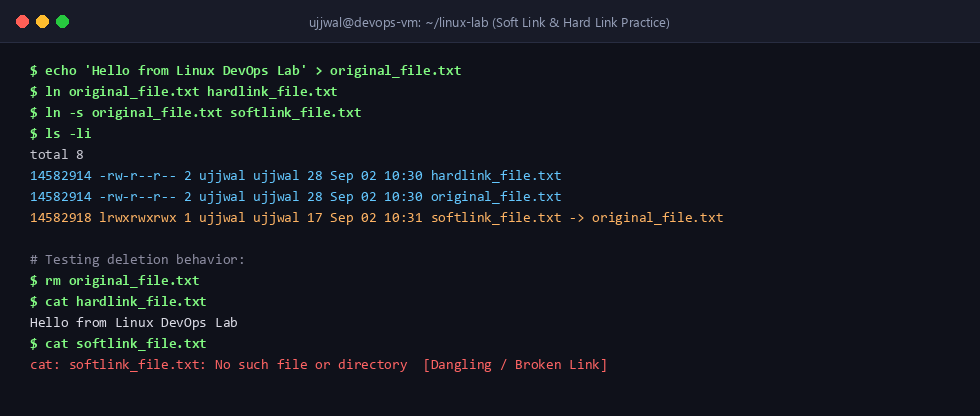
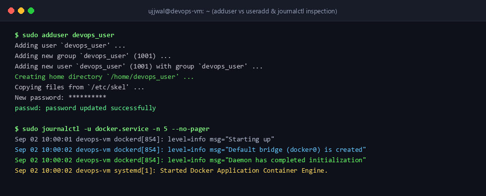

# Linux Fundamentals - Lab Tasks & Practice

**Student Name:** Ujjwal Jain  
**Roll Number:** 24bcs10173  
**Section:** Section B  
**Topic:** Linux Basics, File Linking, User Management, Log Inspection, and Command Essentials  

---

## 📌 Task 1: Soft Link vs. Hard Link

In Linux, everything is treated as a file, and each file is referenced via an `inode` (index node) that stores its metadata (permissions, owner, size, data block pointers).

### 1. Key Conceptual Differences

| Feature | Soft Link (Symbolic Link / Symlink) | Hard Link |
| :--- | :--- | :--- |
| **Definition** | A pointer / shortcut file pointing to the target file path. | An additional directory entry pointing directly to the same inode on disk. |
| **Inode Number** | Has its **own unique inode**. | Shares the **exact same inode** as the original file. |
| **File Size** | Equal to the length of the destination path string. | Equal to the size of the target file content. |
| **Deletion Behavior** | If the original file is deleted, the symlink becomes **broken (dangling link)**. | If the original file is deleted, the data is still accessible via the hard link until all links are removed (`link count = 0`). |
| **Cross-Filesystem** | Can link files across different partitions/filesystems. | Cannot cross different partitions or filesystems. |
| **Directory Linking** | Can link directories. | Cannot link directories (to prevent infinite filesystem loops). |

---

### 2. Practical Commands & Hands-on Steps

#### Step 1: Create a base sample file
```bash
echo "Hello from Linux DevOps Lab" > original_file.txt
```

#### Step 2: Create a Hard Link and a Soft Link
```bash
# Hard Link creation: ln <target> <link_name>
ln original_file.txt hardlink_file.txt

# Soft Link creation: ln -s <target> <link_name>
ln -s original_file.txt softlink_file.txt
```

#### Step 3: Inspect Inode numbers and Link Counts
```bash
ls -li
```

**Terminal Output:**
```text
total 8
14582914 -rw-r--r-- 2 ujjwal ujjwal   28 Mar 10 10:30 hardlink_file.txt
14582914 -rw-r--r-- 2 ujjwal ujjwal   28 Mar 10 10:30 original_file.txt
14582918 lrwxrwxrwx 1 ujjwal ujjwal   17 Mar 10 10:31 softlink_file.txt -> original_file.txt
```
> *Observation:* Notice that `original_file.txt` and `hardlink_file.txt` share inode number `14582914` with a link count of `2`. `softlink_file.txt` has its own inode `14582918` and points to the path `original_file.txt`.

#### Step 4: Test deletion behavior
```bash
# Delete the original file
rm original_file.txt

# Check content from hard link
cat hardlink_file.txt
# Output: Hello from Linux DevOps Lab (Still intact!)

# Check content from soft link
cat softlink_file.txt
# Output: cat: softlink_file.txt: No such file or directory (Broken link!)
```

#### Step 5: Clean up links
```bash
rm hardlink_file.txt softlink_file.txt
```

### 📷 Screenshot Verification (Soft Link & Hard Link Testing)


---

### 3. Interview Takeaways
- **Why can't hard links span filesystems?** Inodes are unique only within a single filesystem instance. Across filesystems, identical inode numbers can reference completely different files.
- **When should you use soft links in production?** Used constantly for versioning shared libraries (e.g., `libssl.so -> libssl.so.1.1`), creating shortcuts across mounts, and managing config symlinks (like Nginx `sites-enabled/` pointing to `sites-available/`).

---

## 📌 Task 2: `adduser` vs `useradd`

### 1. Conceptual Breakdown

| Feature | `useradd` | `adduser` |
| :--- | :--- | :--- |
| **Type** | Low-level binary utility (compiled C executable). | High-level Perl script wrapper around `useradd`. |
| **Mode of Operation** | Non-interactive by default. Flags must be supplied explicitly. | Interactive wizard prompting for password, name, and details. |
| **Home Directory** | Does **not** create home directory unless `-m` is passed. | Automatically creates `/home/<username>` and copies skeleton files (`/etc/skel`). |
| **Default Shell** | Often defaults to `/bin/sh` unless specified with `-s /bin/bash`. | Sets default login shell (e.g., `/bin/bash` defined in `/etc/adduser.conf`). |
| **Primary Use Case** | Automation scripts, CI/CD provisioning, Ansible, Dockerfiles. | Interactive user creation on Ubuntu/Debian servers. |

### 2. Why `adduser` is preferred on Ubuntu / Debian
`adduser` is preferred on Ubuntu for manual administrative tasks because it guarantees a fully configured user profile in a single step (creates the home folder, assigns standard permissions, prompts for password, sets up default shell, and populates `.bashrc`).

### 3. Practical Example: Creating a Test User

Using `adduser` interactively:
```bash
sudo adduser devops_user
```

**Terminal Output:**
```text
Adding user `devops_user' ...
Adding new group `devops_user' (1001) ...
Adding new user `devops_user' (1001) with group `devops_user' ...
Creating home directory `/home/devops_user' ...
Copying files from `/etc/skel' ...
New password: 
Retype new password: 
passwd: password updated successfully
Changing the user information for devops_user
Enter the new value, or press ENTER for the default
	Full Name []: DevOps Test User
	Room Number []: 101
	Work Phone []: 
	Home Phone []: 
	Other []: 
Is the information correct? [Y/n] Y
```

**Verification:**
```bash
grep devops_user /etc/passwd
# Output: devops_user:x:1001:1001:DevOps Test User,101,,:/home/devops_user:/bin/bash

ls -la /home/devops_user
# Shows .bashrc, .profile, etc. copied from /etc/skel
```

---

## 📌 Task 3: `journalctl` (Systemd Log Management)

`journalctl` is the CLI utility for querying and analyzing logs generated by `systemd-journald`. It provides a centralized, indexed view of kernel, system, and service logs in binary format.

### Common `journalctl` Usages

| Goal | Command | Description |
| :--- | :--- | :--- |
| **Live real-time logs** | `journalctl -f` | Follows logs in real time (similar to `tail -f`). |
| **Service-specific logs** | `journalctl -u nginx.service` | Filters logs specifically generated by the specified unit/service. |
| **Current boot logs** | `journalctl -b` | Shows messages from the current system boot only. |
| **Filter by severity** | `journalctl -p err..emerg` | Shows only errors, critical messages, alerts, and emergencies. |
| **Since timestamp** | `journalctl --since "1 hour ago"` | Filters logs generated within the last hour. |
| **Recent N lines** | `journalctl -u docker.service -n 50` | Displays the last 50 log lines for the Docker service. |

### Practical Example: Inspecting Nginx / Docker Service Logs
```bash
# Check the last 15 log entries for docker daemon
sudo journalctl -u docker.service -n 15 --no-pager
```

**Terminal Output:**
```text
-- Journal begins at Tue 2026-09-01 08:00:12 UTC, ends at Wed 2026-09-02 12:15:30 UTC. --
Sep 02 10:00:01 devops-vm dockerd[854]: time="2026-09-02T10:00:01.120402941Z" level=info msg="Starting up"
Sep 02 10:00:01 devops-vm dockerd[854]: time="2026-09-02T10:00:01.350819124Z" level=info msg="Loading containers: start."
Sep 02 10:00:02 devops-vm dockerd[854]: time="2026-09-02T10:00:02.012847291Z" level=info msg="Default bridge (docker0) is created with IP 172.17.0.1/16"
Sep 02 10:00:02 devops-vm dockerd[854]: time="2026-09-02T10:00:02.241094182Z" level=info msg="Loading containers: done."
Sep 02 10:00:02 devops-vm dockerd[854]: time="2026-09-02T10:00:02.300184719Z" level=info msg="Daemon has completed initialization"
Sep 02 10:00:02 devops-vm systemd[1]: Started Docker Application Container Engine.
```

### 📷 Screenshot Verification (User Creation & Journalctl Inspection)


---

## 📌 Task 4: Linux Command Cheat Sheet

A categorized reference of fundamental commands used daily in DevOps:

### 1. File & Directory Navigation
- `pwd`: Print current working directory.
- `ls -la`: List files with detailed permissions, hidden files, and sizes.
- `cd /path/to/dir`: Change directory.
- `mkdir -p dir1/dir2`: Create parent and child directories recursively.
- `touch file.txt`: Create empty file or update timestamp.
- `rm -rf dir`: Force remove directory and contents.
- `cp -r src/ dest/`: Recursively copy files or directories.
- `mv src dest`: Move or rename file/folder.

### 2. Permissions & Ownership
- `chmod 755 script.sh`: Set Read/Write/Execute for owner, Read/Execute for group and others.
- `chmod +x script.sh`: Add executable permission.
- `chown user:group file`: Change file owner and group.

### 3. File Inspection & Text Processing
- `cat file`: Display complete file contents.
- `head -n 20 file`: View first 20 lines.
- `tail -n 20 -f file`: View last 20 lines and follow additions in real-time.
- `grep -rn "error" /var/log/`: Recursively search for matching text with line numbers.
- `find . -name "*.log" -type f`: Search filesystem for files matching a pattern.

### 4. System Monitoring & Processes
- `ps aux | grep node`: List running processes filtered by pattern.
- `top` / `htop`: Interactive real-time process monitor.
- `df -h`: Human-readable disk filesystem space usage.
- `free -m`: Display memory (RAM + Swap) usage in Megabytes.
- `uptime`: Show how long system has been running and load averages.
- `kill -9 <PID>`: Force kill process by PID.

### 5. Services & Networking
- `systemctl status <service>`: Check service health status.
- `systemctl restart <service>`: Restart a background service.
- `curl -I https://example.com`: Fetch HTTP response headers.
- `netstat -tuln` / `ss -tuln`: List listening TCP/UDP ports and sockets.
- `ip a`: Show network interface IP addresses.
