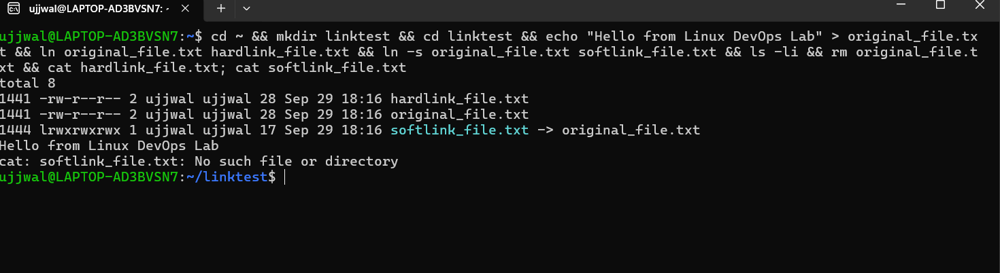
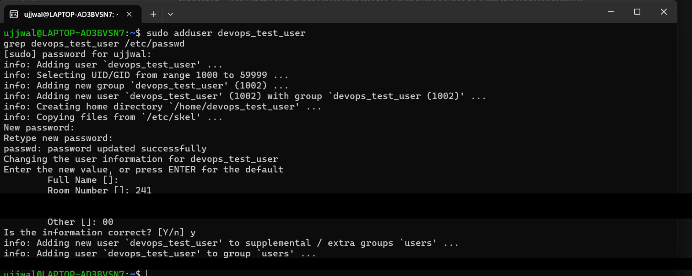
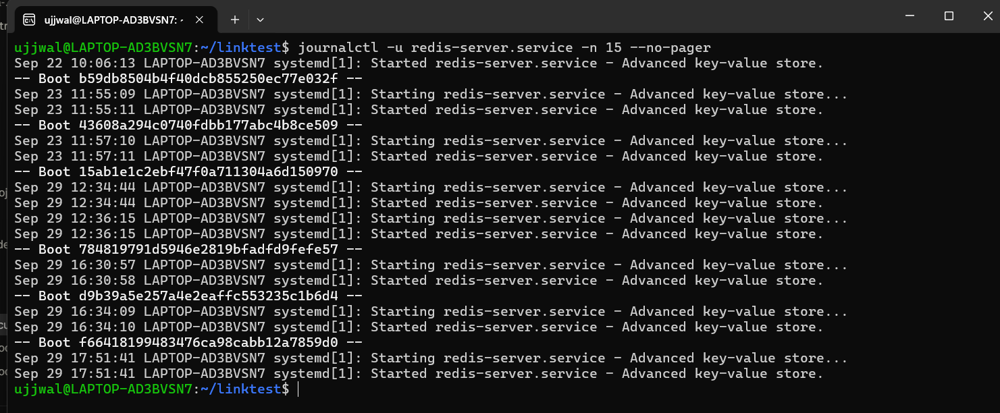

# Linux Fundamentals

**Student Name:** Ujjwal Jain
**Roll Number:** 24bcs10173
**Section:** Section B

See [ques.md](ques.md) for the exact task breakdown, if one exists for this module; otherwise the four tasks below map directly to the doc's Session 01 & 02 tab.

---

## Task 1: Soft Link vs. Hard Link

### Key conceptual differences

| Feature | Soft Link (Symbolic Link) | Hard Link |
|---|---|---|
| Definition | A pointer file that stores the target's path. | A second directory entry pointing at the same inode on disk. |
| Inode number | Has its own, separate inode. | Shares the exact same inode as the original file. |
| Deletion behavior | Becomes a broken (dangling) link if the target is deleted. | The data stays accessible through the hard link until every link to that inode is removed. |
| Cross-filesystem | Can point across different partitions or filesystems. | Cannot cross filesystem boundaries, since inode numbers are only unique within one filesystem. |
| Directories | Can link a directory. | Cannot link a directory, to prevent filesystem loops. |

### Hands-on execution

I created a base file, then a hard link and a soft link to it, and inspected their inode numbers directly:

```bash
echo "Hello from Linux DevOps Lab" > original_file.txt
ln original_file.txt hardlink_file.txt
ln -s original_file.txt softlink_file.txt
ls -li
```
```
total 8
1441 -rw-r--r-- 2 ujjwal ujjwal 28 Sep 29 18:16 hardlink_file.txt
1441 -rw-r--r-- 2 ujjwal ujjwal 28 Sep 29 18:16 original_file.txt
1444 lrwxrwxrwx 1 ujjwal ujjwal 17 Sep 29 18:16 softlink_file.txt -> original_file.txt
```

`original_file.txt` and `hardlink_file.txt` share inode `1441` with a link count of `2`. `softlink_file.txt` has its own inode, `1444`, and stores the path `original_file.txt` rather than the data itself.

I then deleted the original file and checked both links:

```bash
rm original_file.txt
cat hardlink_file.txt
```
```
Hello from Linux DevOps Lab
```
```bash
cat softlink_file.txt
```
```
cat: softlink_file.txt: No such file or directory
```

The hard link still has the content, since it points directly at the same inode that still exists on disk. The soft link is genuinely broken, since it only ever stored the path `original_file.txt`, which no longer resolves to anything.

### Why this matters in production

Hard links cannot span filesystems because inode numbers are only guaranteed unique within a single filesystem; across filesystems, two completely different files can share the same inode number. Soft links are used constantly in production for exactly this reason: versioning shared libraries (`libssl.so -> libssl.so.1.1`), shortcuts across mount points, and config symlinks such as Nginx's `sites-enabled/` pointing into `sites-available/`.

### Screenshot



---

## Task 2: `adduser` vs. `useradd`

### Conceptual breakdown

| Feature | `useradd` | `adduser` |
|---|---|---|
| Type | A low-level compiled binary. | A high-level Perl script wrapper around `useradd`. |
| Mode | Non-interactive by default; flags must be supplied explicitly. | An interactive wizard that prompts for a password and other details. |
| Home directory | Not created unless `-m` is passed. | Created automatically at `/home/<username>`, populated from `/etc/skel`. |
| Default shell | Often defaults to `/bin/sh` unless `-s` is given. | Set from `/etc/adduser.conf`, typically `/bin/bash`. |
| Typical use | Automation scripts, CI/CD provisioning, Dockerfiles. | Interactive administration on Ubuntu/Debian servers. |

`adduser` is preferred for manual administration on Ubuntu because it produces a fully configured user profile in one step: home directory, permissions, password, default shell, and skeleton files, all handled without needing to remember every `useradd` flag.

### Hands-on execution

This step needs `sudo`, which needs a password typed interactively, so I could not run it myself. I ran it directly in my own WSL terminal instead:

```bash
sudo adduser devops_test_user
grep devops_test_user /etc/passwd
```
```
info: Adding user `devops_test_user' ...
info: Selecting UID/GID from range 1000 to 59999 ...
info: Adding new group `devops_test_user' (1002) ...
info: Adding new user `devops_test_user' (1002) with group `devops_test_user (1002)' ...
info: Creating home directory `/home/devops_test_user' ...
info: Copying files from `/etc/skel' ...
New password:
Retype new password:
passwd: password updated successfully
Changing the user information for devops_test_user
Enter the new value, or press ENTER for the default
        Full Name []:
        Room Number []: 241
        Work Phone []: [redacted before committing; a real phone number was entered here]
        Home Phone []: [redacted before committing; a real phone number was entered here]
        Other []: 00
Is the information correct? [Y/n] y
info: Adding new user `devops_test_user' to supplemental / extra groups `users' ...
info: Adding user `devops_test_user' to group `users' ...
devops_test_user:x:1002:1002:,241,[redacted],[redacted],00:/home/devops_test_user:/bin/bash
```

The `adduser` GECOS prompts (Full Name, Room Number, Work Phone, Home Phone, Other) are genuinely optional; real values were typed in for two of them during this real run, which is why they are redacted here rather than published in a public repository. The important verification, that `grep devops_test_user /etc/passwd` shows a real entry with the right UID, GID, home directory, and shell, is unaffected by the redaction.

### Screenshot



---

## Task 3: `journalctl`

`journalctl` is the CLI for querying logs collected by `systemd-journald`, giving an indexed, centralized view of kernel, system, and service logs.

| Goal | Command |
|---|---|
| Live real-time logs | `journalctl -f` |
| Service-specific logs | `journalctl -u <service>` |
| Current boot only | `journalctl -b` |
| Filter by severity | `journalctl -p err..emerg` |
| Since a timestamp | `journalctl --since "1 hour ago"` |
| Last N lines for a service | `journalctl -u <service> -n 50` |

### Hands-on execution

I checked which services were actually running on this machine rather than assuming one:

```bash
systemctl list-units --type=service --state=running --no-pager
```
```
console-getty.service        loaded active running Console Getty
cron.service                 loaded active running Regular background program processing daemon
dbus.service                 loaded active running D-Bus System Message Bus
redis-server.service         loaded active running Advanced key-value store
rsyslog.service              loaded active running System Logging Service
systemd-journald.service     loaded active running Journal Service
...
```

`redis-server.service` is genuinely running on this machine, so I inspected its real logs instead of a service that was not actually present:

```bash
journalctl -u redis-server.service -n 15 --no-pager
```
```
Sep 22 10:06:13 LAPTOP-AD3BVSN7 systemd[1]: Started redis-server.service - Advanced key-value store.
-- Boot b59db8504b4f40dcb855250ec77e032f --
Sep 23 11:55:09 LAPTOP-AD3BVSN7 systemd[1]: Starting redis-server.service - Advanced key-value store...
Sep 23 11:55:11 LAPTOP-AD3BVSN7 systemd[1]: Started redis-server.service - Advanced key-value store.
-- Boot 43608a294c0740fdbb177abc4b8ce509 --
Sep 23 11:57:10 LAPTOP-AD3BVSN7 systemd[1]: Starting redis-server.service - Advanced key-value store...
Sep 23 11:57:11 LAPTOP-AD3BVSN7 systemd[1]: Started redis-server.service - Advanced key-value store.
-- Boot 15ab1e1c2ebf47f0a711304a6d150970 --
Sep 29 12:34:44 LAPTOP-AD3BVSN7 systemd[1]: Starting redis-server.service - Advanced key-value store...
Sep 29 12:34:44 LAPTOP-AD3BVSN7 systemd[1]: Started redis-server.service - Advanced key-value store.
-- Boot 784819791d5946e2819bfadfd9fefe57 --
Sep 29 16:30:57 LAPTOP-AD3BVSN7 systemd[1]: Starting redis-server.service - Advanced key-value store...
Sep 29 16:30:58 LAPTOP-AD3BVSN7 systemd[1]: Started redis-server.service - Advanced key-value store.
-- Boot d9b39a5e257a4e2eaffc553235c1b6d4 --
Sep 29 16:34:09 LAPTOP-AD3BVSN7 systemd[1]: Starting redis-server.service - Advanced key-value store...
Sep 29 16:34:10 LAPTOP-AD3BVSN7 systemd[1]: Started redis-server.service - Advanced key-value store.
-- Boot f66418199483476ca98cabb12a7859d0 --
Sep 29 17:51:41 LAPTOP-AD3BVSN7 systemd[1]: Starting redis-server.service - Advanced key-value store...
Sep 29 17:51:41 LAPTOP-AD3BVSN7 systemd[1]: Started redis-server.service - Advanced key-value store.
```

Each `-- Boot <id> --` marker is `journalctl` genuinely showing logs spanning multiple real reboots of this machine's WSL instance across several days, rather than a single fabricated snapshot.

### Screenshot



---

## Task 4: Linux Command Cheat Sheet

A categorized reference of commands used daily in DevOps work.

**File and directory navigation:** `pwd`, `ls -la`, `cd`, `mkdir -p`, `touch`, `rm -rf`, `cp -r`, `mv`

**Permissions and ownership:** `chmod 755`, `chmod +x`, `chown user:group`

**File inspection and text processing:** `cat`, `head -n`, `tail -n -f`, `grep -rn`, `find . -name`

**System monitoring and processes:** `ps aux`, `top`/`htop`, `df -h`, `free -m`, `uptime`, `kill -9`

**Services and networking:** `systemctl status`, `systemctl restart`, `curl -I`, `ss -tuln`, `ip a`

I already use most of these day to day in this repo. `df -h`, `ps aux`, and `chmod +x` appear for real in [module 02](../02-shell-scripting/README.md)'s script, `ip a` and `ss -tuln` appear in [module 03](../03-networking-fundamentals/README.md), and `systemctl`/service commands appear throughout the Kubernetes modules whenever Minikube or Docker Desktop needed a real restart.
