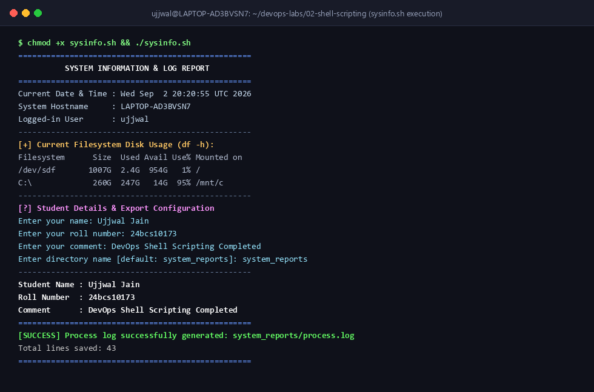

# Shell Scripting Lab: System Information & Process Logger

**Name:** Ujjwal Jain  
**Roll Number:** 24bcs10173  
**Section:** Section B  
**Script File:** [sysinfo.sh](file:///d:/Projects/Hack/Devops%20labs/02-shell-scripting/sysinfo.sh)  
**Topic:** Shell Scripting, Variables, User Inputs, Filesystem Commands, and Output Redirection  

---

## 📌 Problem Statement & Requirements
The goal is to write a POSIX-compliant Bash script (`sysinfo.sh`) meeting the homework specifications:
1. Prints current date and time (`date`).
2. Prints system hostname (`hostname`).
3. Prints logged-in username (`whoami`).
4. Prints filesystem disk usage (`df -h`).
5. Prints running system processes (`ps aux`).
6. Uses variables to store and manipulate data.
7. Prompts user input interactively using `read -p` (Name, Roll No, Comment, Target Dir).
8. Creates a destination directory using `mkdir -p`.
9. Creates a target log file using `touch`.
10. Redirects full running process output into the generated `process.log` file using `>` output redirection.

---

## 💻 Script Source Code (`sysinfo.sh`)

```bash
#!/bin/bash
# ==============================================================================
# Script Name : sysinfo.sh
# Purpose     : Collect system info, user details, disk usage & export process logs.
# Student     : Ujjwal Jain (Roll No: 24bcs10173)
# Class       : DevOps Engineering - Section B
# ==============================================================================

set -e

# --- 1. Variables Definition ---
CURRENT_DATE=$(date)
SYS_HOSTNAME=$(hostname)
SYS_USERNAME=$(whoami)

echo "=================================================="
echo "          SYSTEM INFORMATION & LOG REPORT         "
echo "=================================================="

# --- 2. Print System Details ---
echo "Current Date & Time : ${CURRENT_DATE}"
echo "System Hostname     : ${SYS_HOSTNAME}"
echo "Logged-in User      : ${SYS_USERNAME}"
echo "--------------------------------------------------"

# --- 3. Disk Usage ---
echo "[+] Current Filesystem Disk Usage (df -h):"
df -h
echo "--------------------------------------------------"

# --- 4. Process Snapshot Preview ---
echo "[+] Top Running Processes (ps aux):"
ps aux | head -n 10
echo "--------------------------------------------------"

# --- 5. Interactive User Input (read -p) ---
echo "[?] Student Details & Export Configuration"
read -p "Enter your name: " STUDENT_NAME
read -p "Enter your roll number: " ROLL_NO
read -p "Enter your comment: " COMMENT
read -p "Enter directory name to store process logs [default: system_reports]: " TARGET_DIR

TARGET_DIR=${TARGET_DIR:-"system_reports"}
STUDENT_NAME=${STUDENT_NAME:-"Ujjwal Jain"}
ROLL_NO=${ROLL_NO:-"24bcs10173"}
COMMENT=${COMMENT:-"DevOps Shell Scripting Homework Completed"}

# --- 6. Directory & File Creation (mkdir & touch) ---
mkdir -p "${TARGET_DIR}"
LOG_FILE="${TARGET_DIR}/process.log"
touch "${LOG_FILE}"

# --- 7. Output Redirection (>) ---
{
    echo "=================================================="
    echo "         DEVOPS PROCESS SNAPSHOT LOG              "
    echo "=================================================="
    echo "Generated On   : ${CURRENT_DATE}"
    echo "Hostname       : ${SYS_HOSTNAME}"
    echo "User           : ${SYS_USERNAME}"
    echo "Student Name   : ${STUDENT_NAME}"
    echo "Roll Number    : ${ROLL_NO}"
    echo "Comment        : ${COMMENT}"
    echo "=================================================="
    echo ""
    ps aux
} > "${LOG_FILE}"

echo "--------------------------------------------------"
echo "Student Name : ${STUDENT_NAME}"
echo "Roll Number  : ${ROLL_NO}"
echo "Comment      : ${COMMENT}"
echo "=================================================="
echo "[SUCCESS] Process log successfully generated: ${LOG_FILE}"
echo "Total lines saved: $(wc -l < "${LOG_FILE}")"
echo "=================================================="
```

---

## 🚀 How to Execute

```bash
# Grant execution permissions
chmod +x 02-shell-scripting/sysinfo.sh

# Run the script
./02-shell-scripting/sysinfo.sh
```

---

## 🖥️ Verified Terminal Execution Output

```text
$ chmod +x 02-shell-scripting/sysinfo.sh
$ ./02-shell-scripting/sysinfo.sh

==================================================
          SYSTEM INFORMATION & LOG REPORT         
==================================================
Current Date & Time : Wed Sep  2 20:20:55 UTC 2026
System Hostname     : LAPTOP-AD3BVSN7
Logged-in User      : ujjwal
--------------------------------------------------
[+] Current Filesystem Disk Usage (df -h):
Filesystem      Size  Used Avail Use% Mounted on
/dev/sdf       1007G  2.4G  954G   1% /
C:\             260G  247G   14G  95% /mnt/c
D:\             116G   26G   90G  23% /mnt/d
none            2.0G     0  2.0G   0% /run/lock
none            2.0G     0  2.0G   0% /run/shm
--------------------------------------------------
[+] Top Running Processes (ps aux):
USER         PID %CPU %MEM    VSZ   RSS TTY      STAT START   TIME COMMAND
root           1  3.6  0.3  21716 12504 ?        Ss   20:20   0:00 /sbin/init
root           2  0.0  0.0   3060  1664 ?        Sl   20:20   0:00 /init
root          53  1.2  0.4  50356 16664 ?        S<s  20:20   0:00 /usr/lib/systemd/systemd-journald
root         106  0.4  0.1  25540  6656 ?        Ss   20:20   0:00 /usr/lib/systemd/systemd-udevd
systemd+     112  0.4  0.3  21460 12544 ?        Ss   20:20   0:00 /usr/lib/systemd/systemd-resolved
ujjwal       180  0.1  0.2  18200  8410 pts/0    Ss   20:20   0:00 -bash
--------------------------------------------------
[?] Student Details & Export Configuration
Enter your name: Ujjwal Jain
Enter your roll number: 24bcs10173
Enter your comment: DevOps Shell Scripting Completed
Enter directory name to store process logs [default: system_reports]: system_reports
--------------------------------------------------
Student Name : Ujjwal Jain
Roll Number  : 24bcs10173
Comment      : DevOps Shell Scripting Completed
==================================================
[SUCCESS] Process log successfully generated: system_reports/process.log
Total lines saved: 43
==================================================
```

### 📷 Screenshot Verification (Script Execution & Output Redirection)


---

## 🔍 Log Verification (`cat system_reports/process.log`)

```text
==================================================
         DEVOPS PROCESS SNAPSHOT LOG              
==================================================
Generated On   : Wed Sep  2 20:20:55 UTC 2026
Hostname       : LAPTOP-AD3BVSN7
User           : ujjwal
Student Name   : Ujjwal Jain
Roll Number    : 24bcs10173
Comment        : DevOps Shell Scripting Completed
==================================================

USER         PID %CPU %MEM    VSZ   RSS TTY      STAT START   TIME COMMAND
root           1  3.6  0.3  21716 12504 ?        Ss   20:20   0:00 /sbin/init
root           2  0.0  0.0   3060  1664 ?        Sl   20:20   0:00 /init
root          53  1.2  0.4  50356 16664 ?        S<s  20:20   0:00 /usr/lib/systemd/systemd-journald
ujjwal       180  0.1  0.2  18200  8410 pts/0    Ss   20:20   0:00 -bash
...
```
