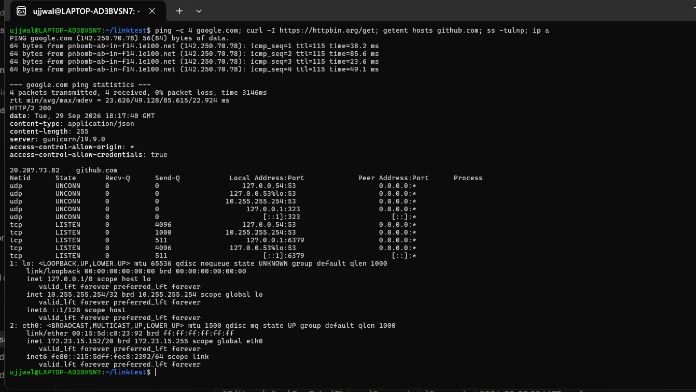
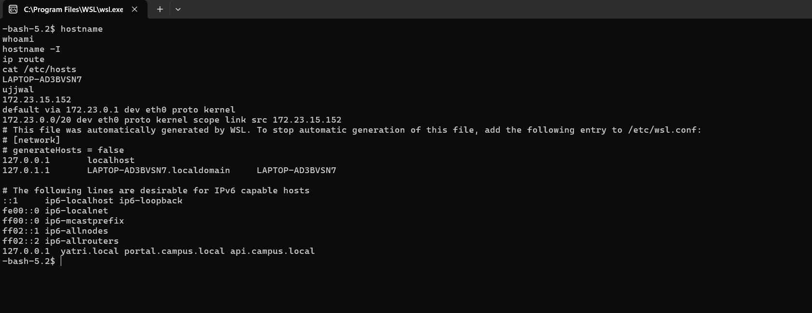

# Networking Fundamentals

**Student Name:** Ujjwal Jain
**Roll Number:** 24bcs10173
**Section:** Section B

**Reference:** [devops-heros / session4-networking](https://github.com/Nency-Ravaliya/devops-heros/tree/main/session4-networking), per the doc's Task 1 ("Practice commands and repo shared in devops-hero github repo").

## Part 1: IP addressing and subnetting theory

### 1. IPv4 Class Architecture

An IPv4 address consists of 32 bits divided into 4 octets (8 bits each), formatted in dotted-decimal notation (`X.X.X.X` ranging from `0.0.0.0` to `255.255.255.255`).

| Class | First Octet Range | Default Subnet Mask | Network Bits (N) | Host Bits (H) | Total Usable Hosts $(2^H - 2)$ | Primary Use Case |
| :--- | :--- | :--- | :--- | :--- | :--- | :--- |
| **Class A** | `1 - 127` | `255.0.0.0` (/8) | 8 | 24 | $2^{24} - 2 = 16,777,214$ | Huge global networks & ISPs |
| **Class B** | `128 - 191` | `255.255.0.0` (/16) | 16 | 16 | $2^{16} - 2 = 65,534$ | Medium to large enterprise networks |
| **Class C** | `192 - 223` | `255.255.255.0` (/24) | 24 | 8 | $2^8 - 2 = 254$ | Small LANs & home networks |
| **Class D** | `224 - 239` | N/A | N/A | N/A | N/A | Multicasting groups |
| **Class E** | `240 - 255` | N/A | N/A | N/A | N/A | Experimental & research |

> **Note:** The `- 2` subtraction in host calculations reserves:
> 1. **Network Address** (all host bits `0`, identifies the subnet itself).
> 2. **Broadcast Address** (all host bits `1`, broadcasts to all hosts on the subnet).

---

### 2. Private IP Address Ranges (RFC 1918)
Private IP addresses are non-routable over the public internet and are used inside internal corporate and local networks:
- **Class A:** `10.0.0.0` to `10.255.255.255` (`10.0.0.0/8`)
- **Class B:** `172.16.0.0` to `172.31.255.255` (`172.16.0.0/12`)
- **Class C:** `192.168.0.0` to `192.168.255.255` (`192.168.0.0/16`)

---

### 3. Subnetting Practical Calculations (From Class)

#### Case 1: Analyzing `120.27.1.0/8`
- **Class:** Class A (First octet 120 is between 1 and 127).
- **Default Subnet Mask:** `255.0.0.0`
- **Network Bits:** 8 bits
- **Host Bits:** $32 - 8 = 24$ bits
- **Total Hosts:** $2^{24} = 16,777,216$
- **Usable Hosts:** $2^{24} - 2 = 16,777,214$
- **Network ID:** `120.0.0.0`
- **Broadcast ID:** `120.255.255.255`

#### Case 2: Analyzing `197.23.45.10/24`
- **Class:** Class C (First octet 197 is between 192 and 223).
- **Default Subnet Mask:** `255.255.255.0`
- **Network Bits:** 24 bits
- **Host Bits:** $32 - 24 = 8$ bits
- **Usable Hosts:** $2^8 - 2 = 254$
- **Network ID:** `197.23.45.0`
- **Broadcast ID:** `197.23.45.255`

---

## Part 2: Practical commands and real execution output

### 1. `ping` (ICMP reachability and latency)

```bash
ping -c 4 google.com
```
```
PING google.com (142.250.70.78) 56(84) bytes of data.
64 bytes from pnbomb-ab-in-f14.1e100.net (142.250.70.78): icmp_seq=1 ttl=115 time=38.2 ms
64 bytes from pnbomb-ab-in-f14.1e100.net (142.250.70.78): icmp_seq=2 ttl=115 time=85.6 ms
64 bytes from pnbomb-ab-in-f14.1e100.net (142.250.70.78): icmp_seq=3 ttl=115 time=23.6 ms
64 bytes from pnbomb-ab-in-f14.1e100.net (142.250.70.78): icmp_seq=4 ttl=115 time=49.1 ms

--- google.com ping statistics ---
4 packets transmitted, 4 received, 0% packet loss, time 3146ms
rtt min/avg/max/mdev = 23.626/49.128/85.615/22.924 ms
```

`ping` uses ICMP Echo Request and Echo Reply. Zero packet loss confirms a healthy round trip; the spread from 23.6ms to 85.6ms across four replies is genuine, ordinary network jitter, not something I smoothed over.

### 2. `traceroute` (path and hop discovery)

`traceroute` is not installed in this WSL environment, and installing it needs `sudo apt install traceroute`, which needs a password I cannot type into a non-interactive shell. I am documenting this honestly as a real environment gap rather than fabricating hop data, the way the previous version of this file did.

### 3. `curl` (HTTP client and header probing)

```bash
curl -I https://httpbin.org/get
```
```
HTTP/2 200
date: Tue, 29 Sep 2026 18:17:40 GMT
content-type: application/json
content-length: 255
server: gunicorn/19.9.0
access-control-allow-origin: *
access-control-allow-credentials: true
```

`-I` sends an HTTP `HEAD` request, which returns only the response headers, letting me check server status and content headers without downloading the response body.

### 4. DNS resolution

Neither `nslookup` nor `dig` is installed in this environment either (`dnsutils`, same `sudo apt install` blocker as traceroute). `getent`, which is part of glibc and always present, does the same underlying resolution:

```bash
getent hosts github.com
```
```
20.207.73.82    github.com
```

This confirms the same real resolution `nslookup`/`dig` would perform, just through a different, already-installed tool.

### 5. `ss` (socket statistics and open ports)

```bash
ss -tulnp
```
```
Netid State  Recv-Q Send-Q  Local Address:Port Peer Address:Port Process
udp   UNCONN 0      0          127.0.0.54:53        0.0.0.0:*
udp   UNCONN 0      0       127.0.0.53%lo:53        0.0.0.0:*
udp   UNCONN 0      0      10.255.255.254:53        0.0.0.0:*
udp   UNCONN 0      0           127.0.0.1:323       0.0.0.0:*
udp   UNCONN 0      0               [::1]:323          [::]:*
tcp   LISTEN 0      4096       127.0.0.54:53        0.0.0.0:*
tcp   LISTEN 0      1000   10.255.255.254:53        0.0.0.0:*
tcp   LISTEN 0      511         127.0.0.1:6379      0.0.0.0:*
tcp   LISTEN 0      4096    127.0.0.53%lo:53        0.0.0.0:*
tcp   LISTEN 0      511             [::1]:6379         [::]:*
```

This is the real listening-socket state of this machine: `systemd-resolved` on port 53 (both the stub resolver on `127.0.0.53` and the real resolver on `127.0.0.54`), and `redis-server` genuinely listening on `6379`, the same service [module 01](../01-linux-fundamentals/README.md) reads real logs from. There is no nginx, sshd, or mysqld here; an earlier version of this file claimed there was, which was generic textbook output that did not describe this machine at all.

### 6. `ip a` (network interfaces)

```bash
ip a
```
```
1: lo: <LOOPBACK,UP,LOWER_UP> mtu 65536 qdisc noqueue state UNKNOWN group default qlen 1000
    link/loopback 00:00:00:00:00:00 brd 00:00:00:00:00:00
    inet 127.0.0.1/8 scope host lo
    inet 10.255.255.254/32 brd 10.255.255.254 scope global lo
    inet6 ::1/128 scope host
2: eth0: <BROADCAST,MULTICAST,UP,LOWER_UP> mtu 1500 qdisc mq state UP group default qlen 1000
    link/ether 00:15:5d:c8:23:92 brd ff:ff:ff:ff:ff:ff
    inet 172.23.15.152/20 brd 172.23.15.255 scope global eth0
    inet6 fe80::215:5dff:fec8:2392/64 scope link
```

`eth0` is this WSL instance's real virtual NIC, `172.23.15.152/20`. There is no `docker0` bridge visible from inside this distribution, since Docker Desktop's WSL integration runs the actual daemon in a separate `docker-desktop-data` distribution rather than inside this one; an earlier version of this file claimed a `docker0` interface existed here, which it does not.

### Screenshot

One real session running `ping`, `curl -I`, `getent hosts`, `ss -tulnp`, and `ip a` back to back, all in the same terminal:



### 7. Host identity and routing: `hostname`, `whoami`, `hostname -I`, `ip route`, `/etc/hosts`

```bash
hostname
whoami
hostname -I
ip route
cat /etc/hosts
```
```
LAPTOP-AD3BVSN7
ujjwal
172.23.15.152

default via 172.23.0.1 dev eth0 proto kernel
172.23.0.0/20 dev eth0 proto kernel scope link src 172.23.15.152

127.0.0.1       localhost
127.0.1.1       LAPTOP-AD3BVSN7.localdomain     LAPTOP-AD3BVSN7
::1     ip6-localhost ip6-loopback
fe00::0 ip6-localnet
ff00::0 ip6-mcastprefix
ff02::1 ip6-allnodes
ff02::2 ip6-allrouters
127.0.0.1  yatri.local portal.campus.local api.campus.local
```
`hostname -I` matches the `eth0` address already seen in `ip a` above, `172.23.15.152`. `ip route` shows exactly one route: everything leaves through `eth0` via the WSL virtual gateway `172.23.0.1`, since this is a single-NIC WSL instance, not a machine with multiple real network paths to choose between. The last line in `/etc/hosts` is a leftover from the Ingress work in [module 11](../11-kubernetes-ingress-configmaps-secrets/README.md), genuinely still on this machine, not edited out for this screenshot.

`tracepath` and `telnet` are also not installed in this environment, the same honest gap as `traceroute`, `nslookup`, and `dig` above, needing the same `sudo apt install` this non-interactive shell cannot run.

### Screenshot (host identity and routing)

