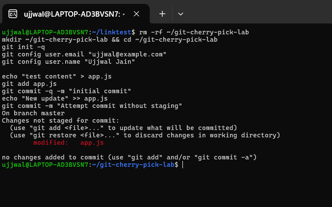
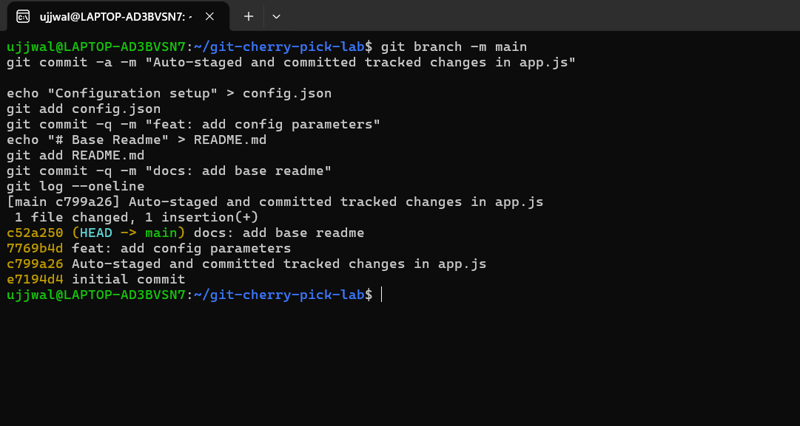
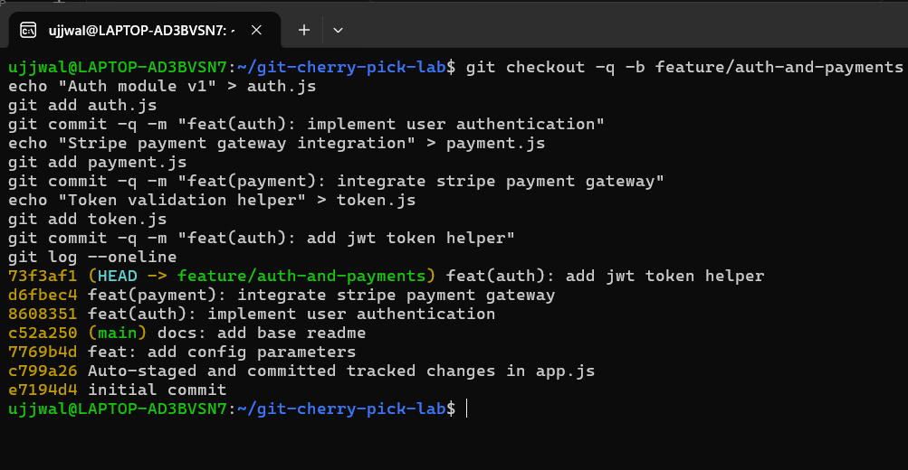
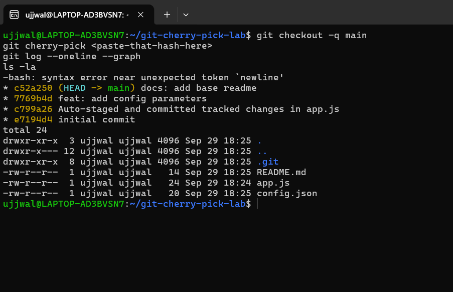
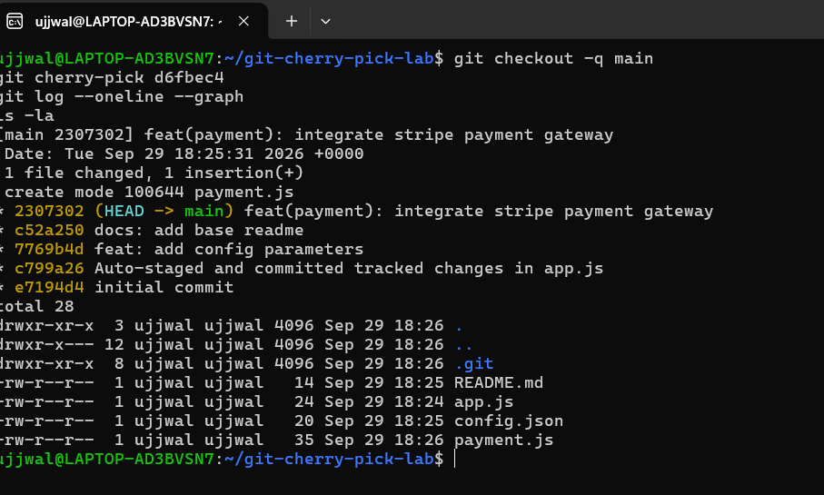

# Git and GitHub Fundamentals

**Student Name:** Ujjwal Jain
**Roll Number:** 24bcs10173
**Section:** Section B

## Task 1: `git commit -a -m` vs. `git commit -m`

### Conceptual distinction

| Command | Auto-stages modified tracked files | Commits new (untracked) files | Requires `git add` first |
|---|---|---|---|
| `git commit -m "msg"` | No | No | Yes, for anything not already staged |
| `git commit -a -m "msg"` | Yes, for modified and deleted tracked files | No, untracked files are still ignored | Only for brand-new files |

### Hands-on execution

I initialized a scratch repository, made a tracked file, then modified it and tried to commit without staging first:

```bash
git init
echo "test content" > app.js
git add app.js
git commit -q -m "initial commit"
echo "New update" >> app.js
git commit -m "Attempt commit without staging"
```
```
On branch master
Changes not staged for commit:
  (use "git add <file>..." to update what will be committed)
  (use "git restore <file>..." to discard changes in working directory)
	modified:   app.js

no changes added to commit (use "git add" and/or "git commit -a")
```

`git commit -m` correctly refuses to commit anything, since `app.js` was modified in the working tree but never staged. I then committed the same change with `-a`:

```bash
git branch -m main
git commit -a -m "Auto-staged and committed tracked changes in app.js"
```
```
[main c799a26] Auto-staged and committed tracked changes in app.js
 1 file changed, 1 insertion(+)
```

The `-a` flag staged the modified tracked file automatically and committed it in one step, with a real commit hash, `c799a26`.

### Screenshot



## Task 2: Git cherry-pick

`git cherry-pick <commit-hash>` applies the changes from an existing commit on another branch and records them as a new commit on the current branch.

### Step 1: create commits on `main`

```bash
echo "Configuration setup" > config.json
git add config.json
git commit -q -m "feat: add config parameters"
echo "# Base Readme" > README.md
git add README.md
git commit -q -m "docs: add base readme"
git log --oneline
```
```
c52a250 (HEAD -> main) docs: add base readme
7769b4d feat: add config parameters
c799a26 Auto-staged and committed tracked changes in app.js
e7194d4 initial commit
```

### Screenshot



### Step 2: create a feature branch with its own commits

```bash
git checkout -q -b feature/auth-and-payments
echo "Auth module v1" > auth.js
git add auth.js
git commit -q -m "feat(auth): implement user authentication"
echo "Stripe payment gateway integration" > payment.js
git add payment.js
git commit -q -m "feat(payment): integrate stripe payment gateway"
echo "Token validation helper" > token.js
git add token.js
git commit -q -m "feat(auth): add jwt token helper"
git log --oneline
```
```
73f3af1 (HEAD -> feature/auth-and-payments) feat(auth): add jwt token helper
d6fbec4 feat(payment): integrate stripe payment gateway
8608351 feat(auth): implement user authentication
c52a250 (main) docs: add base readme
7769b4d feat: add config parameters
c799a26 Auto-staged and committed tracked changes in app.js
e7194d4 initial commit
```

### Screenshot



### Step 3: cherry-pick only the payment commit into `main`

I wanted the payment integration commit (`d6fbec4`) on `main`, without bringing along the incomplete authentication work. My first attempt genuinely failed, worth keeping honest rather than editing out: I copy-pasted a placeholder (`<paste-that-hash-here>`) straight into the terminal instead of substituting the real hash, and bash correctly rejected it as invalid redirection syntax:

```bash
git checkout -q main
git cherry-pick <paste-that-hash-here>
```
```
-bash: syntax error near unexpected token `newline'
```

### Screenshot



Re-ran it with the actual hash from Step 2's log:

```bash
git cherry-pick d6fbec4
```
```
[main 2307302] feat(payment): integrate stripe payment gateway
 Date: Tue Sep 29 18:25:31 2026 +0000
 1 file changed, 1 insertion(+)
 create mode 100644 payment.js
```

### Step 4: verify the result

```bash
git log --oneline --graph
ls -la
```
```
* 2307302 (HEAD -> main) feat(payment): integrate stripe payment gateway
* c52a250 docs: add base readme
* 7769b4d feat: add config parameters
* c799a26 Auto-staged and committed tracked changes in app.js
* e7194d4 initial commit

README.md
app.js
config.json
payment.js
```

`payment.js` is cleanly integrated into `main` under its own real commit, `2307302`, while `auth.js` and `token.js` never appear here at all; they stay isolated on the `feature/auth-and-payments` branch, exactly as intended.

### Screenshot


