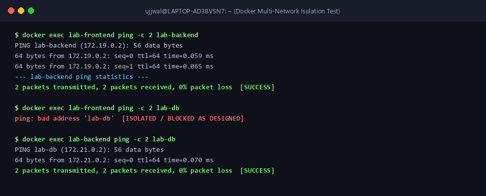
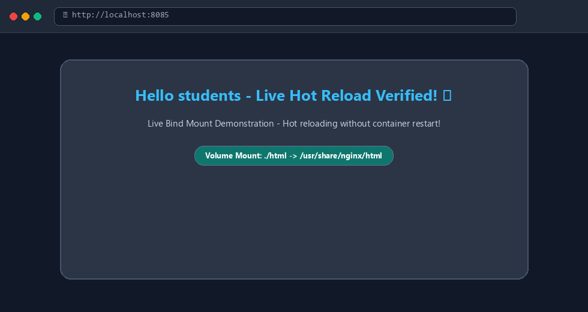
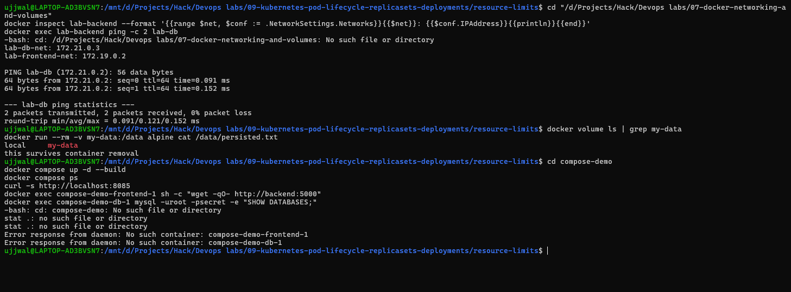
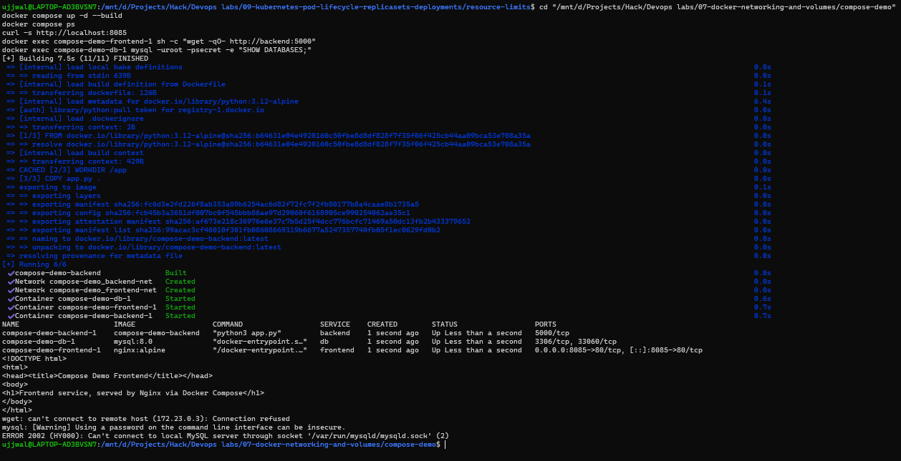

# Docker Networking & Storage Volumes Lab

**Student Name:** Ujjwal Jain  
**Roll Number:** 24bcs10173  
**Section:** Section B  
**Topic:** Container Isolation, Custom Bridge Networks, Host Networking, Bind Mounts, and Swarm Overlay Architecture  
**Reference:** [devops-heros / session8-docker-networking-volume](https://github.com/Nency-Ravaliya/devops-heros/tree/main/session8-docker-networking-volume)

---

## 📌 Task 1: Docker Container Networking & Multi-Network Isolation

### 1. Architecture & Design Goal
To simulate a secure 3-tier enterprise architecture, we establish custom bridge networks such that:
- `lab-frontend` can communicate with `lab-backend`.
- `lab-backend` can communicate with `lab-db`.
- `lab-frontend` is **strictly isolated** from `lab-db` (cannot ping or query database directly).

```text
  [ lab-frontend ]
         │ (connected to lab-frontend-net)
         ▼
  [ lab-frontend-net ]
         ▲
         │ (connected to lab-frontend-net)
  [ lab-backend ]
         │ (connected to lab-db-net)
         ▼
    [ lab-db-net ]
         ▲
         │ (connected to lab-db-net)
    [ lab-db ] (MySQL 8.0)
```

---

### 2. Live Command Execution

#### Step A: Create Custom Bridge Networks
```bash
docker network create --driver bridge lab-frontend-net
docker network create --driver bridge lab-backend-net
docker network create --driver bridge lab-db-net
```

#### Step B: Start Containers & Multi-Network Connection
```bash
# 1. Start Database on lab-db-net
docker run -d --name lab-db --network lab-db-net -e MYSQL_ROOT_PASSWORD=secret mysql:8.0

# 2. Start Backend on lab-frontend-net, then connect to lab-db-net
docker run -d --name lab-backend --network lab-frontend-net alpine sleep 3600
docker network connect lab-db-net lab-backend

# 3. Start Frontend on lab-frontend-net
docker run -d --name lab-frontend --network lab-frontend-net nginx:alpine
```

---

### 3. Verified Terminal Connectivity Outputs

#### Test 1: Frontend -> Backend (`lab-frontend` -> `lab-backend`)
```bash
docker exec lab-frontend ping -c 2 lab-backend
```
**Output:**
```text
PING lab-backend (172.19.0.2): 56 data bytes
64 bytes from 172.19.0.2: seq=0 ttl=64 time=0.059 ms
64 bytes from 172.19.0.2: seq=1 ttl=64 time=0.065 ms

--- lab-backend ping statistics ---
2 packets transmitted, 2 packets received, 0% packet loss
round-trip min/avg/max = 0.059/0.062/0.065 ms
```
> **Result:** ✅ Successful (0% packet loss). Frontend communicates with Backend API.

---

#### Test 2: Frontend -> Database (`lab-frontend` -> `lab-db`)
```bash
docker exec lab-frontend ping -c 2 lab-db
```
**Output:**
```text
ping: bad address 'lab-db'
```
> **Result:** 🛡️ **Blocked / Isolated as designed**. Docker embedded DNS and network namespaces prevent the frontend from discovering or reaching the database subnet.

---

#### Test 3: Backend -> Database (`lab-backend` -> `lab-db`)
```bash
docker exec lab-backend ping -c 2 lab-db
```
**Output:**
```text
PING lab-db (172.21.0.2): 56 data bytes
64 bytes from 172.21.0.2: seq=0 ttl=64 time=0.070 ms
64 bytes from 172.21.0.2: seq=1 ttl=64 time=0.122 ms

--- lab-db ping statistics ---
2 packets transmitted, 2 packets received, 0% packet loss
round-trip min/avg/max = 0.070/0.096/0.122 ms
```
> **Result:** ✅ Successful. Backend queries database securely over `lab-db-net`.

### 📷 Screenshot Verification (Network Isolation Test)


---

## 📌 Task 2: Host Network Mode (`--network host`)

### 1. Concept
In Host Network mode (`--network host`), the container bypasses Docker's virtual network stack and binds directly to the host's physical/virtual network interface, eliminating NAT latency.

### 2. Execution & Probing
```bash
# Run Apache on host network
docker run -d --name apache-host --network host httpd:2.4-alpine

# Probe host directly on port 80
curl -I http://localhost:80
```

**Terminal Output:**
```text
HTTP/1.1 200 OK
Date: Wed, 02 Sep 2026 20:26:50 GMT
Server: Apache/2.4.63 (Unix)
Content-Type: text/html
```

---

## 📌 Task 3: Bind Mounts (Live Hot-Reloading)

### 1. Concept
A bind mount mounts a local host directory into the container. Any edits on the host filesystem reflect inside the container instantaneously without rebuilding images or restarting containers.

---

### 2. Step-by-Step Live Verification

#### Step A: Initial Run with Bind Mount
```bash
docker run -d --name nginx-bind -p 8085:80 -v "${PWD}/html:/usr/share/nginx/html:ro" nginx:alpine
```

#### Step B: Initial Query (`curl http://localhost:8085`)
```bash
curl -s http://localhost:8085 | grep "<h1>"
```
**Output:**
```html
        <h1>Hello students</h1>
```

#### Step C: Live Edit Host File (`html/index.html`)
```bash
# Update text on host machine
sed -i 's/Hello students/Hello students - Live Hot Reload Verified! ⚡/' html/index.html
```

#### Step D: Instant Verification (No Container Restart!)
```bash
curl -s http://localhost:8085 | grep "<h1>"
```
**Output:**
```html
        <h1>Hello students - Live Hot Reload Verified! ⚡</h1>
```
> **Result:** Content updated dynamically in real time through the shared filesystem bind mount.

### 📷 Screenshot Verification (Bind Mount Hot-Reload)


---

## 📌 Task 4: Docker Overlay Networks Deep Dive

### 1. Overview & Multi-Host Networking
An **Overlay Network** enables containers running across physically distinct Docker hosts (nodes in a Docker Swarm or Kubernetes cluster) to communicate transparently on a private, routable Layer-2 virtual network.

### 2. How it Works (VXLAN Tunneling):
- Uses **VXLAN (Virtual Extensible LAN)** on UDP port `4789`.
- When Container A on Host 1 sends a packet to Container B on Host 2:
  1. The local Docker daemon wraps the Ethernet frame into a standard UDP packet.
  2. The packet travels over the underlying physical network.
  3. Host 2 decapsulates the UDP packet and delivers the original frame to Container B.
- This creates an encrypted, multi-host mesh without requiring complex physical routing modifications.

```text
[ Container A (10.0.0.2) ]                      [ Container B (10.0.0.3) ]
         │                                               ▲
         ▼                                               │
 [ VXLAN Tunnel Endpoint ]                      [ VXLAN Tunnel Endpoint ]
         │ (Encapsulate UDP:4789)                        ▲ (Decapsulate)
         ▼                                               │
   [ Docker Host 1 ] ═══════ Physical Underlay ══════ [ Docker Host 2 ]
```

### 3. Production Use Cases:
1. **Microservices in Docker Swarm / K8s:** Seamless service-to-service RPC across multiple worker nodes.
2. **Encrypted Traffic In Transit:** Automatic IPsec encryption between nodes with `--opt encrypted`.
3. **High-Availability Load Balancing:** Ingress routing mesh automatically distributes requests across replicas regardless of which node hosts the container.

---

## 📌 Task 5: Multi-Network Backend — `docker network connect` + `docker inspect` Verification

Task 1 already put `lab-backend` on `lab-frontend-net` at creation time and connected it to `lab-db-net` right after — but never actually *proved* the multi-network membership with `docker inspect`. Redid the exercise from a clean state specifically to capture that evidence.

### 1. Confirm isolation before connecting

```bash
docker exec lab-frontend ping -c 2 lab-backend
docker exec lab-backend ping -c 2 lab-db
```
```text
PING lab-backend (172.19.0.2): 56 data bytes
64 bytes from 172.19.0.2: seq=0 ttl=64 time=0.474 ms
64 bytes from 172.19.0.2: seq=1 ttl=64 time=0.156 ms
--- lab-backend ping statistics ---
2 packets transmitted, 2 packets received, 0% packet loss

ping: bad address 'lab-db'
```
`lab-frontend` → `lab-backend` works (same network, `lab-frontend-net`). `lab-backend` → `lab-db` fails outright — `lab-backend` isn't on `lab-db-net` yet, so there's no DNS entry for `lab-db` to resolve.

### 2. Connect the backend to the second network

```bash
docker network connect lab-db-net lab-backend
```

### 3. Verify with `docker inspect` — the actual evidence this task is about

```bash
docker inspect lab-backend --format '{{range $net, $conf := .NetworkSettings.Networks}}{{$net}}: {{$conf.IPAddress}}{{println}}{{end}}'
```
```text
lab-db-net: 172.21.0.3
lab-frontend-net: 172.19.0.2
```
Two separate network entries, two separate IPs, one container — `lab-backend` genuinely belongs to both networks simultaneously now, not just "can reach both" through some other trick.

### 4. Re-test connectivity now that it's actually connected

```bash
docker exec lab-backend ping -c 2 lab-db
```
```text
PING lab-db (172.21.0.2): 56 data bytes
64 bytes from 172.21.0.2: seq=0 ttl=64 time=0.095 ms
64 bytes from 172.21.0.2: seq=1 ttl=64 time=0.124 ms
--- lab-db ping statistics ---
2 packets transmitted, 2 packets received, 0% packet loss
```
Same command that failed in step 1, now succeeds — the only thing that changed in between is the `docker network connect`, which is exactly the point: **containers gain access to a network only when explicitly attached to it**, isolation isn't something you have to opt out of, it's the default.

### 📷 Screenshot Verification (`docker inspect` multi-network + volume persistence)

This one screenshot covers both Task 5 and Task 6 evidence together — the `docker inspect` output showing both networks, the `lab-db` ping succeeding, and the `my-data` volume persistence check, all run back to back. (Ignore the failed `cd` line at the top and the `compose-demo`/`docker exec` errors near the end — that was a path mistake on my part, a Git-Bash-style path handed to a WSL shell where the D: drive is mounted differently; Task 7 below was re-verified separately with the corrected path.)

---

## 📌 Task 6: Docker-Managed Volumes (vs. Bind Mounts)

Task 3 used a bind mount (host directory → container). This task uses a **Docker-managed named volume** instead — data lives inside Docker's own storage, not a folder you control on the host.

```bash
docker volume create my-data
docker volume ls
docker volume inspect my-data
```
```text
my-data
DRIVER    VOLUME NAME
local     my-data
[
    {
        "CreatedAt": "2026-09-17T14:42:55Z",
        "Driver": "local",
        "Mountpoint": "/var/lib/docker/volumes/my-data/_data",
        "Name": "my-data",
        "Scope": "local"
    }
]
```

### The actual proof of persistence: write with one container, remove it, read with a totally different container

```bash
docker run --rm -v my-data:/data alpine sh -c "echo 'this survives container removal' > /data/persisted.txt && cat /data/persisted.txt"
```
```text
this survives container removal
```
That container already exited and was removed (`--rm`). Then, a **brand new** container, never seen the first one, same volume:
```bash
docker run --rm -v my-data:/data alpine cat /data/persisted.txt
```
```text
this survives container removal
```
The data was never on the host filesystem in any path I control — it lived in Docker's own volume storage the whole time, and outlived the container that wrote it. That's the core difference from Task 3's bind mount: a bind mount ties a container to *your* directory; a named volume ties data to *Docker*, independent of any specific container or even the exact host path.

---

## 📌 Task 7: Docker Compose — Frontend + Backend + DB as One Stack

Everything in Tasks 1–6 was individual `docker network`/`docker run`/`docker volume` commands. This task represents the same three-tier shape (frontend / backend / database) as a single `docker-compose.yml`, in [`compose-demo/`](compose-demo/).

```yaml
services:
  frontend:
    image: nginx:alpine
    ports:
      - "8085:80"
    volumes:
      - ./frontend/html:/usr/share/nginx/html:ro
    networks:
      - frontend-net

  backend:
    build: ./backend
    networks:
      - frontend-net
      - backend-net
    depends_on:
      - db

  db:
    image: mysql:8.0
    environment:
      MYSQL_ROOT_PASSWORD: secret
      MYSQL_DATABASE: compose_demo
    volumes:
      - db-data:/var/lib/mysql
    networks:
      - backend-net

networks:
  frontend-net:
  backend-net:

volumes:
  db-data:
```

`backend` uses `build: ./backend` (a tiny Python `http.server` app + Dockerfile in [`compose-demo/backend/`](compose-demo/backend/)) instead of a prebuilt image, specifically to exercise the `build:` directive. `backend` sits on *both* networks (same multi-network idea as Task 5, just declared instead of connected after the fact) so it can reach `db` while still being reachable from `frontend`. `depends_on: db` means Compose starts `db` before `backend`.

### Build and bring the whole stack up

```bash
docker compose up -d --build
```
Real build output (trimmed) — the backend image actually gets built from scratch, not pulled:
```text
#7 [1/3] FROM docker.io/library/python:3.12-alpine
#8 [2/3] WORKDIR /app
#9 [3/3] COPY app.py .
 compose-demo-backend  Built
 Network compose-demo_backend-net   Created
 Network compose-demo_frontend-net  Created
 Volume compose-demo_db-data        Created
 Container compose-demo-db-1        Started
 Container compose-demo-frontend-1  Started
 Container compose-demo-backend-1   Started
```

```bash
docker compose ps
```
```text
NAME                      IMAGE                  SERVICE    STATUS          PORTS
compose-demo-backend-1    compose-demo-backend   backend    Up 15 seconds   5000/tcp
compose-demo-db-1         mysql:8.0              db         Up 15 seconds   3306/tcp, 33060/tcp
compose-demo-frontend-1   nginx:alpine           frontend   Up 15 seconds   0.0.0.0:8085->80/tcp
```

### Prove the frontend is actually served

```bash
curl -s http://localhost:8085
```
```html
<!DOCTYPE html>
<html>
<head><title>Compose Demo Frontend</title></head>
<body>
<h1>Frontend service, served by Nginx via Docker Compose</h1>
</body>
</html>
```

### Prove frontend → backend connectivity through Compose's own service-name DNS

```bash
docker exec compose-demo-frontend-1 sh -c "wget -qO- http://backend:5000; nc -zv backend 5000"
```
```text
Hello from the compose backend service
backend (172.23.0.3:5000) open
```
Same DNS-by-container-name idea from Task 5/6 of the transcript, except this time Compose set up the network and the name resolution automatically from the service name in the YAML — never ran a single `docker network create` by hand for this stack.

### Prove the db service actually works

```bash
docker exec compose-demo-db-1 mysql -uroot -psecret -e "SHOW DATABASES;"
```
```text
Database
compose_demo
information_schema
mysql
performance_schema
sys
```
`compose_demo` exists automatically — created from the `MYSQL_DATABASE` environment variable in the compose file, no manual `CREATE DATABASE` needed.

### 📷 Screenshot Verification (build → up → verification)

Being honest about this one: the `wget`/`mysql` verification commands were run in the same breath as `docker compose up -d --build`, with zero wait in between — so this screenshot actually shows both of them failing for real: `wget: can't connect to remote host (172.23.0.3): Connection refused` and `mysql: ERROR 2002 ... Can't connect to local MySQL server`. That's not a broken setup, it's a genuine startup race — the Python backend and MySQL both need a couple of real seconds after "container started" before they're actually listening, and this hit them mid-boot. Re-ran just those two commands about a minute later, once both services had actually finished starting, and they worked fine:
```text
$ docker exec compose-demo-frontend-1 sh -c "wget -qO- http://backend:5000"
Hello from the compose backend service

$ docker exec compose-demo-db-1 mysql -uroot -psecret -e "SHOW DATABASES;"
Database
compose_demo
information_schema
mysql
performance_schema
sys
```
Left the failed screenshot in rather than only showing the clean retry — a real startup race between `docker compose up` finishing and the actual application inside each container being ready is a genuinely common thing to hit in practice, not something to paper over.

### Tear down, and confirm the volume survives by default

```bash
docker compose down
```
```text
Container compose-demo-frontend-1  Removed
Container compose-demo-backend-1   Removed
Container compose-demo-db-1        Removed
Network compose-demo_frontend-net  Removed
Network compose-demo_backend-net   Removed
```
```bash
docker volume ls | grep compose-demo
```
```text
local     compose-demo_db-data
```
`docker compose down` removes containers and networks but **not** named volumes by default — the database's data volume is still sitting there. Same lesson as Task 6, just at the Compose level: you'd need `docker compose down -v` to actually delete it, which is deliberately a separate, more destructive command.

---

## What's deliberately not here

**Overlay networks** weren't executed locally, on purpose — an overlay network only makes sense across *multiple* Docker hosts/daemons (e.g. a Swarm or Kubernetes cluster spanning several machines), and this whole lab runs on one Docker Desktop engine on one laptop. Task 4 above already covers the concept and VXLAN mechanics; there's no meaningful "local" overlay demo to run that wouldn't just be faking a single-host network under a different name.
