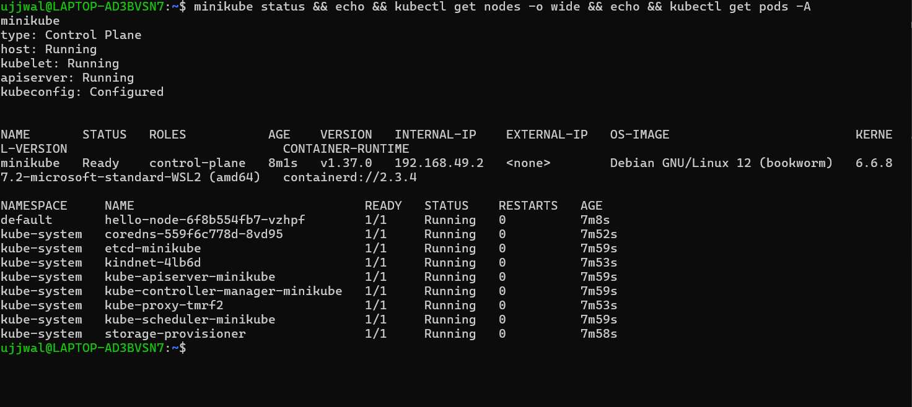
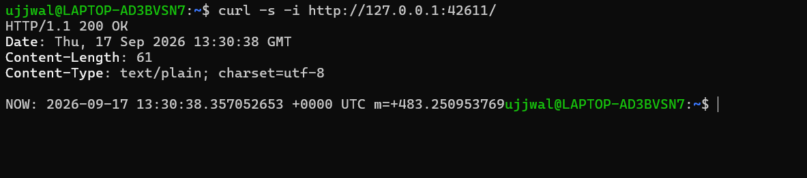
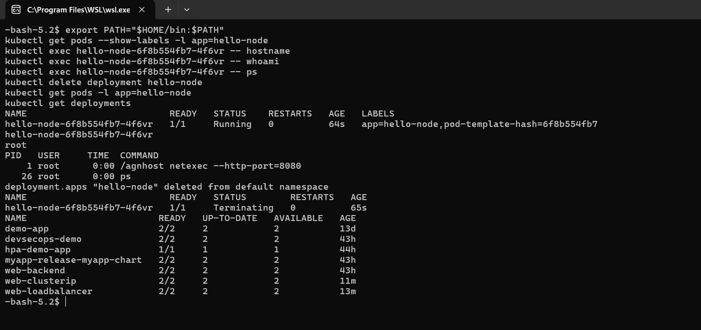

# Kubernetes Fundamentals

**Student Name:** Ujjwal Jain
**Roll Number:** 24bcs10173
**Section:** Section B

The exact breakdown of what was required is documented in [ques.md](ques.md). I ran every command below inside WSL2 (Ubuntu), with Docker Desktop as the backing engine (WSL integration enabled for the Ubuntu distribution, so `docker` inside WSL talks to the same Docker Desktop engine), since on Windows 11 that is what "installing Minikube on Linux" means in practice.

---

## Task 1: Kubernetes Architecture

I went through `kubernetes.io/docs/concepts/architecture/` directly rather than relying on secondhand tutorial write-ups, since that was what was emphasized in class. Below is how I am mapping the official definitions to what was discussed in the lecture.

### Control plane components

| Component | Official docs definition | How it was framed in class |
|---|---|---|
| **kube-apiserver** | "The API server is a component of the Kubernetes control plane that exposes the Kubernetes API. The API server is the front end for the Kubernetes control plane." | The "front door and security guard": nothing talks to anything else in the cluster directly, it all routes through here |
| **etcd** | "Consistent and highly-available key value store used as Kubernetes' backing store for all cluster data." | The database that holds cluster state and all the API object information |
| **kube-scheduler** | "Watches for newly created Pods with no assigned node, and selects a node for them to run on," based on resource requirements, constraints, affinity rules, data locality, deadlines, etc. | It picks which node a new Pod lands on, based on available resources |
| **kube-controller-manager** | Runs controller processes, logically separate controllers, compiled into one binary/process. Includes the Node controller, Job controller, EndpointSlice controller, ServiceAccount controller. | Reconciliation loops that compare desired state against actual state (the ReplicaSet controller and Node controller were the ones called out in class) |
| **cloud-controller-manager** | Embeds cloud-provider-specific logic (node/route/service controllers), only runs in actual cloud environments. | Mentioned as optional and cloud-only; it does not apply to a local Minikube setup, which is exactly why it never shows up in `kubectl get pods -A` below |

### Worker node components

| Component | Official docs definition | How it was framed in class |
|---|---|---|
| **kubelet** | "An agent that runs on each node... makes sure containers are running in Pods," reports status back to the control plane | Watches Pods on the node, sends heartbeat and status information to the API server, and actually creates and stops Pods as instructed |
| **kube-proxy** | Network proxy maintaining Service networking rules; *optional* if a CNI plugin does its own proxying | Handles node-level networking; called "optional but part of the standard setup" in class |
| **Container runtime (CRI)** | The software that actually runs containers | Kubernetes defaults to containerd; other CRI-compliant runtimes are swappable |

### The flow that actually matters

The one point I wanted to make sure I genuinely understood, rather than simply memorizing the component list, is that the API server is the only thing every other component talks to. The scheduler does not tell the kubelet directly to run a given pod on a given node. Instead, it writes that decision back through the API server, which persists it via etcd, and the kubelet on the target node watches the API server and picks up the decision from there. The same is true for controllers: they watch the API server for drift between desired and actual state and issue corrections back through it. Nothing in this architecture talks peer-to-peer.

That maps directly onto the `kubectl get pods -A` output further down. Every one of those `kube-system` pods (etcd, apiserver, scheduler, controller-manager, kube-proxy, CoreDNS) is a real, individually running process, even on a tiny single-node Minikube cluster, which made the point that these are not just abstract diagram boxes fairly concrete.

---

## Task 2: Installing Minikube (WSL2 Ubuntu)

I checked what was already on the machine first. Docker Desktop and `kubectl` (v1.34.1, bundled with Docker Desktop) were already present, but Minikube was not.

```bash
cd ~
curl -LO https://storage.googleapis.com/minikube/releases/latest/minikube-linux-amd64
sudo install minikube-linux-amd64 /usr/local/bin/minikube
```

The download itself was approximately 136MB. Installing to `/usr/local/bin` required `sudo`, which meant I had to run that one line myself in an interactive terminal, since a password prompt does not work over a scripted shell. Everything else in this document was run directly.

```text
$ minikube version
minikube version: v1.39.0
commit: 7a9f6a841470a207de8cf4bafcccee0969d8ba10

$ kubectl version --client
Client Version: v1.34.1
Kustomize Version: v5.7.1
```

I confirmed both binaries were working before moving on.

---

## Task 3: `minikube start` + `minikube status`

```bash
minikube start --driver=docker
```

The first real surprise in the output was that Minikube warned about memory before it even started pulling images:

```text
* minikube v1.39.0 on Ubuntu 24.04 (kvm/amd64)
* Using the docker driver based on user configuration

X The requested memory allocation of 3072MiB does not leave room for system overhead (total system memory: 3917MiB). You may face stability issues.
* Suggestion: Start minikube with less memory allocated: 'minikube start --memory=3072mb'

* Using Docker driver with root privileges
! For an improved experience it's recommended to use Docker Engine instead of Docker Desktop.
* Starting "minikube" primary control-plane node in "minikube" cluster
* Pulling base image v0.0.51 ...
* Downloading Kubernetes v1.37.0 preload ...
```


Once it finished pulling images and provisioning, the status command showed:

```text
$ minikube status
minikube
type: Control Plane
host: Running
kubelet: Running
apiserver: Running
kubeconfig: Configured
```

Control plane, kubelet, and API server all report `Running`, which is the actual pass/fail signal the instructor pointed to.

I went a step further and checked the cluster from `kubectl`'s side as well, since that is the CLI the instructor uses for inspection:

```text
$ kubectl get nodes -o wide
NAME       STATUS   ROLES           AGE   VERSION   INTERNAL-IP    EXTERNAL-IP   OS-IMAGE                         KERNEL-VERSION                             CONTAINER-RUNTIME
minikube   Ready    control-plane   34s   v1.37.0   192.168.49.2   <none>        Debian GNU/Linux 12 (bookworm)   6.6.87.2-microsoft-standard-WSL2 (amd64)   containerd://2.3.4

$ kubectl cluster-info
Kubernetes control plane is running at https://127.0.0.1:64437
CoreDNS is running at https://127.0.0.1:64437/api/v1/namespaces/kube-system/services/kube-dns:dns/proxy

$ kubectl get pods -A
NAMESPACE     NAME                               READY   STATUS    RESTARTS   AGE
kube-system   coredns-559f6c778d-8vd95           1/1     Running   0          26s
kube-system   etcd-minikube                      1/1     Running   0          33s
kube-system   kindnet-4lb6d                      1/1     Running   0          27s
kube-system   kube-apiserver-minikube            1/1     Running   0          33s
kube-system   kube-controller-manager-minikube   1/1     Running   0          33s
kube-system   kube-proxy-tmrf2                   1/1     Running   0          27s
kube-system   kube-scheduler-minikube            1/1     Running   0          33s
kube-system   storage-provisioner                1/1     Running   0          32s
```

The container runtime confirms `containerd`, exactly matching the default mentioned in class. This is the concrete proof moment for Task 1 above: `etcd-minikube`, `kube-apiserver-minikube`, `kube-scheduler-minikube`, and `kube-controller-manager-minikube` are each individually running Pods, not just theoretical boxes on a slide.

### Screenshot Verification (Minikube Status & Cluster Check)


---

## Task 3.5: `minikube stop`, cleanly powering down the cluster

I missed this the first time through, so I went back and actually ran it, since `minikube start` without `minikube stop` is only half the lifecycle:

```bash
minikube stop
```
```text
* Stopping node "minikube"  ...
* Powering off "minikube" via SSH ...
* 1 node stopped.
```

```bash
minikube status
```
```text
minikube
type: Control Plane
host: Stopped
kubelet: Stopped
apiserver: Stopped
kubeconfig: Stopped
```

Every component flips to `Stopped`, including `kubeconfig`. At this point `kubectl` genuinely has nothing to talk to (any `kubectl get pods` here would simply hang or error, not silently succeed). I brought it back up right after with a plain `minikube start` to keep working on the rest of this module. `minikube stop` does not delete anything; it just powers down the container or VM, so everything (Pods, Deployments, the whole cluster state) came back exactly as it was.

---

## Task 4: Hello Minikube, deploying an application

To confirm Minikube is functional for real workloads end-to-end, beyond just starting the cluster, I walked through the official Hello Minikube deployment flow (`kubernetes.io/docs/tutorials/hello-minikube/`).

#### Step 1: Create the deployment

```bash
kubectl create deployment hello-node --image=registry.k8s.io/e2e-test-images/agnhost:2.53 -- /agnhost netexec --http-port=8080
```

```text
deployment.apps/hello-node created
```

#### Step 2: Confirm it actually came up

```text
$ kubectl get deployments
NAME         READY   UP-TO-DATE   AVAILABLE   AGE
hello-node   1/1     1            1           26s

$ kubectl get pods -o wide
NAME                          READY   STATUS    RESTARTS   AGE   IP           NODE       NOMINATED NODE   READINESS GATES
hello-node-6f8b554fb7-vzhpf   1/1     Running   0          26s   10.244.0.3   minikube   <none>           <none>
```

```text
$ kubectl logs hello-node-6f8b554fb7-vzhpf --tail=10
I0917 13:22:36.569412       1 log.go:245] Started HTTP server on port 8080
I0917 13:22:36.569935       1 log.go:245] Started UDP server on port  8081
```

#### Step 3: Expose it and actually hit it with curl

The tutorial uses `--type=LoadBalancer`, but on the Docker driver (Linux/WSL) `LoadBalancer` needs a separate `minikube tunnel` process anyway, so I used `NodePort` directly instead. This produces the same end result with one less moving part:

```text
$ kubectl expose deployment hello-node --type=NodePort --port=8080
service/hello-node exposed

$ kubectl get services
NAME         TYPE        CLUSTER-IP      EXTERNAL-IP   PORT(S)          AGE
hello-node   NodePort    10.104.174.54   <none>        8080:30453/TCP   1s
kubernetes   ClusterIP   10.96.0.1       <none>        443/TCP          87s
```

On the Docker driver, the node's own IP (`192.168.49.2`) is not directly reachable from the WSL host. Curling it directly timed out, which makes sense given that Minikube explicitly warns about this ("Because you are using a Docker driver on linux, the terminal needs to be open to run it"). I therefore ran the documented access command and used the local tunnel that it opens:

```bash
minikube service hello-node --url
# -> http://127.0.0.1:35793
```

```text
$ curl -s -i http://127.0.0.1:35793/
HTTP/1.1 200 OK
Date: Thu, 17 Sep 2026 13:25:06 GMT
Content-Length: 61
Content-Type: text/plain; charset=utf-8

NOW: 2026-09-17 13:25:06.899386671 +0000 UTC m=+150.883712382
```

A real `200 OK` with a live server-generated timestamp is about as end-to-end as this verification gets: Minikube installed, cluster started, workload scheduled, container running, networked and reachable from the host.

#### Full resource snapshot at the end

As a genuinely nice bonus, this output shows a **Pod**, a **ReplicaSet**, and a **Deployment** all in one place, exactly the three objects in this lecture's title, even though writing the YAML for them by hand is next session's work.

```text
$ kubectl get all -o wide
NAME                              READY   STATUS    RESTARTS   AGE     IP           NODE       CONTAINERS   IMAGES
pod/hello-node-6f8b554fb7-vzhpf   1/1     Running   0          3m19s   10.244.0.3   minikube   agnhost      registry.k8s.io/e2e-test-images/agnhost:2.53

NAME                 TYPE        CLUSTER-IP      EXTERNAL-IP   PORT(S)          AGE
service/hello-node   NodePort    10.104.174.54   <none>        8080:30453/TCP   2m45s
service/kubernetes   ClusterIP   10.96.0.1       <none>        443/TCP          4m11s

NAME                         READY   UP-TO-DATE   AVAILABLE   AGE     CONTAINERS   IMAGES
deployment.apps/hello-node   1/1     1            1           3m19s   agnhost      registry.k8s.io/e2e-test-images/agnhost:2.53

NAME                                    DESIRED   CURRENT   READY   AGE     CONTAINERS   IMAGES
replicaset.apps/hello-node-6f8b554fb7   1         1         1       3m19s   agnhost      registry.k8s.io/e2e-test-images/agnhost:2.53
```

It is worth noting for next session that I did not write a ReplicaSet or Deployment manifest by hand here. `kubectl create deployment` generated the Deployment, which in turn created the ReplicaSet, which in turn created the Pod. That cascading ownership chain, in which the Deployment owns the ReplicaSet and the ReplicaSet owns the Pod, is presumably exactly what we will be doing manually via YAML next.

### Screenshot Verification (Hello Minikube - Live Service Response)


#### Step 4: Labels, `kubectl exec`, and actually cleaning up

Every Pod created through a Deployment carries labels automatically; I checked them rather than assuming, then used `kubectl exec` to run real commands inside the container itself, not just observe it from the outside through `logs`:

```bash
kubectl get pods --show-labels -l app=hello-node
kubectl exec hello-node-6f8b554fb7-d2fdw -- hostname
kubectl exec hello-node-6f8b554fb7-d2fdw -- whoami
kubectl exec hello-node-6f8b554fb7-d2fdw -- ps
```
```text
NAME                          READY   STATUS    RESTARTS   AGE   LABELS
hello-node-6f8b554fb7-d2fdw   1/1     Running   0          9s    app=hello-node,pod-template-hash=6f8b554fb7

hello-node-6f8b554fb7-d2fdw
root

PID   USER     TIME  COMMAND
    1 root      0:00 /agnhost netexec --http-port=8080
   27 root      0:00 ps
```
The Pod's hostname inside the container is its own Pod name, a Kubernetes convention, and the container runs as `root` since the `agnhost` test image does not define a non-root user. `ps` shows exactly two processes: PID 1 is the actual application (`/agnhost netexec`), and PID 27 is the `ps` command itself, running inside the same container namespace. `pod-template-hash` is the label the ReplicaSet controller adds automatically to tell which Pods belong to which version of the Pod template, the same mechanism a rolling update relies on.

Finally, I cleaned up rather than leaving the Deployment running indefinitely:

```bash
kubectl delete deployment hello-node
kubectl get pods -l app=hello-node
kubectl get deployments
```
```text
deployment.apps "hello-node" deleted from default namespace

NAME                          READY   STATUS        RESTARTS   AGE
hello-node-6f8b554fb7-d2fdw   1/1     Terminating   0          16s

NAME        READY   UP-TO-DATE   AVAILABLE   AGE
(hello-node no longer listed)
```
Deleting the Deployment deletes the ReplicaSet it owns, which deletes the Pod it owns, the same ownership chain noted above, just running in reverse. The Pod shows `Terminating` for a moment rather than disappearing instantly, since the container gets a grace period to shut down cleanly.

### Screenshot Verification (labels, exec, cleanup)

