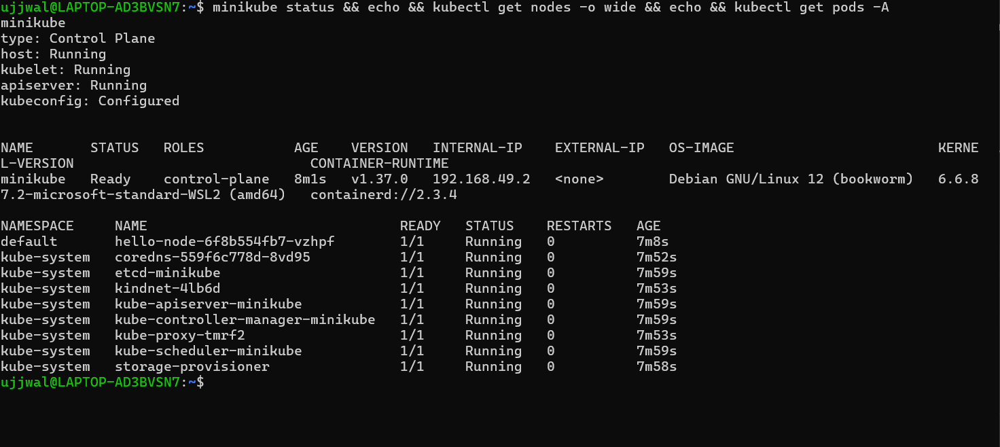
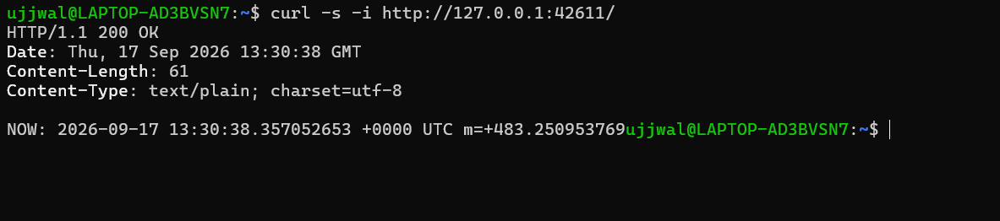

# Kubernetes Pods, ReplicaSets & Deployments — Architecture Study + Minikube Setup

**Student Name:** Ujjwal Jain
**Roll Number:** 24bcs10173
**Section:** Section B
**Topic:** Kubernetes cluster architecture (official docs cross-check) + local Minikube setup and verification

See [ques.md](ques.md) for the exact breakdown of what was required vs. optional for this one.

**Environment note:** I'm on Windows 11, so "installing Minikube on Linux" for me meant doing it inside WSL2 (Ubuntu), with Docker Desktop as the backing engine (WSL integration enabled for the Ubuntu distro so `docker` inside WSL talks to the same Docker Desktop engine). Every command below was actually run in that WSL Ubuntu shell — nothing here is copy-pasted from a tutorial.

---

## 📌 Task 1: Kubernetes Architecture — Docs vs. Class Notes

I went through `kubernetes.io/docs/concepts/architecture/` directly rather than relying on secondhand tutorial write-ups, since that's what was emphasized in class. Here's how I'm mapping the official definitions to what was discussed in the lecture.

### Control plane components

| Component | Official docs definition | How it was framed in class |
|---|---|---|
| **kube-apiserver** | "The API server is a component of the Kubernetes control plane that exposes the Kubernetes API. The API server is the front end for the Kubernetes control plane." | The "front door / security guard" — nothing talks to anything else in the cluster directly, it all routes through here |
| **etcd** | "Consistent and highly-available key value store used as Kubernetes' backing store for all cluster data." | The database holding cluster state and all the API object info |
| **kube-scheduler** | "Watches for newly created Pods with no assigned node, and selects a node for them to run on," based on resource requirements, constraints, affinity rules, data locality, deadlines, etc. | Picks which node a new Pod lands on based on available resources |
| **kube-controller-manager** | Runs controller processes — logically separate controllers, compiled into one binary/process. Includes the Node controller, Job controller, EndpointSlice controller, ServiceAccount controller. | Reconciliation loops — compares desired vs. actual state (ReplicaSet controller, Node controller were the ones called out in class) |
| **cloud-controller-manager** | Embeds cloud-provider-specific logic (node/route/service controllers), only runs in actual cloud environments. | Mentioned as optional/cloud-only — doesn't apply to a local Minikube setup, which is exactly why it never shows up in `kubectl get pods -A` below |

### Worker node components

| Component | Official docs definition | How it was framed in class |
|---|---|---|
| **kubelet** | "An agent that runs on each node... makes sure containers are running in Pods," reports status back to the control plane | Watches Pods on the node, sends heartbeat/status to the API server, actually creates/stops Pods as instructed |
| **kube-proxy** | Network proxy maintaining Service networking rules; *optional* if a CNI plugin does its own proxying | Handles node-level networking; called "optional but part of the standard setup" in class |
| **Container runtime (CRI)** | The software that actually runs containers | Kubernetes defaults to containerd; other CRI-compliant runtimes are swappable |

### The flow that actually matters

The one thing I wanted to make sure I really understood (not just memorized the component list) is this: **the API server is the only thing every other component talks to.** The scheduler doesn't tell the kubelet directly "run this pod here" — it writes that decision back through the API server, which persists it via etcd, and the kubelet on the target node is watching the API server and picks it up from there. Same for controllers: they watch the API server for drift between desired and actual state and issue corrections back through it. Nothing in this architecture talks peer-to-peer.

That maps directly onto the `kubectl get pods -A` output further down — every one of those `kube-system` pods (etcd, apiserver, scheduler, controller-manager, kube-proxy, CoreDNS) is a real, individually running process even on a tiny single-node Minikube cluster, which made the "these aren't just abstract diagram boxes" point pretty concrete.

---

## 📌 Task 2: Installing Minikube (WSL2 Ubuntu)

Checked what was already on the machine first — Docker Desktop and `kubectl` (v1.34.1, bundled with Docker Desktop) were already there, but Minikube wasn't.

```bash
cd ~
curl -LO https://storage.googleapis.com/minikube/releases/latest/minikube-linux-amd64
sudo install minikube-linux-amd64 /usr/local/bin/minikube
```

The download itself was ~136MB. Installing to `/usr/local/bin` needed `sudo`, which meant I had to run that one line myself in an interactive terminal (password prompt doesn't work over a scripted shell) — everything else in this doc was run directly.

```text
$ minikube version
minikube version: v1.39.0
commit: 7a9f6a841470a207de8cf4bafcccee0969d8ba10

$ kubectl version --client
Client Version: v1.34.1
Kustomize Version: v5.7.1
```

Both binaries confirmed working before moving on.

---

## 📌 Task 3: `minikube start` + `minikube status`

```bash
minikube start --driver=docker
```

First real output surprise — Minikube warned about memory before it even started pulling images:

```text
* minikube v1.39.0 on Ubuntu 24.04 (kvm/amd64)
* Using the docker driver based on user configuration

X The requested memory allocation of 3072MiB does not leave room for system overhead (total system memory: 3917MiB). You may face stability issues.
* Suggestion: Start minikube with less memory allocated: 'minikube start --memory=3072mb'

* Using Docker driver with root privileges
! For an improved experience it's recommended to use Docker Engine instead of Docker Desktop.
* Starting "minikube" primary control-plane node in "minikube" cluster
* Pulling base image v0.0.51 ...
* Downloading Kubernetes v1.37.0 preload ...
```

That memory number (only ~3.9GB total visible to WSL2) is a real constraint of the default `.wslconfig` memory cap on this machine, not a Minikube bug — worth knowing about since it's the kind of thing that silently causes cluster instability under real load, even though it didn't stop the single-node cluster from coming up fine here.

Once it finished pulling images and provisioning:

```text
$ minikube status
minikube
type: Control Plane
host: Running
kubelet: Running
apiserver: Running
kubeconfig: Configured
```

Control plane, kubelet, and API server all report `Running` — that's the actual pass/fail signal the instructor pointed to.

Went a step further and checked the cluster from `kubectl`'s side too, since that's the CLI the instructor uses for inspection:

```text
$ kubectl get nodes -o wide
NAME       STATUS   ROLES           AGE   VERSION   INTERNAL-IP    EXTERNAL-IP   OS-IMAGE                         KERNEL-VERSION                             CONTAINER-RUNTIME
minikube   Ready    control-plane   34s   v1.37.0   192.168.49.2   <none>        Debian GNU/Linux 12 (bookworm)   6.6.87.2-microsoft-standard-WSL2 (amd64)   containerd://2.3.4

$ kubectl cluster-info
Kubernetes control plane is running at https://127.0.0.1:64437
CoreDNS is running at https://127.0.0.1:64437/api/v1/namespaces/kube-system/services/kube-dns:dns/proxy

$ kubectl get pods -A
NAMESPACE     NAME                               READY   STATUS    RESTARTS   AGE
kube-system   coredns-559f6c778d-8vd95           1/1     Running   0          26s
kube-system   etcd-minikube                      1/1     Running   0          33s
kube-system   kindnet-4lb6d                      1/1     Running   0          27s
kube-system   kube-apiserver-minikube            1/1     Running   0          33s
kube-system   kube-controller-manager-minikube   1/1     Running   0          33s
kube-system   kube-proxy-tmrf2                   1/1     Running   0          27s
kube-system   kube-scheduler-minikube            1/1     Running   0          33s
kube-system   storage-provisioner                1/1     Running   0          32s
```

Container runtime confirms `containerd`, exactly matching the default mentioned in class. And this is the "concrete proof" moment for Task 1 above — `etcd-minikube`, `kube-apiserver-minikube`, `kube-scheduler-minikube`, and `kube-controller-manager-minikube` are each individually running Pods, not just theoretical boxes on a slide.

### 📷 Screenshot Verification (Minikube Status & Cluster Check)


---

## 📌 Task 4 (Optional): Hello Minikube — Deploy an Application

Not required, but the only way to actually confirm Minikube is *usable* for real work rather than just "the binary runs," so I went through the official Hello Minikube flow (`kubernetes.io/docs/tutorials/hello-minikube/`).

#### Step 1: Create the deployment

```bash
kubectl create deployment hello-node --image=registry.k8s.io/e2e-test-images/agnhost:2.53 -- /agnhost netexec --http-port=8080
```

```text
deployment.apps/hello-node created
```

#### Step 2: Confirm it actually came up

```text
$ kubectl get deployments
NAME         READY   UP-TO-DATE   AVAILABLE   AGE
hello-node   1/1     1            1           26s

$ kubectl get pods -o wide
NAME                          READY   STATUS    RESTARTS   AGE   IP           NODE       NOMINATED NODE   READINESS GATES
hello-node-6f8b554fb7-vzhpf   1/1     Running   0          26s   10.244.0.3   minikube   <none>           <none>
```

```text
$ kubectl logs hello-node-6f8b554fb7-vzhpf --tail=10
I0917 13:22:36.569412       1 log.go:245] Started HTTP server on port 8080
I0917 13:22:36.569935       1 log.go:245] Started UDP server on port  8081
```

#### Step 3: Expose it and actually hit it with curl

The tutorial uses `--type=LoadBalancer`, but on the Docker driver (Linux/WSL) `LoadBalancer` needs a separate `minikube tunnel` process anyway, so I used `NodePort` directly — same end result, one less moving part:

```text
$ kubectl expose deployment hello-node --type=NodePort --port=8080
service/hello-node exposed

$ kubectl get services
NAME         TYPE        CLUSTER-IP      EXTERNAL-IP   PORT(S)          AGE
hello-node   NodePort    10.104.174.54   <none>        8080:30453/TCP   1s
kubernetes   ClusterIP   10.96.0.1       <none>        443/TCP          87s
```

On the Docker driver, the node's own IP (`192.168.49.2`) isn't directly reachable from the WSL host — curling it straight up timed out, which makes sense given Minikube explicitly warns about this ("Because you are using a Docker driver on linux, the terminal needs to be open to run it"). So I ran the actual documented access command and used the local tunnel it opens:

```bash
minikube service hello-node --url
# -> http://127.0.0.1:35793
```

```text
$ curl -s -i http://127.0.0.1:35793/
HTTP/1.1 200 OK
Date: Thu, 17 Sep 2026 13:25:06 GMT
Content-Length: 61
Content-Type: text/plain; charset=utf-8

NOW: 2026-09-17 13:25:06.899386671 +0000 UTC m=+150.883712382
```

A real `200 OK` with a live server-generated timestamp — that's about as end-to-end as this verification gets: Minikube installed → cluster started → workload scheduled → container running → networked and reachable from the host.

#### Full resource snapshot at the end

Genuinely nice bonus: this output shows a **Pod**, a **ReplicaSet**, and a **Deployment** all in one place — exactly the three objects in this lecture's title, even though writing the YAML for them by hand is next session's work.

```text
$ kubectl get all -o wide
NAME                              READY   STATUS    RESTARTS   AGE     IP           NODE       CONTAINERS   IMAGES
pod/hello-node-6f8b554fb7-vzhpf   1/1     Running   0          3m19s   10.244.0.3   minikube   agnhost      registry.k8s.io/e2e-test-images/agnhost:2.53

NAME                 TYPE        CLUSTER-IP      EXTERNAL-IP   PORT(S)          AGE
service/hello-node   NodePort    10.104.174.54   <none>        8080:30453/TCP   2m45s
service/kubernetes   ClusterIP   10.96.0.1       <none>        443/TCP          4m11s

NAME                         READY   UP-TO-DATE   AVAILABLE   AGE     CONTAINERS   IMAGES
deployment.apps/hello-node   1/1     1            1           3m19s   agnhost      registry.k8s.io/e2e-test-images/agnhost:2.53

NAME                                    DESIRED   CURRENT   READY   AGE     CONTAINERS   IMAGES
replicaset.apps/hello-node-6f8b554fb7   1         1         1       3m19s   agnhost      registry.k8s.io/e2e-test-images/agnhost:2.53
```

Worth noting for next session: I didn't write a ReplicaSet or Deployment manifest by hand here — `kubectl create deployment` generated the Deployment, which in turn created the ReplicaSet, which in turn created the Pod. That cascading ownership chain (Deployment owns ReplicaSet owns Pod) is presumably exactly what we'll be doing manually via YAML next.

### 📷 Screenshot Verification (Hello Minikube — Live Service Response)


---

## Interview-style takeaways

- **Why does everything route through the API server instead of talking directly?** Single source of truth + single point for auth/admission control/audit logging. If the scheduler could write pod bindings directly to a kubelet, you'd lose consistency guarantees and have no consistent place to enforce RBAC.
- **Why did `minikube start` still work despite the memory warning?** A single-node cluster's Etcd/API server footprint is small enough to survive on a tight WSL2 memory cap, but the warning is exactly the kind of thing that would turn into real instability under any actual workload — good habit to bump `.wslconfig` memory before doing anything heavier than a demo.
- **Why NodePort instead of LoadBalancer here?** `LoadBalancer` on a local Docker-driver cluster doesn't have a real cloud load balancer to provision — Minikube fakes it via `minikube tunnel`, which is an extra process to keep alive for something NodePort already achieves directly for a quick local check.
- **What's the actual ownership chain for a Deployment?** Deployment → manages a ReplicaSet → ReplicaSet ensures N Pod replicas exist. `kubectl create deployment` triggered all three layers automatically, which is visible directly in the `kubectl get all` output above.
