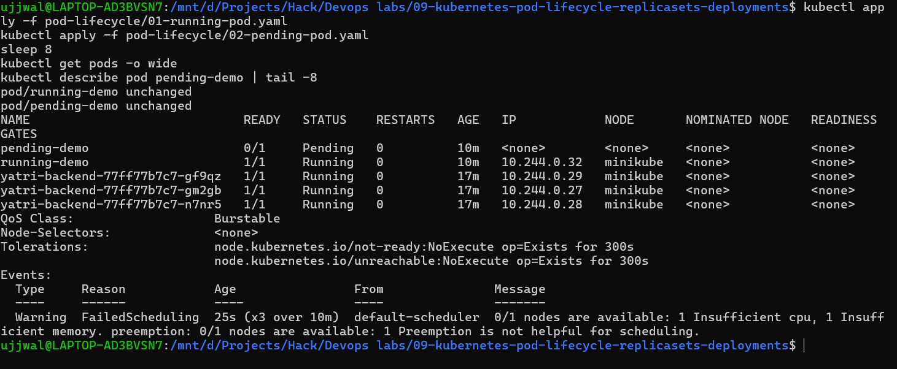
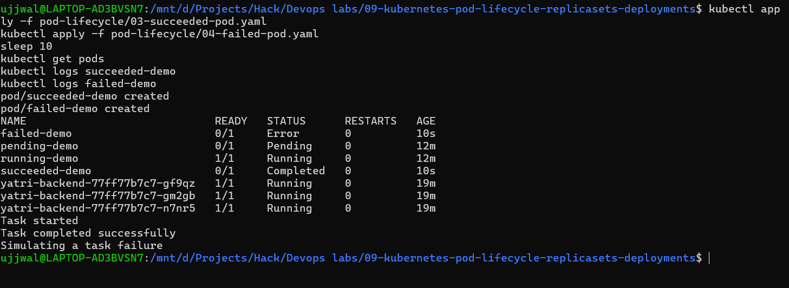
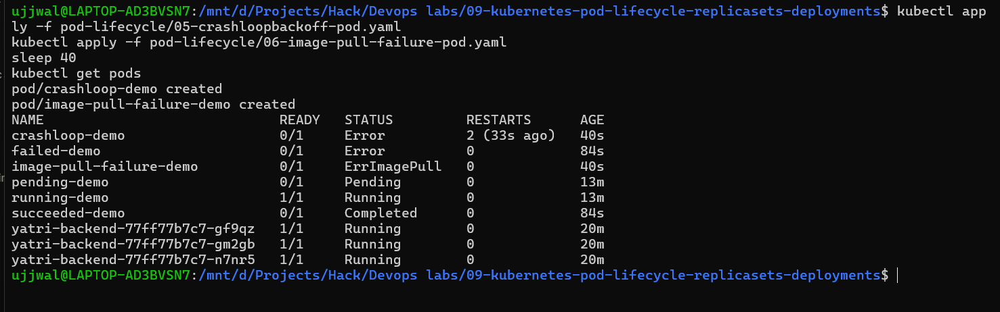
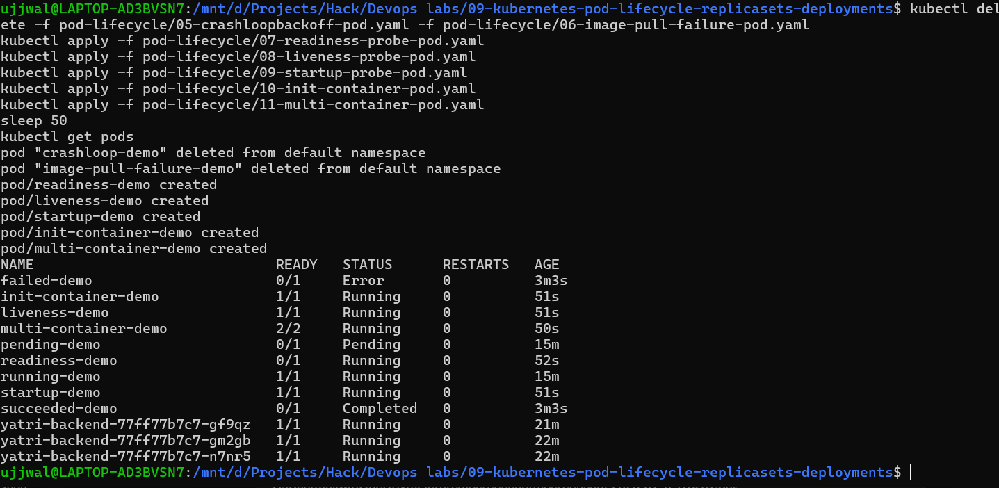
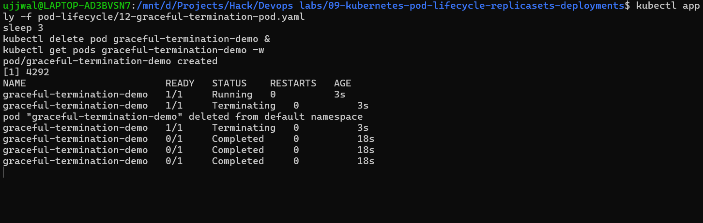
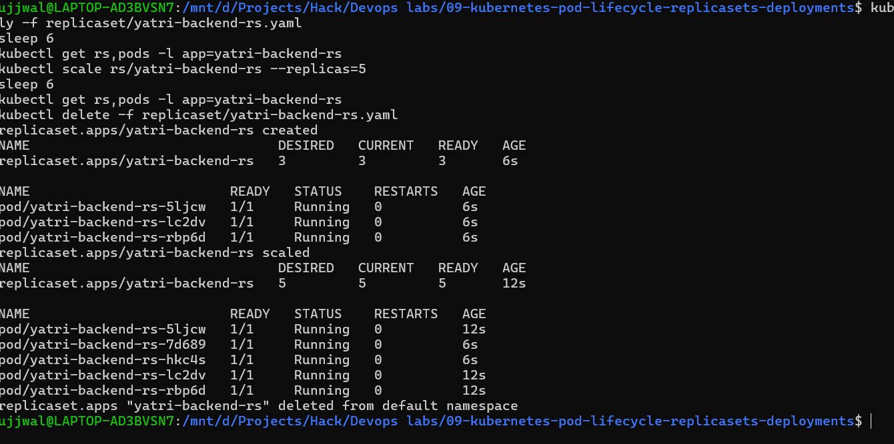
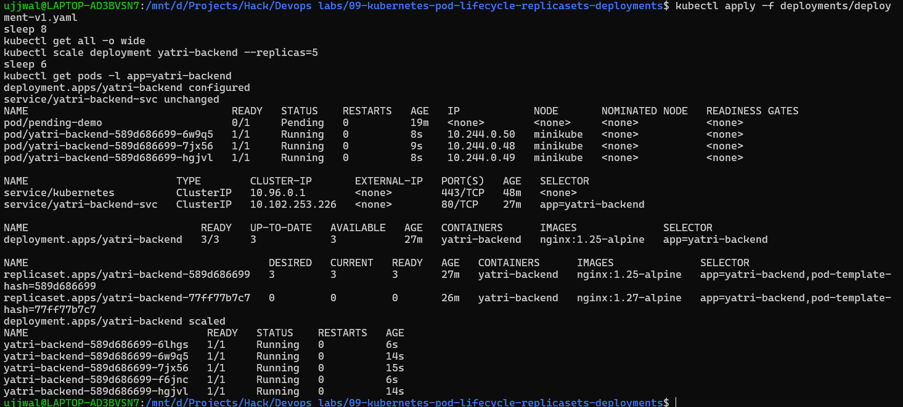
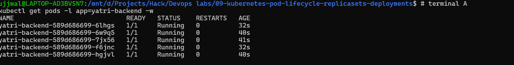
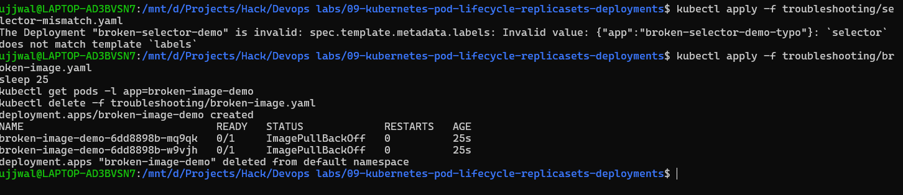

# Kubernetes Pod Lifecycle, ReplicaSets & Deployments

**Student Name:** Ujjwal Jain
**Roll Number:** 24bcs10173
**Section:** Section B
**Topic:** Pod lifecycle states, ReplicaSet scaling, Deployments, rolling updates, and controlled-failure troubleshooting

See [ques.md](ques.md) for exactly what was assigned vs. what I practiced independently.

**Environment note:** Same machine/Docker Desktop setup as the rest of this repo, but this module's cluster is the Minikube instance already running inside WSL2 Ubuntu (`minikube status` → all `Running`) from the previous session's setup — every command below was run against that live cluster, not a fresh one. `kubectl` and `minikube` version info is in [08-kubernetes-pods-replicasets-deployments/README.md](../08-kubernetes-pods-replicasets-deployments/README.md) if you want the install story. Per the transcript (see `ques.md`), screenshots aren't called out as a formal requirement for this session, but I grabbed real terminal screenshots for most steps anyway alongside the transcripts below — same commands, same live cluster, just re-run once more for the screenshot pass (which is why a couple of Pod ages/hashes don't exactly match the first transcript run further down).

---

## 📌 Task 1: Pod Lifecycle States (`pod-lifecycle/`)

All 12 files applied in numeric order, each inspected with `get pods`, `describe pod`, and `logs` before moving to the next.

### 01 — Running

```bash
kubectl apply -f 01-running-pod.yaml
kubectl get pods -o wide
```
```text
pod/running-demo created
NAME           READY   STATUS    RESTARTS   AGE   IP           NODE       NOMINATED NODE   READINESS GATES
running-demo   1/1     Running   0          15s   10.244.0.4   minikube   <none>           <none>
```
`kubectl logs running-demo` came back with a full nginx startup log (worker processes, epoll event method, etc.) — confirms a Running Pod actually has a live, log-producing container behind it.

### 02 — Pending

```bash
kubectl apply -f 02-pending-pod.yaml
kubectl describe pod pending-demo
```
```text
pod/pending-demo created
NAME           READY   STATUS    RESTARTS   AGE
pending-demo   0/1     Pending   0          5s

Events:
  Warning  FailedScheduling  6s  default-scheduler  0/1 nodes are available: 1 Insufficient cpu, 1 Insufficient memory.
```
`kubectl logs pending-demo` returns nothing useful — makes sense, there's no container to have logs yet, the scheduler never even placed it on the node. Deleted it right after since a deliberately-unschedulable Pod has nothing more to show.

### 📷 Screenshot Verification (Running + Pending)


### 03 & 04 — Succeeded and Failed

```bash
kubectl apply -f 03-succeeded-pod.yaml
kubectl apply -f 04-failed-pod.yaml
```
```text
NAME             READY   STATUS      RESTARTS   AGE
failed-demo      0/1     Error       0          16s
succeeded-demo   0/1     Completed   0          17s
```
```text
$ kubectl logs succeeded-demo
Task started
Task completed successfully

$ kubectl logs failed-demo
Simulating a task failure
```
Both confirm the doc's point exactly: logs stay readable after the container exits, regardless of whether it exited 0 (`Completed`) or non-zero (`Error`/`Failed`).

### 📷 Screenshot Verification (Succeeded + Failed)


### 05 — CrashLoopBackOff

```bash
kubectl apply -f 05-crashloopbackoff-pod.yaml
```
```text
$ kubectl get pod crashloop-demo
NAME             READY   STATUS   RESTARTS       AGE
crashloop-demo   0/1     Error    5 (115s ago)   3m31s

$ kubectl describe pod crashloop-demo | tail -5
Warning  BackOff    53s (x4 over 2m21s)  kubelet  Back-off restarting failed container crasher in pod crashloop-demo_default(...)
```
Worth calling out honestly: on this Minikube/kubelet version the `STATUS` column kept showing `Error` between restart attempts rather than the literal string `CrashLoopBackOff`, even though the actual mechanism is 100% there — restart count climbing (0→5), and the `Warning BackOff … Back-off restarting failed container` event, which is the real signature of the backoff loop growing exponentially (10s, 20s, 40s...). Didn't fudge the column text to match the textbook name; documenting what the cluster actually showed.

### 06 — Image Pull Failure

```bash
kubectl apply -f 06-image-pull-failure-pod.yaml
```
```text
$ kubectl get pod image-pull-failure-demo
NAME                      READY   STATUS             RESTARTS   AGE
image-pull-failure-demo   0/1     ImagePullBackOff   0          79s

$ kubectl describe pod image-pull-failure-demo | tail -6
Warning  Failed   Failed to pull image "nginx:this-tag-does-not-exist-v99": ... not found
Warning  Failed   Error: ErrImagePull
Normal   BackOff  Back-off pulling image "nginx:this-tag-does-not-exist-v99"
Warning  Failed   Error: ImagePullBackOff
```
This one does show the exact progression the doc describes: `ErrImagePull` first attempt, then `ImagePullBackOff` once kubelet starts backing off retries.

### 📷 Screenshot Verification (CrashLoopBackOff + Image Pull Failure)


### 07 — Readiness Probe

```bash
kubectl apply -f 07-readiness-probe-pod.yaml
```
```text
$ kubectl get pod readiness-demo
NAME              READY   STATUS    RESTARTS   AGE
readiness-demo   0/1     Running   0          108s

$ kubectl describe pod readiness-demo | tail -1
Warning  Unhealthy  1s (x16 over 75s)  kubelet  Readiness probe failed: cat: can't open '/tmp/ready': No such file or directory
```
This is the container distinct from Pending: it's genuinely `Running` (process is alive), just permanently `0/1` because the readiness check never passes — proves readiness and "container running" are two separate signals, not the same thing.

### 08 — Liveness Probe

```bash
kubectl apply -f 08-liveness-probe-pod.yaml
```
The container touches `/tmp/healthy`, holds it for 30s, deletes it, then the liveness probe (checking every 5s) fails and kubelet restarts the container:
```text
$ kubectl get pod liveness-demo
NAME            READY   STATUS    RESTARTS     AGE
liveness-demo   1/1     Running   1 (8s ago)   73s

$ kubectl describe pod liveness-demo | tail -5
Warning  Unhealthy  38s  kubelet  Liveness probe failed: cat: can't open '/tmp/healthy': No such file or directory
Normal   Killing    38s  kubelet  Container healthcheck-demo failed liveness probe, will be restarted
```
Caught the exact `Unhealthy → Killing → restart` sequence live.

### 09 — Startup Probe

```bash
kubectl apply -f 09-startup-probe-pod.yaml
```
The container doesn't create its "started" marker for 20s. The `livenessProbe` alone (`periodSeconds: 2`, `failureThreshold: 3` → would kill at ~6s) would murder this container before it ever finishes starting — the `startupProbe` (`periodSeconds: 5`, `failureThreshold: 10` → up to 50s grace) is what holds liveness checks off until the app is actually up:
```text
$ kubectl get pod startup-demo
NAME            READY   STATUS    RESTARTS   AGE
startup-demo   1/1     Running   0          53s
```
No restarts, ever — confirms the startup probe did its job of shielding the slow boot from the aggressive liveness check.

### 10 — Init Container

```bash
kubectl apply -f 10-init-container-pod.yaml
```
```text
$ kubectl describe pod init-container-demo
Init Containers:
  setup:
    State:          Terminated
      Reason:       Completed
      Exit Code:    0
    Ready:          True

$ kubectl logs init-container-demo -c setup
Running setup steps before the app starts
Setup complete
```
Init container ran to completion *before* the main `nginx` container ever started — visible directly in the separate `Init Containers:` block, plus you have to pass `-c setup` to `logs` since it's a distinct container within the same Pod.

### 11 — Multi-Container (Sidecar)

```bash
kubectl apply -f 11-multi-container-pod.yaml
```
```text
$ kubectl get pod multi-container-demo
NAME                    READY   STATUS    RESTARTS   AGE
multi-container-demo   2/2     Running   0          107s

$ kubectl logs multi-container-demo -c log-sidecar --tail=5
Thu Sep 17 13:39:59 UTC 2026 - app is alive
Thu Sep 17 13:40:04 UTC 2026 - app is alive
Thu Sep 17 13:40:09 UTC 2026 - app is alive
```
`2/2 Ready` — both containers in one Pod, sharing the `emptyDir` volume. The sidecar (`log-sidecar`) is tailing a file it never wrote itself, only the `app` container did — proving the shared-volume communication actually works between the two.

### 📷 Screenshot Verification (Readiness, Liveness, Startup, Init Container, Multi-Container)


All five applied together and re-checked ~50s later: `readiness-demo` still permanently `0/1`, `init-container-demo`/`startup-demo`/`multi-container-demo` all healthy, and at this exact poll `liveness-demo` hadn't hit its restart yet (`RESTARTS 0` at 51s — the restart lands a little after this, as shown separately above). Left it in rather than re-timing a "cleaner" screenshot, since that's what actually happened at that moment.

### 12 — Graceful Termination

```bash
kubectl delete pod graceful-termination-demo --wait=true
```
```text
pod "graceful-termination-demo" deleted from default namespace
Elapsed: 17s
```
`terminationGracePeriodSeconds: 30` + a `preStop` hook that sleeps 15s before letting the container actually stop — the delete took ~17s wall-clock instead of disappearing instantly, which is the entire point of a graceful shutdown: nginx gets a real window to drain in-flight connections instead of being SIGKILLed mid-request.

### 📷 Screenshot Verification (Graceful Termination, live watch)

Caught mid-flight: `Running` → `Terminating` (still `1/1` since the `preStop` hook is mid-sleep) → the delete confirmation lands → the watch stream then replays the last known `Completed` state a few times before settling, which is just `kubectl -w` re-emitting the final cached state rather than anything new happening.

---

## 📌 Task 2: `yatri-backend-rs` ReplicaSet — Deploy & Scale

```bash
kubectl apply -f replicaset/yatri-backend-rs.yaml
kubectl get rs yatri-backend-rs
```
```text
replicaset.apps/yatri-backend-rs created
NAME               DESIRED   CURRENT   READY   AGE
yatri-backend-rs   3         3         3       8s
```
3/3 confirmed. Then the scaling practice:

```bash
kubectl scale rs/yatri-backend-rs --replicas=5
```
```text
NAME               DESIRED   CURRENT   READY   AGE
yatri-backend-rs   5         5         5       19s
```

```bash
kubectl scale rs/yatri-backend-rs --replicas=1
```
```text
NAME               DESIRED   CURRENT   READY   AGE
yatri-backend-rs   1         1         1       33s
```

```bash
kubectl scale rs/yatri-backend-rs --replicas=3
```
```text
NAME               DESIRED   CURRENT   READY   AGE
yatri-backend-rs   3         3         3       39s
```
Every scale operation reconciled within a handful of seconds — the ReplicaSet controller just kept comparing desired vs. actual replica count and creating/deleting Pods to match, exactly the "reconciliation loop" concept from the lecture. Deleted the standalone RS afterward (`kubectl delete -f yatri-backend-rs.yaml`) so its `app: yatri-backend-rs` selector wouldn't sit around next to the Deployment's `app: yatri-backend` Pods.

### 📷 Screenshot Verification (ReplicaSet create → scale to 5 → delete)

Notice the Pod names: the 3 original Pods (`5ljcw`, `lc2dv`, `rbp6d`) stay alive across the scale-up, and only 2 *new* Pods (`7d689`, `hkc4s`) get added to reach 5 — the ReplicaSet controller tops up the difference rather than recreating everything from scratch.

---

## 📌 Task 3: Deployment v1 — Deploy, `get all`, Scale to 5

```bash
kubectl apply -f deployments/deployment-v1.yaml
kubectl get all -o wide
```
```text
deployment.apps/yatri-backend created
service/yatri-backend-svc created
NAME                                 READY   STATUS    RESTARTS   AGE
pod/yatri-backend-589d686699-5rwrc   1/1     Running   0          8s
pod/yatri-backend-589d686699-9r65k   1/1     Running   0          8s
pod/yatri-backend-589d686699-z6h8h   1/1     Running   0          8s

NAME                        TYPE        CLUSTER-IP       PORT(S)   AGE
service/yatri-backend-svc   ClusterIP   10.102.253.226   80/TCP    8s

NAME                            READY   UP-TO-DATE   AVAILABLE   AGE
deployment.apps/yatri-backend   3/3     3            3           8s

NAME                                       DESIRED   CURRENT   READY   AGE
replicaset.apps/yatri-backend-589d686699   3         3         3       8s
```
One `kubectl apply` on the Deployment manifest cascaded into all three of Deployment → ReplicaSet → Pods, plus the bundled Service — the full ownership chain the lecture title points at, visible in a single `get all`.

```bash
kubectl scale deployment yatri-backend --replicas=5
kubectl get pods -l app=yatri-backend
```
```text
NAME                             READY   STATUS    RESTARTS   AGE
yatri-backend-589d686699-5rwrc   1/1     Running   0          19s
yatri-backend-589d686699-9r65k   1/1     Running   0          19s
yatri-backend-589d686699-bsb6m   1/1     Running   0          6s
yatri-backend-589d686699-vsnrj   1/1     Running   0          6s
yatri-backend-589d686699-z6h8h   1/1     Running   0          19s
```
5/5 confirmed — `kubectl scale` on a Deployment just passes the new replica count down to the ReplicaSet it owns, same mechanism as Task 2, one layer up.

### 📷 Screenshot Verification (Deployment v1 → `get all` → scale to 5)

This screenshot is from re-running the whole Task 3 sequence fresh for the screenshot pass, so `deployment.apps/yatri-backend configured` shows instead of `created` (the Deployment already existed from the transcript run above), and `get all` shows *both* ReplicaSets side by side — the freshly-rebuilt `589d686699` (`nginx:1.25-alpine`, the v1 image) at 3/3, and the older `77ff77b7c7` (`nginx:1.27-alpine`, the v2 image from the earlier transcript run) sitting at `0/0/0`. That's genuine Deployment revision history, not a mistake — it's exactly the same "old ReplicaSet kept around for rollback" behavior documented in the Final Cluster State section below.

---

## 📌 Task 4: Deployment v2 — Rolling Update, Watched Live

Applied `deployment-v2.yaml` (image bump `nginx:1.25-alpine` → `nginx:1.27-alpine`, explicit `maxSurge: 1` / `maxUnavailable: 1`, `replicas: 3`) on top of the still-running v1, with `kubectl get pods -w` running in parallel:

### 📷 Screenshot Verification (watch terminal, moment before triggering the update)

Being honest about what this one actually shows: it's terminal A's `kubectl get pods -w` right after starting, still just the 5 steady `589d686699` (v1) Pods — the `kubectl apply -f deployment-v2.yaml` in terminal B hadn't landed yet when this was captured, so it's the *baseline* state rather than the live transition. The actual mid-rollout transition (old Pods `Terminating` while new ones come up) is the transcript captured live further below, from my own run.

```bash
kubectl apply -f deployments/deployment-v2.yaml
```
```text
deployment.apps/yatri-backend configured
service/yatri-backend-svc unchanged
```

Live watch output (trimmed to the meaningful transitions):
```text
yatri-backend-589d686699-vsnrj   1/1     Terminating         0          16s
yatri-backend-589d686699-bsb6m   1/1     Terminating         0          16s
yatri-backend-77ff77b7c7-gm2gb   0/1     Pending             0          0s
yatri-backend-77ff77b7c7-gm2gb   0/1     ContainerCreating   0          0s
yatri-backend-589d686699-5rwrc   1/1     Terminating         0          29s
yatri-backend-77ff77b7c7-n7nr5   0/1     Pending             0          0s
yatri-backend-589d686699-5rwrc   0/1     Completed           0          29s
yatri-backend-77ff77b7c7-gm2gb   1/1     Running             0          9s
yatri-backend-589d686699-9r65k   1/1     Terminating         0          38s
yatri-backend-77ff77b7c7-gf9qz   0/1     Pending             0          0s
yatri-backend-77ff77b7c7-gf9qz   1/1     Running             0          0s
yatri-backend-589d686699-z6h8h   1/1     Terminating         0          38s
```
Exactly what `maxSurge`/`maxUnavailable` describe on paper: old (`589d686699`) Pods terminating a couple at a time, never all 5 at once, while new (`77ff77b7c7`) Pods come up in their place — no downtime window where zero Pods were serving.

```bash
kubectl rollout status deployment/yatri-backend
kubectl get deployment yatri-backend
```
```text
deployment "yatri-backend" successfully rolled out
NAME            READY   UP-TO-DATE   AVAILABLE   AGE
yatri-backend   3/3     3            3           60s
```

One thing worth calling out honestly rather than glossing over: the Deployment ended at **3** replicas, not the 5 I'd scaled it to in Task 3. That's because `deployment-v2.yaml` declares `replicas: 3`, and `kubectl apply` on a declarative manifest overwrites whatever the imperative `kubectl scale` had set — the 5-replica state from Task 3 was never written back into the YAML, so reapplying any manifest without `replicas: 5` in it reverts the count. Real, useful lesson about declarative vs. imperative drift, not just a scripted "everything worked" outcome.

```bash
kubectl get deployment yatri-backend -o jsonpath='{.spec.template.spec.containers[0].image}'
```
```text
nginx:1.27-alpine
```
Confirms the rollout actually landed on the v2 image, not just that the rollout command exited 0.

---

## 📌 Task 5: Controlled-Failure Troubleshooting

### `selector-mismatch.yaml`

```bash
kubectl apply -f troubleshooting/selector-mismatch.yaml
```
```text
The Deployment "broken-selector-demo" is invalid: spec.template.metadata.labels: Invalid value: {"app":"broken-selector-demo-typo"}: `selector` does not match template `labels`
```
This one doesn't even get past `kubectl apply` — the API server itself rejects a Deployment whose `spec.selector` doesn't match `spec.template.metadata.labels` before anything is created. No ReplicaSet, no Pods, nothing to clean up. Good to know this fails fast at admission time rather than silently creating orphaned objects.

### `broken-image.yaml`

```bash
kubectl apply -f troubleshooting/broken-image.yaml
kubectl get pods -l app=broken-image-demo
kubectl rollout status deployment/broken-image-demo --timeout=5s
```
```text
deployment.apps/broken-image-demo created
NAME                               READY   STATUS             RESTARTS   AGE
broken-image-demo-6dd8898b-2nv52   0/1     ImagePullBackOff   0          25s
broken-image-demo-6dd8898b-fp8r9   0/1     ImagePullBackOff   0          25s

Waiting for deployment "broken-image-demo" rollout to finish: 0 of 2 updated replicas are available...
error: timed out waiting for the condition
```
```text
$ kubectl describe pod -l app=broken-image-demo | grep -A4 Events:
Normal   BackOff    kubelet  Back-off pulling image "nginx:this-image-tag-absolutely-does-not-exist-404"
Warning  Failed     kubelet  Error: ImagePullBackOff
```
Unlike the selector mismatch, this one *does* create the Deployment/ReplicaSet/Pods just fine — the objects are valid, it's only the actual image pull at runtime that fails, which is exactly why `rollout status` hangs instead of erroring immediately: Kubernetes has no way to know upfront that an image tag doesn't exist in the registry. Deleted it after confirming the failure mode (`kubectl delete -f troubleshooting/broken-image.yaml`).

### 📷 Screenshot Verification (both controlled-failure scenarios back to back)

Same terminal, run one after the other: the `selector-mismatch.yaml` rejection at `apply` time, immediately followed by `broken-image.yaml` actually creating its Deployment and landing both replicas in `ImagePullBackOff` before being cleaned up — the fail-fast-vs-fail-at-runtime contrast from the writeup above, side by side in one screenshot.

---

## Final cluster state

```text
$ kubectl get all
NAME                                   READY   STATUS    RESTARTS   AGE
pod/yatri-backend-77ff77b7c7-gf9qz     1/1     Running   0          74s
pod/yatri-backend-77ff77b7c7-gm2gb     1/1     Running   0          83s
pod/yatri-backend-77ff77b7c7-n7nr5     1/1     Running   0          83s

NAME                        TYPE        CLUSTER-IP       PORT(S)   AGE
service/yatri-backend-svc   ClusterIP   10.102.253.226   80/TCP    112s

NAME                            READY   UP-TO-DATE   AVAILABLE   AGE
deployment.apps/yatri-backend   3/3     3            3           112s

NAME                                       DESIRED   CURRENT   READY   AGE
replicaset.apps/yatri-backend-589d686699   0         0         0       112s
replicaset.apps/yatri-backend-77ff77b7c7   3         3         3       83s
```
Left the v2 Deployment running as the end state of the assignment. The old `589d686699` ReplicaSet is still there at `0/0/0` — Kubernetes keeps it around (by default, last 10 revisions) purely so `kubectl rollout undo` has something to roll back to, which is a detail worth remembering for whenever rollback actually comes up.

## Interview-style takeaways

- **Why did `kubectl logs` fail on the Pending Pod but work on Failed/Completed ones?** Logs come from a container, and a Pending Pod was never scheduled far enough to have one created — Failed/Completed containers did run, so their log stream exists even after they exit.
- **Why does CrashLoopBackOff take longer and longer between restarts?** Kubelet doubles the backoff delay after each failed restart (10s, 20s, 40s...) capped at 5 minutes, specifically so a permanently broken container doesn't hammer the node with restart attempts forever.
- **What's actually different between a readiness probe and a liveness probe failing?** Readiness failing just pulls the Pod out of Service endpoints (traffic stops routing to it) without touching the container. Liveness failing gets the container killed and restarted. Same mechanism (a probe), completely different consequence.
- **Why did the selector-mismatch file fail at `apply` while the broken-image file failed at runtime?** Selector/label matching is something the API server can validate from the YAML alone, before anything is created. An image actually existing in a registry can only be checked once the kubelet tries to pull it on a real node — that's an inherently runtime failure, not a validation-time one.
