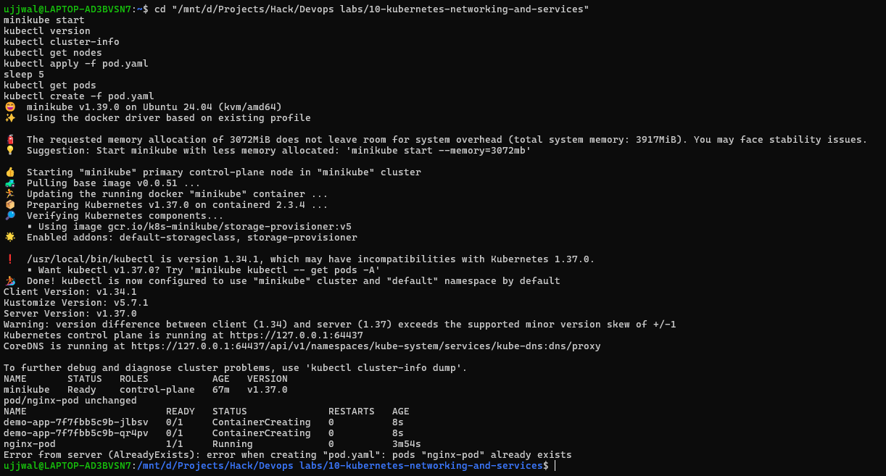
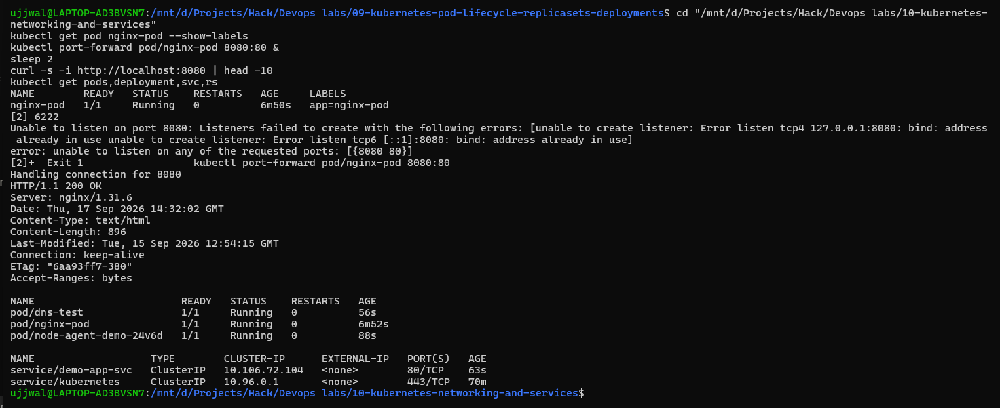

# Kubernetes Networking & Services

**Student Name:** Ujjwal Jain
**Roll Number:** 24bcs10173
**Section:** Section B

See [ques.md](ques.md) for exactly what this session asked for

**Environment note:** Same live Minikube cluster (WSL2 Ubuntu) as the rest of this repo. Cleaned up leftover Pods/Deployments from the previous module's before starting this one, so everything below starts from a genuinely empty `default` namespace.

---

## Step 1: Confirm the cluster is actually up

```bash
minikube start
```
```text
* Enabled addons: storage-provisioner, default-storageclass
! /usr/local/bin/kubectl is version 1.34.1, which may have incompatibilities with Kubernetes 1.37.0.
  - Want kubectl v1.37.0? Try 'minikube kubectl -- get pods -A'
* Done! kubectl is now configured to use "minikube" cluster and "default" namespace by default
```
Already running, so this just re-confirmed the addons and printed a real (and accurate) warning about client/server version skew - `kubectl` on this machine is v1.34.1 talking to a v1.37.0 server, a couple of minor versions apart.

```bash
kubectl version
```
```text
Client Version: v1.34.1
Kustomize Version: v5.7.1
Server Version: v1.37.0
Warning: version difference between client (1.34) and server (1.37) exceeds the supported minor version skew of +/-1
```

```bash
kubectl cluster-info
```
```text
Kubernetes control plane is running at https://127.0.0.1:64437
CoreDNS is running at https://127.0.0.1:64437/api/v1/namespaces/kube-system/services/kube-dns:dns/proxy
```

```bash
kubectl get nodes
```
```text
NAME       STATUS   ROLES           AGE   VERSION
minikube   Ready    control-plane   63m   v1.37.0
```

###  Screenshot Verification (`minikube start` → deploy → `create` error)

This run shows `pod/nginx-pod unchanged` on the `apply` rather than `created` - that's because the Pod already existed from an earlier pass in this same session with an identical spec, so `apply` correctly recognized there was nothing to change. The `create` error right after is the real thing either way.

---

##  Step 2: `pod.yaml`, written by hand

Not copy-pasted from the transcript doc just the four mandatory fields filled in for a basic Nginx Pod:

```yaml
apiVersion: v1
kind: Pod
metadata:
  name: nginx-pod
  labels:
    app: nginx-pod
spec:
  containers:
    - name: nginx
      image: nginx
      ports:
        - containerPort: 80
```

`apiVersion`, `kind`, `metadata`, `spec` - the four required top-level fields. Everything under `spec.containers` is the actual container definition: a name for the container (distinct from the Pod's own name), the image to pull, and the port Nginx listens on inside the container.

(The `labels:` block wasn't in the first version I applied  added a bit later specifically to test the `apply` update behavior in Step 4.)

---

## Step 3: Deploy and verify `1/1 Running`

```bash
kubectl apply -f pod.yaml
kubectl get pods
```
```text
pod/nginx-pod created
NAME        READY   STATUS              RESTARTS   AGE
nginx-pod   0/1     ContainerCreating   0          9s
```
Checked again a few seconds later once the image finished pulling:
```text
NAME        READY   STATUS    RESTARTS   AGE
nginx-pod   1/1     Running   0          21s
```

---

##  Step 4: `apply` vs `create` -  actually testing it, not just reciting it

**First, `create` against an already-existing Pod:**
```bash
kubectl create -f pod.yaml
```
```text
Error from server (AlreadyExists): error when creating "pod.yaml": pods "nginx-pod" already exists
```
Exactly the failure mode `create` has no concept of "update if it already exists," it just tries to create and the API server rejects the duplicate.

**Then, edit the file (added the `labels:` block above) and re-`apply`:**
```bash
kubectl apply -f pod.yaml
kubectl get pod nginx-pod --show-labels
```
```text
pod/nginx-pod configured
NAME        READY   STATUS    RESTARTS   AGE   LABELS
nginx-pod   1/1     Running   0          37s   app=nginx-pod
```
`configured` - not `created` (it already existed), not `unchanged` (the spec actually differs now), and no error. The label shows up immediately and the Pod's `AGE` didn't reset, meaning the *existing* container was updated in place rather than the Pod being recreated from scratch. That's the actual, demonstrable difference between the two commands: `create` is one-shot and errors on conflict, `apply` diffs against the live object and patches only what changed.

---

##  Step 5: Verify the Nginx app is actually reachable

```bash
kubectl port-forward pod/nginx-pod 8080:80
```
In parallel, from another shell:
```bash
curl -s -i http://localhost:8080
```
```text
HTTP/1.1 200 OK
Server: nginx/1.31.6
Date: Thu, 17 Sep 2026 14:25:57 GMT
Content-Type: text/html
Content-Length: 896
...

<!DOCTYPE html>
<html>
<head>
<title>Welcome to nginx!</title>
```
A real `200 OK` with the default Nginx welcome page  confirms this isn't just a Pod object sitting in `Running` status, there's an actual working web server behind it reachable through the forwarded port. The `port-forward` terminal itself logged the connection:
```text
Forwarding from 127.0.0.1:8080 -> 80
Forwarding from [::1]:8080 -> 80
Handling connection for 8080
```

###  Screenshot Verification (labels, port-forward, live `curl`)

Worth being upfront about what this screenshot actually shows: the *second* `kubectl port-forward` call in it failed outright 
```text
Unable to listen on port 8080: ... bind: address already in use
error: unable to listen on any of the requested ports: [{8080 80}]
```
 because an earlier port-forward from a previous pass in this same session was still holding port 8080 in the background. The `curl` right after it still came back with a genuine `200 OK`, but that's because it hit the *older* still-running forward, not the one that just failed. Real behavior, just not the command I thought was serving it at the time  documenting it as it actually happened rather than cropping out the error. (The `dns-test`, `node-agent-demo`, and `demo-app-svc` entries in the `get pods`/`get svc` output are unrelated practice from a different exercise running on the same cluster, not part of this assignment.)

---

## Step 6: The `kubectl get` sweep

```bash
kubectl get pods
kubectl get nodes
kubectl get deployment
kubectl get svc
kubectl get rs
kubectl get all
```
```text
$ kubectl get pods
NAME        READY   STATUS    RESTARTS   AGE
nginx-pod   1/1     Running   0          52s

$ kubectl get nodes
NAME       STATUS   ROLES           AGE   VERSION
minikube   Ready    control-plane   64m   v1.37.0

$ kubectl get deployment
No resources found in default namespace.

$ kubectl get svc
NAME         TYPE        CLUSTER-IP   EXTERNAL-IP   PORT(S)   AGE
kubernetes   ClusterIP   10.96.0.1    <none>        443/TCP   64m

$ kubectl get rs
No resources found in default namespace.

$ kubectl get all
NAME            READY   STATUS    RESTARTS   AGE
pod/nginx-pod   1/1     Running   0          52s

NAME                 TYPE        CLUSTER-IP   EXTERNAL-IP   PORT(S)   AGE
service/kubernetes   ClusterIP   10.96.0.1    <none>        443/TCP   64m
```
Worth pointing out honestly: `get deployment` and `get rs` both come back empty - because this exercise only created a bare Pod, not a Deployment or ReplicaSet. That's not a mistake, it's exactly the point the transcript makes in §8: Service/labels/selectors (and by extension, the ReplicaSet/Deployment layer that a Service usually sits in front of) are next session's material, not this one's. The only Service that exists right now is the cluster's own built-in `kubernetes` Service, not anything I created.

---

## What's deliberately not here

No `service.yaml` in this module. The lecture introduces the *concept* - a Service is needed because a bare Pod can't be exposed the way a Docker container can, and labels/selectors are the mechanism a Service uses to find its Pods 