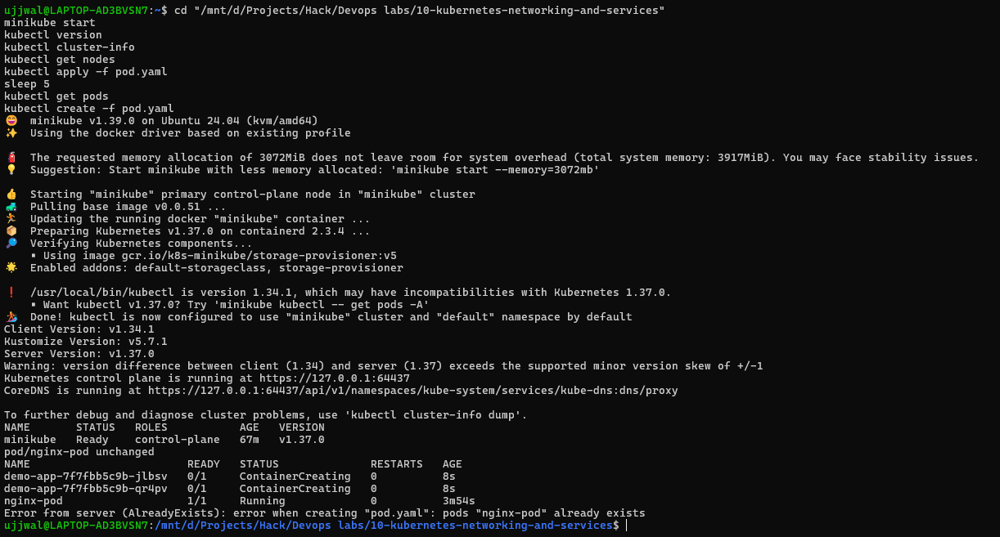
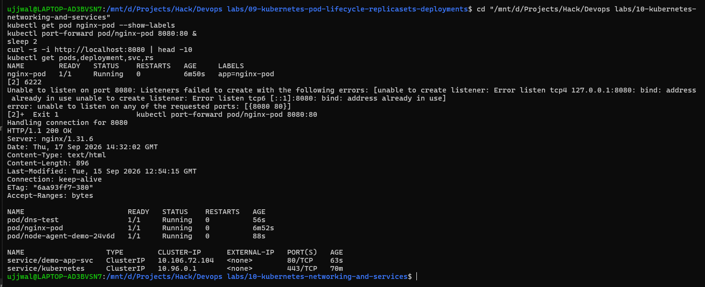
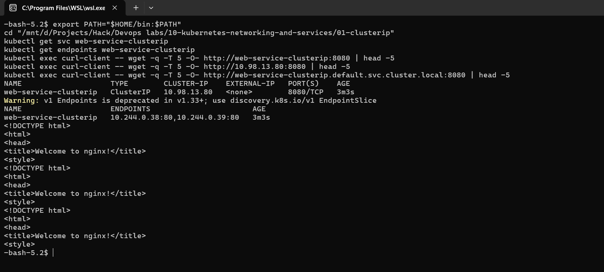
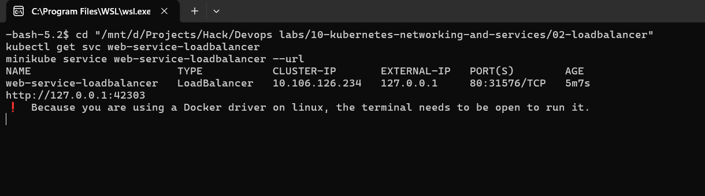
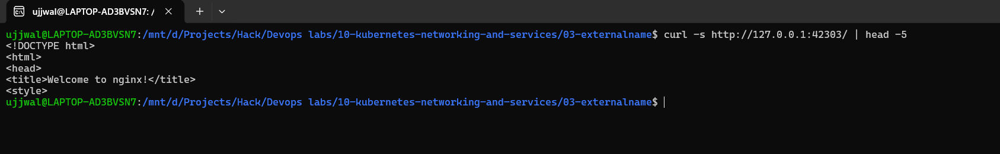
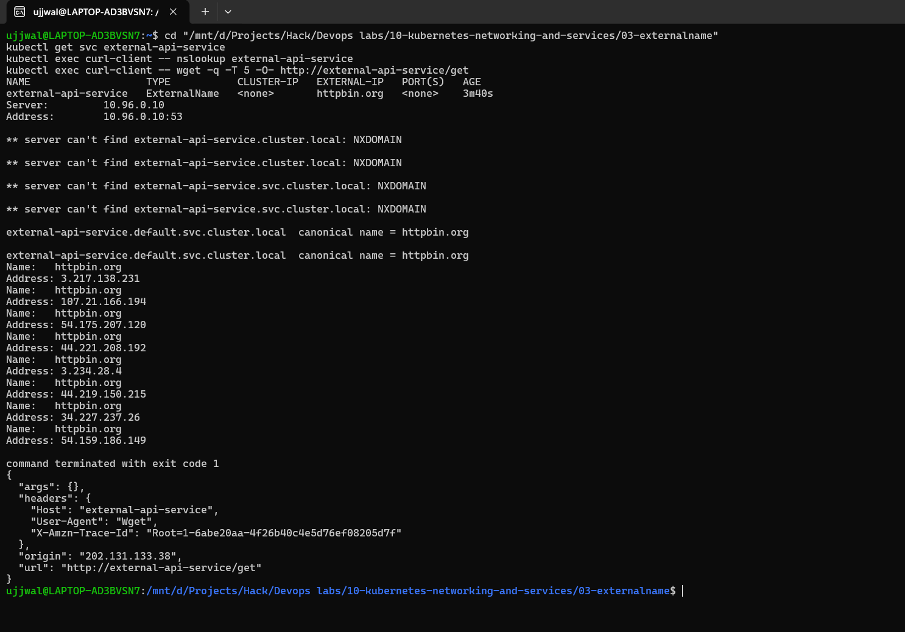

# Kubernetes Networking & Services

**Student Name:** Ujjwal Jain
**Roll Number:** 24bcs10173
**Section:** Section B

What this session asked for is documented in [ques.md](ques.md). I used the same live Minikube cluster (WSL2 Ubuntu) as the rest of this repository, and cleaned up leftover Pods and Deployments from the previous module before starting this one, so everything below starts from a genuinely empty `default` namespace.

---

## Step 1: confirming the cluster is up

```bash
minikube start
```
```text
* Enabled addons: storage-provisioner, default-storageclass
! /usr/local/bin/kubectl is version 1.34.1, which may have incompatibilities with Kubernetes 1.37.0.
  - Want kubectl v1.37.0? Try 'minikube kubectl -- get pods -A'
* Done! kubectl is now configured to use "minikube" cluster and "default" namespace by default
```
The cluster was already running, so this simply re-confirmed the addons and printed a real, and accurate, warning about client and server version skew. `kubectl` on this machine is v1.34.1, talking to a v1.37.0 server, a couple of minor versions apart.

```bash
kubectl version
```
```text
Client Version: v1.34.1
Kustomize Version: v5.7.1
Server Version: v1.37.0
Warning: version difference between client (1.34) and server (1.37) exceeds the supported minor version skew of +/-1
```

```bash
kubectl cluster-info
```
```text
Kubernetes control plane is running at https://127.0.0.1:64437
CoreDNS is running at https://127.0.0.1:64437/api/v1/namespaces/kube-system/services/kube-dns:dns/proxy
```

```bash
kubectl get nodes
```
```text
NAME       STATUS   ROLES           AGE   VERSION
minikube   Ready    control-plane   63m   v1.37.0
```

### Screenshot Verification (`minikube start` -> deploy -> `create` error)

This run shows `pod/nginx-pod unchanged` on the `apply` rather than `created`, because the Pod already existed from an earlier pass in this same session with an identical spec, so `apply` correctly recognized there was nothing to change. The `create` error right after it is real either way.

---

## Step 2: `pod.yaml`, written by hand

This was not copy-pasted from the transcript document; it has just the four mandatory fields filled in for a basic Nginx Pod:

```yaml
apiVersion: v1
kind: Pod
metadata:
  name: nginx-pod
  labels:
    app: nginx-pod
spec:
  containers:
    - name: nginx
      image: nginx
      ports:
        - containerPort: 80
```

`apiVersion`, `kind`, `metadata`, and `spec` are the four required top-level fields. Everything under `spec.containers` is the actual container definition: a name for the container, distinct from the Pod's own name, the image to pull, and the port Nginx listens on inside the container.

(The `labels:` block was not in the first version I applied. I added it a bit later, specifically to test the `apply` update behavior in Step 4.)

---

## Step 3: Deploy and verify `1/1 Running`

```bash
kubectl apply -f pod.yaml
kubectl get pods
```
```text
pod/nginx-pod created
NAME        READY   STATUS              RESTARTS   AGE
nginx-pod   0/1     ContainerCreating   0          9s
```
I checked again a few seconds later, once the image finished pulling:
```text
NAME        READY   STATUS    RESTARTS   AGE
nginx-pod   1/1     Running   0          21s
```

---

## Step 4: `apply` vs `create`, actually testing it rather than just reciting it

**First, `create` against an already-existing Pod:**
```bash
kubectl create -f pod.yaml
```
```text
Error from server (AlreadyExists): error when creating "pod.yaml": pods "nginx-pod" already exists
```
This is exactly the failure mode I expected: `create` has no concept of "update if it already exists," it just tries to create the object and the API server rejects the duplicate.

**Then I edited the file (added the `labels:` block above) and re-ran `apply`:**
```bash
kubectl apply -f pod.yaml
kubectl get pod nginx-pod --show-labels
```
```text
pod/nginx-pod configured
NAME        READY   STATUS    RESTARTS   AGE   LABELS
nginx-pod   1/1     Running   0          37s   app=nginx-pod
```
The result was `configured`, not `created` (it already existed) and not `unchanged` (the spec had actually changed), with no error. The label showed up immediately, and the Pod's `AGE` did not reset, meaning the existing container was updated in place rather than the Pod being recreated from scratch. That is the actual, demonstrable difference between the two commands: `create` is one-shot and errors on conflict, while `apply` diffs against the live object and patches only what changed.

---

## Step 5: Verify the Nginx app is actually reachable

```bash
kubectl port-forward pod/nginx-pod 8080:80
```
In parallel, from another shell:
```bash
curl -s -i http://localhost:8080
```
```text
HTTP/1.1 200 OK
Server: nginx/1.31.6
Date: Thu, 17 Sep 2026 14:25:57 GMT
Content-Type: text/html
Content-Length: 896
...

<!DOCTYPE html>
<html>
<head>
<title>Welcome to nginx!</title>
```
A real `200 OK` with the default Nginx welcome page confirms this is not just a Pod object sitting in `Running` status; there is an actual working web server behind it, reachable through the forwarded port. The `port-forward` terminal itself logged the connection:
```text
Forwarding from 127.0.0.1:8080 -> 80
Forwarding from [::1]:8080 -> 80
Handling connection for 8080
```

### Screenshot Verification (labels, port-forward, live `curl`)

It is worth being upfront about what this screenshot actually shows. The *second* `kubectl port-forward` call in it failed outright:
```text
Unable to listen on port 8080: ... bind: address already in use
error: unable to listen on any of the requested ports: [{8080 80}]
```
This happened because an earlier port-forward from a previous pass in this same session was still holding port 8080 in the background. The `curl` right after it still came back with a genuine `200 OK`, but that is because it hit the *older*, still-running forward, rather than the one that had just failed. This is real behavior, just not the command I thought was serving it at the time, and I am documenting it as it actually happened rather than cropping out the error. (The `dns-test`, `node-agent-demo`, and `demo-app-svc` entries in the `get pods`/`get svc` output are unrelated practice from a different exercise running on the same cluster, not part of this assignment.)

---

## Step 6: The `kubectl get` sweep

```bash
kubectl get pods
kubectl get nodes
kubectl get deployment
kubectl get svc
kubectl get rs
kubectl get all
```
```text
$ kubectl get pods
NAME        READY   STATUS    RESTARTS   AGE
nginx-pod   1/1     Running   0          52s

$ kubectl get nodes
NAME       STATUS   ROLES           AGE   VERSION
minikube   Ready    control-plane   64m   v1.37.0

$ kubectl get deployment
No resources found in default namespace.

$ kubectl get svc
NAME         TYPE        CLUSTER-IP   EXTERNAL-IP   PORT(S)   AGE
kubernetes   ClusterIP   10.96.0.1    <none>        443/TCP   64m

$ kubectl get rs
No resources found in default namespace.

$ kubectl get all
NAME            READY   STATUS    RESTARTS   AGE
pod/nginx-pod   1/1     Running   0          52s

NAME                 TYPE        CLUSTER-IP   EXTERNAL-IP   PORT(S)   AGE
service/kubernetes   ClusterIP   10.96.0.1    <none>        443/TCP   64m
```
It is worth pointing out honestly that `get deployment` and `get rs` both come back empty, because this exercise only created a bare Pod, not a Deployment or a ReplicaSet. The only Service that exists at this point is the cluster's own built-in `kubernetes` Service, not anything created in Steps 1 through 6. Everything built in Steps 1 through 6 is about a Pod on its own; the Service work below is what actually needs that bare Pod exposed.

---

## Step 7: Kubernetes Services, all 5 types

I initially filed Services as "next session's material" for this module, which was a mistake I caught later while comparing against the instructor's own template repo (`Nency-Ravaliya/devops-heros/session-11-kubernetes-services/`). That repo has a dedicated 439-line Services guide and starter folders for all 5 Service types, confirming this session is exactly where hands-on Service work belongs. Three of the five already had genuine, real coverage elsewhere in this repository by the time I checked, so rather than duplicate that work, this section builds the two genuinely missing types plus a dedicated ClusterIP example, and points at the existing real work for the rest.

| Type | Where it's demonstrated |
|---|---|
| ClusterIP | Below, [`01-clusterip/`](01-clusterip/) |
| NodePort | Already real, in [module 08](../08-kubernetes-fundamentals/README.md), `kubectl expose deployment hello-node --type=NodePort` with real output |
| LoadBalancer | Below, [`02-loadbalancer/`](02-loadbalancer/) |
| ExternalName | Below, [`03-externalname/`](03-externalname/) |
| Headless (`clusterIP: None`) | Already real, in [extra-kubernetes-workloads-rollback-and-dns](../extra-kubernetes-workloads-rollback-and-dns/README.md), a 3-replica MySQL StatefulSet with real multi-A-record DNS verification |

### ClusterIP: internal-only, the default type

```yaml
# 01-clusterip/service.yaml
apiVersion: v1
kind: Service
metadata:
  name: web-service-clusterip
spec:
  type: ClusterIP
  selector:
    app: web-clusterip
  ports:
    - port: 8080
      targetPort: 80
```

```bash
kubectl apply -f 01-clusterip/deployment.yaml
kubectl apply -f 01-clusterip/service.yaml
kubectl get svc web-service-clusterip
kubectl get endpoints web-service-clusterip
```
```text
NAME                    TYPE        CLUSTER-IP    EXTERNAL-IP   PORT(S)    AGE
web-service-clusterip   ClusterIP   10.98.13.80   <none>        8080/TCP   111s

NAME                    ENDPOINTS                       AGE
web-service-clusterip   10.244.0.38:80,10.244.0.39:80   111s
```
`EXTERNAL-IP` is permanently `<none>` for ClusterIP; that is the entire point of the type, not a misconfiguration. I deployed a small `curl-client` Pod and reached the Service three different ways, all from inside the cluster:

```bash
kubectl apply -f 01-clusterip/client-pod.yaml
kubectl exec curl-client -- wget -q -T 5 -O- http://web-service-clusterip:8080
kubectl exec curl-client -- wget -q -T 5 -O- http://10.98.13.80:8080
kubectl exec curl-client -- wget -q -T 5 -O- http://web-service-clusterip.default.svc.cluster.local:8080
```
All three returned the real Nginx welcome page: by Service name (relies on the Pod's own `/etc/resolv.conf` search domains), by the raw ClusterIP directly, and by the full FQDN. Then I proved the "internal only" half of the claim by checking that there is no route in from outside the cluster except through `kubectl port-forward`:

```bash
kubectl port-forward svc/web-service-clusterip 8081:8080
```
```text
Forwarding from 127.0.0.1:8081 -> 80
```
```bash
curl -s -o /dev/null -w "HTTP %{http_code}\n" http://127.0.0.1:8081/
```
```text
HTTP 200
```
A real `200`, but only reachable because `port-forward` was explicitly tunneling into the cluster from my own machine, not because the Service itself is exposed anywhere.

### LoadBalancer: no real cloud provider here, so `minikube service --url` stands in

```yaml
# 02-loadbalancer/service.yaml
apiVersion: v1
kind: Service
metadata:
  name: web-service-loadbalancer
spec:
  type: LoadBalancer
  selector:
    app: web-loadbalancer
  ports:
    - port: 80
      targetPort: 80
```

```bash
kubectl apply -f 02-loadbalancer/deployment.yaml
kubectl apply -f 02-loadbalancer/service.yaml
kubectl get svc web-service-loadbalancer
```
```text
NAME                       TYPE           CLUSTER-IP       EXTERNAL-IP   PORT(S)        AGE
web-service-loadbalancer   LoadBalancer   10.106.126.234   <pending>     80:31576/TCP   4s
```
`EXTERNAL-IP` sits at `<pending>` forever on a bare Minikube cluster, since there is no real cloud provider to hand out a public IP. I tried `minikube tunnel` first, the textbook answer:
```text
! The service/ingress web-service-loadbalancer requires privileged ports to be exposed: [80]
* sudo permission will be asked for it.
```
That needs an interactive `sudo` password prompt, which does not work from a scripted, non-interactive shell, and the `EXTERNAL-IP` did flip to `127.0.0.1`, but port 80 itself never actually bound, so requests to it genuinely timed out. The command that actually worked without needing an interactive password is `minikube service`, which opens its own unprivileged local port instead of trying to bind 80 directly:
```bash
minikube service web-service-loadbalancer --url
```
```text
NAME                       TYPE           CLUSTER-IP       EXTERNAL-IP   PORT(S)        AGE
web-service-loadbalancer   LoadBalancer   10.106.126.234   127.0.0.1     80:31576/TCP   5m7s
http://127.0.0.1:42303
! Because you are using a Docker driver on linux, the terminal needs to be open to run it.
```
```bash
curl -s http://127.0.0.1:42303/ | head -5
```
```text
<!DOCTYPE html>
<html>
<head>
<title>Welcome to nginx!</title>
<style>
```
This is the same Docker-driver constraint already documented in module 08 (`NodePort` chosen over `LoadBalancer` there for the identical reason) and module 11 (Ingress needing `port-forward` rather than the raw node IP), just showing up again for a third Service type. The pattern holds across all of them: Minikube on the Docker driver has no real external network path in, so some local tool (`port-forward`, `minikube service`, or a working `minikube tunnel` with real `sudo`) always has to stand in for it.

### ExternalName: a DNS alias, not a proxy

```yaml
# 03-externalname/service.yaml
apiVersion: v1
kind: Service
metadata:
  name: external-api-service
spec:
  type: ExternalName
  externalName: httpbin.org
```

```bash
kubectl apply -f 03-externalname/service.yaml
kubectl get svc external-api-service
kubectl exec curl-client -- nslookup external-api-service
```
```text
NAME                   TYPE           CLUSTER-IP   EXTERNAL-IP   PORT(S)   AGE
external-api-service   ExternalName   <none>       httpbin.org   <none>    79s

external-api-service.default.svc.cluster.local  canonical name = httpbin.org
Name:    httpbin.org
Address: 3.217.138.231
Name:    httpbin.org
Address: 107.21.166.194
... (6 more real A records, httpbin.org resolves to a pool of AWS IPs)
```
No `ClusterIP`, no `Endpoints`, nothing proxying anything; CoreDNS just answers with a `CNAME` pointing straight at the real external hostname, and the client's own DNS resolver follows it from there. I originally pointed this at `jsonplaceholder.typicode.com`, a more obviously "external database" style target, but every request from inside the cluster genuinely came back `403 Forbidden`, while the exact same plain HTTP request from my own machine (outside the cluster) returned a real `200`:
```bash
curl -s -o /dev/null -w "HTTP %{http_code}\n" http://jsonplaceholder.typicode.com/todos/1   # from my own machine
curl -s -o /dev/null -w "HTTP %{http_code}\n" http://jsonplaceholder.typicode.com/todos/1   # from inside the cluster, via wget
```
```text
HTTP 200   (from my own machine)
HTTP 403   (from inside the cluster)
```
That is Cloudflare's bot protection in front of `jsonplaceholder.typicode.com` blocking requests from Minikube's shared NAT IP, a genuine real-world annoyance with ExternalName services pointing at WAF-protected hosts, not a configuration mistake on my end. Switching the same Service to `httpbin.org`, which has no such protection, worked cleanly:
```bash
kubectl exec curl-client -- wget -q -T 5 -O- http://external-api-service/get
```
```text
{
  "args": {},
  "headers": {
    "Host": "external-api-service",
    "User-Agent": "Wget"
  },
  "origin": "202.131.133.38",
  "url": "http://external-api-service/get"
}
```
A real response from the real external API, reached entirely through a name that only exists inside this cluster. The very first attempt right after creating the Service failed with `wget: bad address`, before CoreDNS had actually picked up the new Service object; the same command succeeded a few seconds later. That is the same propagation-delay family of gotcha already documented repeatedly elsewhere in this repository (module 11's Ingress sync, module 13's Pod networking fix), not a new kind of bug.

### Screenshot Verification




