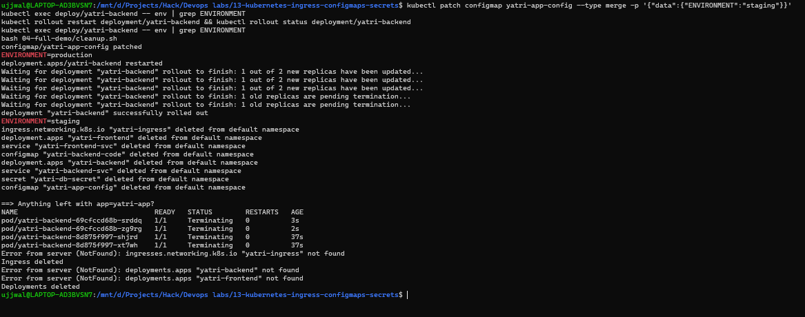
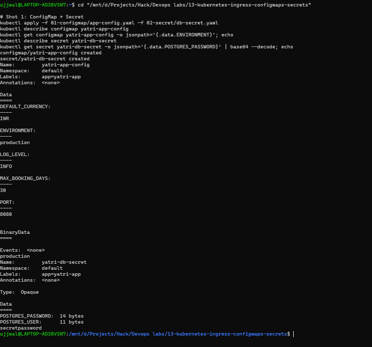
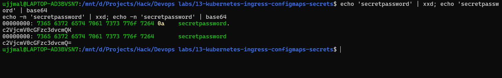
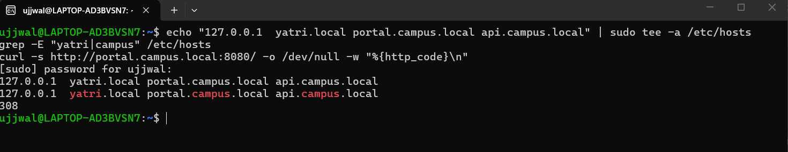
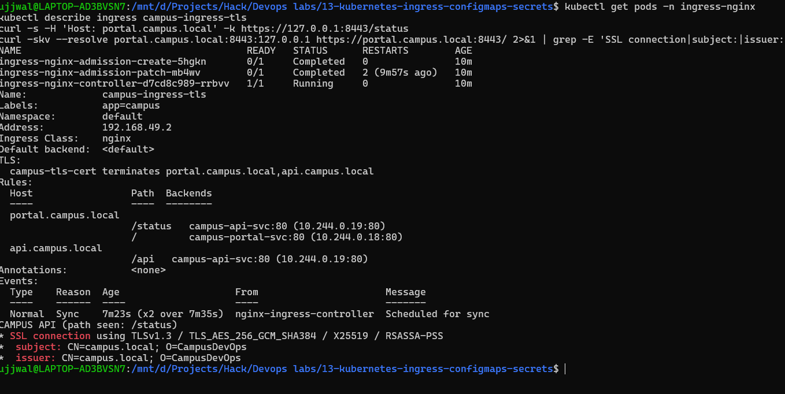
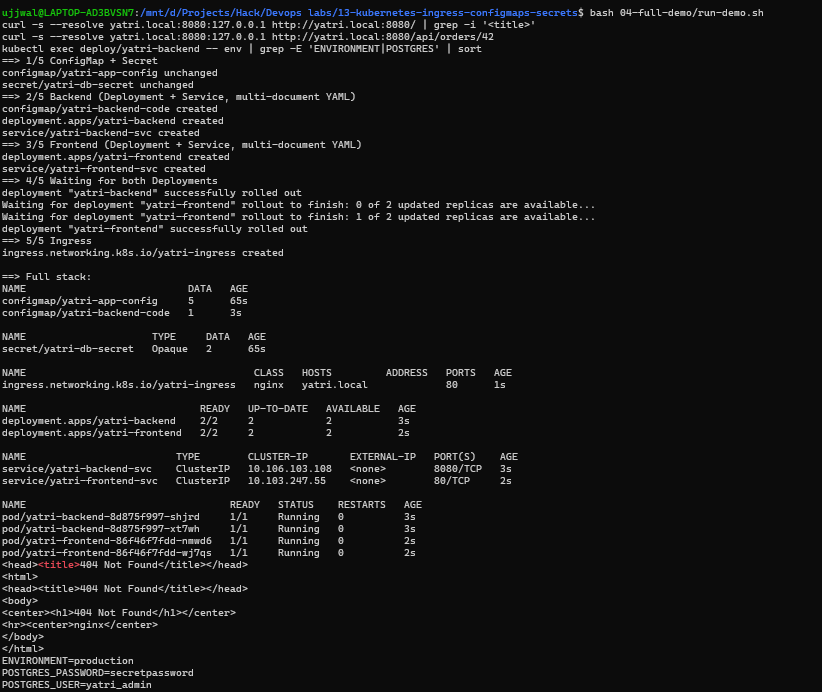

# Kubernetes Ingress, ConfigMaps & Secrets

**Student Name:** Ujjwal Jain
**Roll Number:** 24bcs10173
**Section:** Section B

See [ques.md](ques.md) for the exact task list and why this module exists separately from module 09.

**Environment note:** same Minikube cluster (WSL2 Ubuntu, Docker driver) as the other Kubernetes modules. Two things about that setup shaped how I tested the Ingress parts, so flagging them up front:

1. On the Docker driver the node IP (`192.168.49.2`) is not reachable from WSL. I tried it directly against the Ingress controller's NodePort and it just timed out (Task 9 has the output). So all Ingress traffic below goes through `kubectl port-forward` on the controller (`localhost:8080` for HTTP, `localhost:8443` for HTTPS).
2. Editing `/etc/hosts` needs `sudo` and a password, which I can't type into a scripted shell. Where a hostname mattered I used `curl --resolve host:port:127.0.0.1`, which does exactly the same job for one request without touching the hosts file.

---

# Part A - ConfigMaps & Secrets

## Task 1: ConfigMap - config that lives outside the image

```yaml
# 01-configmap/app-config.yaml
apiVersion: v1
kind: ConfigMap
metadata:
  name: yatri-app-config
  labels:
    app: yatri-app
data:
  ENVIRONMENT: "production"
  LOG_LEVEL: "INFO"
  PORT: "8080"
  DEFAULT_CURRENCY: "INR"
  MAX_BOOKING_DAYS: "30"
```

```bash
kubectl apply -f 01-configmap/app-config.yaml
kubectl get configmap yatri-app-config
kubectl describe configmap yatri-app-config
kubectl get configmap yatri-app-config -o jsonpath='{.data.ENVIRONMENT}'
kubectl get configmap yatri-app-config -o jsonpath='{.data.LOG_LEVEL}'
```
```text
configmap/yatri-app-config created
NAME               DATA   AGE
yatri-app-config   5      0s

Data
====
DEFAULT_CURRENCY:
----
INR

ENVIRONMENT:
----
production

LOG_LEVEL:
----
INFO

MAX_BOOKING_DAYS:
----
30

PORT:
----
8080

$ ...jsonpath='{.data.ENVIRONMENT}'
production
$ ...jsonpath='{.data.LOG_LEVEL}'
INFO
```
All five keys are there and the JSONPath queries pull single values out. Note every value is a string, even `PORT` and `MAX_BOOKING_DAYS` - that's why they're quoted in the YAML; a ConfigMap's `data` only holds strings.

## Task 2: Live-updating a ConfigMap - and why running Pods ignore it

This one needs a running Pod that consumes the ConfigMap, so it uses the backend from Task 6 (`yatri-backend`). I did Task 6 first and came back to this.

```bash
kubectl exec deploy/yatri-backend -- env | grep ENVIRONMENT        # before
kubectl patch configmap yatri-app-config --type merge -p '{"data":{"ENVIRONMENT":"staging"}}'
kubectl get configmap yatri-app-config -o jsonpath='{.data.ENVIRONMENT}'
kubectl exec deploy/yatri-backend -- env | grep ENVIRONMENT        # after patch, no restart
kubectl rollout restart deployment/yatri-backend
kubectl rollout status deployment/yatri-backend
kubectl exec deploy/yatri-backend -- env | grep ENVIRONMENT        # after restart
```
```text
--- before patch ---
ENVIRONMENT=production
configmap/yatri-app-config patched
--- ConfigMap now says: ---
staging
--- running pod still says (no restart yet): ---
ENVIRONMENT=production
--- rollout restart ---
deployment.apps/yatri-backend restarted
Waiting for deployment "yatri-backend" rollout to finish: 1 out of 2 new replicas have been updated...
Waiting for deployment "yatri-backend" rollout to finish: 1 old replicas are pending termination...
deployment "yatri-backend" successfully rolled out
--- new pods say: ---
ENVIRONMENT=staging
```
The ConfigMap object says `staging` immediately, but the Pod that was already running still says `production`. Environment variables are baked into a container's process at start, so nothing changes until the container is recreated - `rollout restart` does that gradually (new Pods up before old ones go), so there's no downtime. Reverted the patch back to `production` and restarted once more so the later tasks start from the same known state.

### Screenshot Verification (patch -> still `production` -> restart -> `staging`)

This is a second run of the same drill for the screenshot pass: patch, `ENVIRONMENT=production` still showing in the running Pod, the rolling restart, then `ENVIRONMENT=staging` in the new Pod. The `cleanup.sh` output underneath belongs to Task 14 - the stack was torn down straight after this drill, and the leftover `Terminating` Pods in its "anything left?" list are just the old replicas still shutting down (the Deployments and Ingress themselves are already gone).

## Task 3: Secret - and why base64 is not security

```yaml
# 02-secret/db-secret.yaml (values already base64-encoded)
apiVersion: v1
kind: Secret
metadata:
  name: yatri-db-secret
  labels:
    app: yatri-app
type: Opaque
data:
  POSTGRES_USER: eWF0cmlfYWRtaW4=
  POSTGRES_PASSWORD: c2VjcmV0cGFzc3dvcmQ=
```
```bash
kubectl apply -f 02-secret/db-secret.yaml
kubectl describe secret yatri-db-secret
kubectl get secret yatri-db-secret -o jsonpath='{.data.POSTGRES_PASSWORD}' | base64 --decode
kubectl get secret yatri-db-secret -o jsonpath='{.data.POSTGRES_USER}' | base64 --decode
```
```text
secret/yatri-db-secret created

Type:  Opaque

Data
====
POSTGRES_PASSWORD:  14 bytes
POSTGRES_USER:      11 bytes

$ ...POSTGRES_PASSWORD | base64 --decode
secretpassword
$ ...POSTGRES_USER | base64 --decode
yatri_admin
```
`describe` politely hides the values and just prints byte lengths - which looks like protection, but one JSONPath and one `base64 --decode` later the password is sitting there in plain text. Base64 is an *encoding* (so binary data fits in YAML), not encryption. Anyone who can `kubectl get secret` can read it, which is why RBAC on Secrets matters far more than the encoding.

### Screenshot Verification (ConfigMap + Secret, Tasks 1 and 3)

Both objects created back to back: all five ConfigMap keys via `describe`, the `production` JSONPath result, the Secret's masked `14 bytes` / `11 bytes` lengths, and the decoded `secretpassword` at the bottom.

## Task 4: The trailing-newline gotcha

```bash
echo 'secretpassword' | xxd            # plain echo
echo 'secretpassword' | base64
echo -n 'secretpassword' | xxd         # -n = no trailing newline
echo -n 'secretpassword' | base64
```
```text
--- broken: plain echo ---
00000000: 7365 6372 6574 7061 7373 776f 7264 0a    secretpassword.
c2VjcmV0cGFzc3dvcmQK

--- correct: echo -n ---
00000000: 7365 6372 6574 7061 7373 776f 7264       secretpassword
c2VjcmV0cGFzc3dvcmQ=

Wrong (with newline): c2VjcmV0cGFzc3dvcmQK
Right (no newline):   c2VjcmV0cGFzc3dvcmQ=

--- decoding the wrong one shows the stray byte ---
00000000: 7365 6372 6574 7061 7373 776f 7264 0a    secretpassword.
```
Plain `echo` silently appends a newline byte (`0a`, the last byte in the first dump). It's invisible on screen, but base64 encodes it faithfully, so the stored password becomes `secretpassword\n` - 15 bytes instead of 14. A database comparing that to what the user typed would reject a login that "looks" correct, and it's miserable to debug because the value prints identically. `echo -n` (or `printf`) avoids it. The Secret in Task 3 was encoded with `echo -n`, which is why `describe` there says exactly 14 bytes.

### Screenshot Verification (trailing-newline gotcha)

The highlighted `0a` at the end of the first hex dump is the invisible newline; the second dump (`echo -n`) ends cleanly at `64`, and the two base64 strings differ in their last characters.

## Task 5: Enterprise secret management (writeup)

Checked whether this cluster has any secret-management operator installed:
```bash
kubectl get crds | grep -i secret || echo "Standard native secrets in use"
```
```text
Standard native secrets in use (no External Secrets / Vault CRDs installed)
```
Just native Secrets, as expected on a lab cluster. In a real company that's not enough, for a few reasons:

- **Git remembers everything.** A base64 Secret committed to a repo lives in history forever, even after the file is deleted. Base64 isn't protection, so anyone with repo read access has the password - and rotating it means rewriting history everywhere it was cloned.
- **No rotation or audit trail.** A static YAML has no notion of expiry, and nothing records who read it.
- **One value, many copies.** The same DB password ends up pasted into dev/staging/prod manifests and drifts apart.

The pattern that replaces it keeps the real secret in a dedicated store and lets the cluster *pull* it at runtime:

```
AWS Secrets Manager / Azure Key Vault / HashiCorp Vault
        │   (source of truth: encrypted, versioned, audited, rotated)
        ▼
External Secrets Operator  (or Vault Agent Injector / CSI driver)
        │   (runs in the cluster, authenticates with a scoped identity)
        ▼
Kubernetes Secret  (created and refreshed automatically, never committed)
        ▼
Pod  (env var or mounted file)
```
- **External Secrets Operator** watches an `ExternalSecret` object (which only *references* a key name, no value) and creates/updates the real Kubernetes Secret from the cloud store.
- **Vault Agent Injector** goes a step further: a sidecar fetches the secret and writes it into the Pod's memory, so it may never exist as a Kubernetes Secret at all.
- **CI/CD** side: GitHub Actions secrets or Azure DevOps Variable Groups hold deploy-time credentials and inject them into the pipeline as masked variables at run time, so the manifests in the repo contain placeholders or references, never values.

## Task 6: ConfigMap + Secret injected into one Pod

The backend (`04-full-demo/backend.yaml`) is a tiny Python API that reports what it was given. The two injection styles side by side:

```yaml
          envFrom:                       # whole ConfigMap -> every key becomes an env var
            - configMapRef:
                name: yatri-app-config
          env:                           # Secret: pick keys individually
            - name: POSTGRES_USER
              valueFrom:
                secretKeyRef: { name: yatri-db-secret, key: POSTGRES_USER }
            - name: POSTGRES_PASSWORD
              valueFrom:
                secretKeyRef: { name: yatri-db-secret, key: POSTGRES_PASSWORD }
```
```bash
kubectl apply -f 04-full-demo/configmap.yaml -f 04-full-demo/secret.yaml
kubectl apply -f 04-full-demo/backend.yaml
kubectl rollout status deployment/yatri-backend --timeout=120s
kubectl exec deploy/yatri-backend -- env | grep -E 'ENVIRONMENT|LOG_LEVEL|POSTGRES|DEFAULT_CURRENCY|MAX_BOOKING|^PORT' | sort
```
```text
configmap/yatri-app-config unchanged
secret/yatri-db-secret unchanged
configmap/yatri-backend-code created
deployment.apps/yatri-backend created
service/yatri-backend-svc created
deployment "yatri-backend" successfully rolled out

DEFAULT_CURRENCY=INR
ENVIRONMENT=production
LOG_LEVEL=INFO
MAX_BOOKING_DAYS=30
PORT=8080
POSTGRES_PASSWORD=secretpassword
POSTGRES_USER=yatri_admin
```
Both sources merge into one environment. (`configmap/yatri-app-config unchanged` is because it's the same ConfigMap from Task 1 - applying an identical manifest is a no-op.) Two takeaways from that output:

- `envFrom` is convenient but takes *everything*; the Secret is injected key by key so the container only receives what it needs.
- `POSTGRES_PASSWORD=secretpassword` is right there in plain text for anyone who can `kubectl exec` into the Pod. Secrets protect the value *at rest and in manifests*, not from someone with exec access - another reason to lock down RBAC. My API deliberately reports the password only as `set (hidden)`:
```text
$ kubectl exec dns-test -- wget -qO- http://yatri-backend-svc:8080/
Yatri backend API
path: /
ENVIRONMENT: production
LOG_LEVEL: INFO
DEFAULT_CURRENCY: INR
POSTGRES_USER: yatri_admin
POSTGRES_PASSWORD: set (hidden)
```

---

# Part B - Ingress

## Task 7: Ingress resource vs. Ingress controller (writeup)

| | **Ingress (resource)** | **Ingress Controller** |
|---|---|---|
| What it is | A Kubernetes API object: a written set of Layer-7 routing rules (hosts, paths, TLS secret, target Service) | A running Pod - a reverse proxy (NGINX, Traefik, HAProxy, Envoy) |
| Does it do anything alone? | **No.** It's only a blueprint stored in etcd | **Yes** - it's the thing that actually receives and forwards traffic |
| How they connect | The controller watches the API server for Ingress objects | ...and turns each one into real proxy config, then reloads |
| Analogy | The seating plan | The host who actually seats people |

Proof that the API side exists natively while the controller is separate:
```text
$ kubectl api-resources | grep -iE 'NAME|ingress'
NAME             SHORTNAMES   APIVERSION             NAMESPACED   KIND
ingressclasses                networking.k8s.io/v1   false        IngressClass
ingresses        ing          networking.k8s.io/v1   true         Ingress
```
That API was available on a cluster with **no** controller at all - I could have applied Ingress objects and nothing would have happened. That's exactly the state this cluster was in until Task 8. I saw the controller's watch-and-reconcile behaviour for real in Task 12: it rejected a conflicting Ingress through its admission webhook.

## Task 8: Enabling the NGINX Ingress Controller

```bash
minikube addons enable ingress
kubectl get pods -n ingress-nginx
kubectl wait --namespace ingress-nginx --for=condition=ready pod \
  --selector=app.kubernetes.io/component=controller --timeout=120s
kubectl get service -n ingress-nginx
```
```text
* ingress is an addon maintained by Kubernetes. ...
  - Using image registry.k8s.io/ingress-nginx/controller:v1.15.1
  - Using image registry.k8s.io/ingress-nginx/kube-webhook-certgen:v1.6.9
* Verifying ingress addon...
* The 'ingress' addon is enabled

NAME                                       READY   STATUS      RESTARTS      AGE
ingress-nginx-admission-create-5hgkn       0/1     Completed   0             56s
ingress-nginx-admission-patch-mb4wv        0/1     Completed   2 (47s ago)   56s
ingress-nginx-controller-d7cd8c989-rrbvv   1/1     Running     0             56s

pod/ingress-nginx-controller-d7cd8c989-rrbvv condition met

NAME                                 TYPE        CLUSTER-IP      EXTERNAL-IP   PORT(S)                      AGE
ingress-nginx-controller             NodePort    10.111.89.182   <none>        80:30647/TCP,443:31704/TCP   57s
ingress-nginx-controller-admission   ClusterIP   10.110.36.2     <none>        443/TCP                      57s
```
The controller Pod is `1/1 Running`. The two `Completed` Pods are one-shot Jobs that generate the certificate for the admission webhook (the `patch` one retried twice before succeeding, which is normal while the API server settles). The controller Service is a `NodePort` - Minikube has no cloud load balancer to hand out an external IP.

## Task 9: Getting a hostname to reach the cluster

The task says to map `yatri.local` to `minikube ip` in `/etc/hosts`. Trying that first:

```text
$ minikube ip
192.168.49.2
$ curl -m 4 http://192.168.49.2:30647/
curl: (28) Connection timed out after 4001 milliseconds
```
That's the Docker-driver limitation: `192.168.49.2` lives on an internal Docker bridge that the WSL shell can't route to. So mapping the hostname to `minikube ip` would just give a hostname that times out. The workable route is a port-forward to the controller:
```bash
kubectl port-forward -n ingress-nginx svc/ingress-nginx-controller 8080:80 8443:443
```
and the hostnames map to `127.0.0.1` instead. The `/etc/hosts` line for that:
```bash
echo "127.0.0.1  yatri.local portal.campus.local api.campus.local" | sudo tee -a /etc/hosts
```
This needs `sudo` (so a password prompt), which is why I ran it by hand in an interactive terminal rather than through the scripted shell I'd used for everything else:
```text
$ echo "127.0.0.1  yatri.local portal.campus.local api.campus.local" | sudo tee -a /etc/hosts
[sudo] password for ujjwal:
127.0.0.1  yatri.local portal.campus.local api.campus.local
$ grep -E "yatri|campus" /etc/hosts
127.0.0.1  yatri.local portal.campus.local api.campus.local
$ curl -s http://portal.campus.local:8080/ -o /dev/null -w "%{http_code}\n"
308
```
The `grep` finds exactly one entry (no duplicate from an earlier run), and the bare hostname now resolves without any `--resolve` flag. The `308` is the controller redirecting HTTP to HTTPS - correct, because by this point the campus Ingress has TLS configured (Task 13). Everything from here on could use plain hostnames; I kept `--resolve` in my own transcripts because they were run before this line existed, and it gives identical results.

### Screenshot Verification (`/etc/hosts` mapping)


---

## Task 10: Path-based routing (`04-full-demo/ingress.yaml`)

One host (`yatri.local`), two paths going to different Services:

```yaml
  annotations:
    nginx.ingress.kubernetes.io/rewrite-target: /$2
    nginx.ingress.kubernetes.io/use-regex: "true"
spec:
  ingressClassName: nginx
  rules:
    - host: yatri.local
      http:
        paths:
          - path: /api(/|$)(.*)        # -> backend, prefix stripped
            pathType: ImplementationSpecific
            backend: { service: { name: yatri-backend-svc, port: { number: 8080 } } }
          - path: /()(.*)              # -> frontend, everything else
            pathType: ImplementationSpecific
            backend: { service: { name: yatri-frontend-svc, port: { number: 80 } } }
```
`rewrite-target: /$2` rewrites the URL using the *second* capture group of the path regex. In `/api(/|$)(.*)` that's whatever follows `/api/`, so `/api/orders/42` reaches the backend as `/orders/42`. One subtlety I had to think about: the annotation applies to **every** path in the Ingress, including `/`. A plain `/` rule has no capture groups, so `$2` would be empty and every frontend request would be rewritten to just `/`. Writing the frontend path as `/()(.*)` gives it two (empty first, everything second) so the same rewrite passes URLs through unchanged.

```text
$ kubectl get ingress yatri-ingress
NAME            CLASS   HOSTS         ADDRESS   PORTS   AGE
yatri-ingress   nginx   yatri.local             80      4s

Rules:
  Host         Path  Backends
  yatri.local
               /api(/|$)(.*)   yatri-backend-svc:8080 (10.244.0.11:8080,10.244.0.12:8080)
               /()(.*)         yatri-frontend-svc:80 (10.244.0.16:80,10.244.0.17:80)
```
(`ADDRESS` is empty for the first several seconds after creation. A few minutes later it fills in with `192.168.49.2` - the Minikube node IP, visible in the Task 13 screenshot - which is the same Docker-bridge address that timed out in Task 9, so an `ADDRESS` being present doesn't mean it's reachable from the host.) Then the actual requests:

```text
--- GET / (frontend) ---
<title>Welcome to nginx!</title>

--- GET /api/ (backend, rewritten) ---
Yatri backend API
path: /
ENVIRONMENT: production
LOG_LEVEL: INFO
DEFAULT_CURRENCY: INR
POSTGRES_USER: yatri_admin
POSTGRES_PASSWORD: set (hidden)

--- GET /api/orders/42 (backend should see /orders/42) ---
Yatri backend API
path: /orders/42

--- GET /index.html (frontend, passes through unchanged) ---
http_code=200

--- request with no matching Host ---
http_code=404
```
The `path: /orders/42` line is the proof the rewrite works: the client asked for `/api/orders/42` and the backend saw `/orders/42`. And a request with the wrong `Host` gets the controller's own 404 - the Ingress only answers for the hostname in its rules.

## Task 11: Host-based routing (virtual hosts)

Two tiny nginx apps (`03-ingress/campus-apps.yaml`), one per hostname, behind one Ingress (`03-ingress/ingress-host.yaml`) - same IP, same port, routing decided by the `Host` header only:

```text
--- portal.campus.local ---
<title>Campus Portal</title>
--- api.campus.local ---
CAMPUS API (path seen: /)

--- same IP + port, just the Host header changes ---
CAMPUS PORTAL
CAMPUS API

--- unknown host ---
http_code=404
```
This is the whole trick behind hosting many sites/services on one IP: the client says which name it wants, and the controller picks the backend. Nothing else changed between those two requests.

## Task 12: Hybrid routing - host *and* path in one Ingress (`03-ingress/ingress-tls.yaml`)

Before applying this I hit something genuinely useful. The host-only Ingress from Task 11 was still in the cluster, and applying the hybrid one (same hosts, same `/` path) was refused:

```text
$ kubectl apply -f ingress-tls.yaml
Error from server (BadRequest): admission webhook "validate.nginx.ingress.kubernetes.io"
denied the request: host "portal.campus.local" and path "/" is already defined in
ingress default/campus-ingress-host
```
That's the controller's admission webhook protecting against two Ingresses fighting over the same host+path (which would make routing ambiguous). It's also a nice live demonstration of Task 7 - the controller isn't just passively reading Ingress objects, it's actively validating them. Deleted the host-only Ingress, then applied the hybrid one:

```text
$ kubectl describe ingress campus-ingress-tls
TLS:
  campus-tls-cert terminates portal.campus.local,api.campus.local
Rules:
  Host                 Path  Backends
  portal.campus.local
                       /status   campus-api-svc:80 (10.244.0.19:80)
                       /         campus-portal-svc:80 (10.244.0.18:80)
  api.campus.local
                       /api      campus-api-svc:80 (10.244.0.19:80)
```
The host picks the *site*, and within `portal.campus.local` the path picks the *Service* (`/status` is deliberately sent to the API app). Verifying that each combination really goes where the table says:

```text
portal /        -> CAMPUS PORTAL
portal /status  -> CAMPUS API
api    /api     -> CAMPUS API
api    /        -> http_code=404
```
The last line matters as much as the others: `api.campus.local` has no rule for `/`, so it's a 404, not a fall-through to the portal. Hosts stay isolated.

## Task 13: TLS termination

```bash
openssl req -x509 -nodes -days 365 -newkey rsa:2048 \
  -keyout tls.key -out tls.crt \
  -subj "/CN=campus.local/O=CampusDevOps" \
  -addext "subjectAltName=DNS:portal.campus.local,DNS:api.campus.local"
kubectl create secret tls campus-tls-cert --cert=tls.crt --key=tls.key
kubectl get secret campus-tls-cert
```
```text
subject=CN = campus.local, O = CampusDevOps
notBefore=Sep 21 20:38:14 2026 GMT
notAfter=Sep 21 20:38:14 2027 GMT
X509v3 Subject Alternative Name:
    DNS:portal.campus.local, DNS:api.campus.local

secret/campus-tls-cert created
NAME              TYPE                DATA   AGE
campus-tls-cert   kubernetes.io/tls   2      0s
```
(Two notes: I added the `subjectAltName` on top of the plain `-subj` from the task - modern clients ignore the CN and check the SAN list, so without it a strict client would reject the hostnames even with `-k` off. And the key/cert live in `/tmp`, not this repo - a private key doesn't belong in Git, which is Task 5's whole point.)

The Ingress references it through `spec.tls` (already in `ingress-tls.yaml`): `secretName: campus-tls-cert` for both hosts. Testing HTTPS over the forwarded 443:

```bash
curl -skv --resolve portal.campus.local:8443:127.0.0.1 https://portal.campus.local:8443/
```
```text
* SSL connection using TLSv1.3 / TLS_AES_256_GCM_SHA384 / X25519 / RSASSA-PSS
*  subject: CN=campus.local; O=CampusDevOps
*  expire date: Sep 21 20:38:14 2027 GMT
*  issuer: CN=campus.local; O=CampusDevOps
* using HTTP/2
```
That subject/issuer is *my* certificate, not the controller's built-in default one, so the Secret binding really worked. `subject == issuer` is what "self-signed" looks like, which is also why `curl -k` is needed - no CA vouches for it. And with TLS configured, plain HTTP is redirected automatically:
```text
$ curl -I http://portal.campus.local:8080/
HTTP/1.1 308 Permanent Redirect
Location: https://portal.campus.local
```
The controller terminates TLS itself and talks plain HTTP to the Pods behind it, so none of the apps needed any certificate handling.

### Screenshot Verification (controller Pods, hybrid Ingress table, HTTPS handshake)

One screenshot covering Tasks 8, 12 and 13: the controller Pod `1/1 Running` (plus the two completed webhook Jobs), `describe ingress campus-ingress-tls` showing the TLS binding and the host/path routing table, `/status` on the portal host answered by `CAMPUS API (path seen: /status)` over HTTPS, and the handshake lines showing TLS 1.3 with `CN=campus.local; O=CampusDevOps` as both subject and issuer. `ADDRESS` reads `192.168.49.2` here because this was captured several minutes after the Ingress was created.

## Task 14: End-to-end automation

`04-full-demo/` holds the whole Yatri stack. `backend.yaml` and `frontend.yaml` are **multi-document YAML** - a Deployment and a Service in one file, separated by `---`, so one `kubectl apply -f` creates both (the backend file also carries the ConfigMap holding its Python code, so three objects). `run-demo.sh` applies everything in order, waits for rollouts, then applies the Ingress last, once its backends exist:

```text
$ bash run-demo.sh
==> 1/5 ConfigMap + Secret
configmap/yatri-app-config created
secret/yatri-db-secret created
==> 2/5 Backend (Deployment + Service, multi-document YAML)
configmap/yatri-backend-code created
deployment.apps/yatri-backend created
service/yatri-backend-svc created
==> 3/5 Frontend (Deployment + Service, multi-document YAML)
deployment.apps/yatri-frontend created
service/yatri-frontend-svc created
==> 4/5 Waiting for both Deployments
deployment "yatri-backend" successfully rolled out
deployment "yatri-frontend" successfully rolled out
==> 5/5 Ingress
ingress.networking.k8s.io/yatri-ingress created

==> Full stack:
NAME                           DATA   AGE
configmap/yatri-app-config     5      2s
configmap/yatri-backend-code   1      2s

NAME                     TYPE     DATA   AGE
secret/yatri-db-secret   Opaque   2      2s

NAME                                      CLASS   HOSTS         ADDRESS   PORTS   AGE
ingress.networking.k8s.io/yatri-ingress   nginx   yatri.local             80      0s

NAME                             READY   UP-TO-DATE   AVAILABLE   AGE
deployment.apps/yatri-backend    2/2     2            2           2s
deployment.apps/yatri-frontend   2/2     2            2           1s

NAME                         TYPE        CLUSTER-IP       EXTERNAL-IP   PORT(S)    AGE
service/yatri-backend-svc    ClusterIP   10.96.225.87     <none>        8080/TCP   2s
service/yatri-frontend-svc   ClusterIP   10.106.245.160   <none>        80/TCP     1s
```
That last block is the single-command audit: because every object carries the label `app: yatri-app`, one `kubectl get configmap,secret,ingress,deploy,svc,pods -l app=yatri-app` shows the whole application at once. (The Pod list in the real output also showed two old backend Pods still `Terminating` from the previous run - I'd just torn the stack down a moment earlier - trimmed here for readability.) After it finished, the stack served real traffic through the Ingress (`Welcome to nginx!` on `/`, the backend report on `/api/`).

### Screenshot Verification (`run-demo.sh`) - and a timing gotcha it caught

This screenshot is worth reading closely, because the two `curl` commands typed straight after `run-demo.sh` returned **`404 Not Found`** instead of the frontend title and the API response. The Ingress was only 1 second old (the `AGE` column shows it), and the controller needs a moment to notice a new Ingress and reload its NGINX config - until then it has no route for `yatri.local` and answers with its default 404. I reproduced it on purpose to be sure it wasn't a real routing bug:
```text
=== immediately after run-demo.sh ===
GET /               -> 404
GET /api/orders/42  -> 404
=== after +3s ===
GET /               -> 200
GET /api/orders/42  -> 200
=== after +6s ===
GET /               -> 200
GET /api/orders/42  -> 200
```
404 straight away, 200 within three seconds, every time. Same family of gotcha as the Compose startup race in module 07: "the object exists" and "traffic is actually being served" are not the same moment. (The `ENVIRONMENT`/`POSTGRES_*` lines at the bottom of the screenshot are the Secret and ConfigMap values, still showing correctly in the running backend.) Then `cleanup.sh`:

```text
$ bash cleanup.sh
ingress.networking.k8s.io "yatri-ingress" deleted from default namespace
deployment.apps "yatri-frontend" deleted from default namespace
service "yatri-frontend-svc" deleted from default namespace
configmap "yatri-backend-code" deleted from default namespace
deployment.apps "yatri-backend" deleted from default namespace
service "yatri-backend-svc" deleted from default namespace
secret "yatri-db-secret" deleted from default namespace
configmap "yatri-app-config" deleted from default namespace

Error from server (NotFound): ingresses.networking.k8s.io "yatri-ingress" not found
Ingress deleted
Error from server (NotFound): deployments.apps "yatri-backend" not found
Error from server (NotFound): deployments.apps "yatri-frontend" not found
Deployments deleted
```
The `NotFound` errors are the *good* outcome here - they're the verification step confirming the objects no longer exist.

---

## Interview-style takeaways

- **Why didn't the Pod see the patched ConfigMap?** Env vars are fixed when the container process starts. Only a restart (`rollout restart`) re-reads them. (Files from a ConfigMap *volume* do eventually refresh in place, but env vars never do.)
- **Is base64 in a Secret encryption?** No, it's encoding. `base64 --decode` reverses it instantly. Real protection comes from RBAC, encryption at rest in etcd, and keeping the source of truth in an external secret store.
- **Why does `echo` vs `echo -n` matter?** `echo` appends `\n`; base64 encodes it faithfully; the app then compares a password with a hidden newline and rejects the correct one.
- **Ingress vs Ingress Controller?** The Ingress is only rules stored in etcd; the controller is the proxy that reads them and moves traffic. Without a controller, an Ingress does nothing.
- **Why did `rewrite-target` need `/()(.*)` on the frontend path?** The annotation applies to every path in that Ingress. A path without capture groups would make `$2` empty and collapse every URL to `/`.
- **Why can the Ingress serve many hostnames on one IP?** Routing is decided by the `Host` header (and TLS SNI for HTTPS), not by IP or port.
- **Why couldn't I just use `minikube ip`?** On the Docker driver the node lives on an internal bridge network that the host can't route to, so access has to go through a forwarded port (or `minikube tunnel`).
