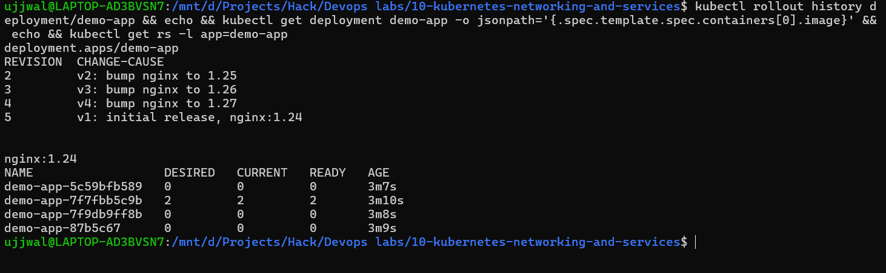
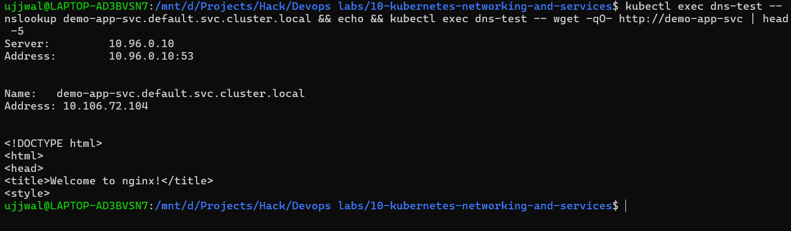

# Kubernetes Workloads, Rollback & DNS

**Student Name:** Ujjwal Jain
**Roll Number:** 24bcs10173
**Section:** Section B

See [ques.md](ques.md) for the exact breakdown of what was required

**Environment note:** Same WSL2 (Ubuntu) environment and Docker Desktop engine as previous modules, running against the local Minikube cluster. Every command below was executed in that WSL Ubuntu shell.

---

## Task 1: StatefulSet vs. DaemonSet vs. Deployment

The instructor was explicit that StatefulSet wasn't taught this session - it's flagged as homework research, with only one clue given: a StatefulSet Pod "is created in a particular manner." Here's what that actually means, from the official docs (`kubernetes.io/docs/concepts/workloads/controllers/statefulset/` and `.../daemonset/`):

| | **Deployment** | **StatefulSet** | **DaemonSet** |
|---|---|---|---|
| **Pod identity** | Interchangeable - any replica can replace any other | Sticky, stable identity per Pod (`web-0`, `web-1`, `web-2`, ...) that survives rescheduling | One Pod per eligible node, tied to that node |
| **Pod naming** | Random hash suffix (`demo-app-7f7fbb5c9b-bk9rg`) | Stable ordinal suffix (`-0`, `-1`, `-2`) | Named per-node, no replica count to set |
| **Startup/scaling order** | Unordered, concurrent | **Ordered, sequential** - Pod 0 must be Ready before Pod 1 starts; scales down in reverse | N/A - driven by node membership, not a replica count |
| **Storage** | Ephemeral or shared | Stable, per-Pod `PersistentVolumeClaim` that follows the same ordinal even after rescheduling | Typically none, or `hostPath`/node-local mounts |
| **Typical use case** | Stateless web apps, APIs | Databases, distributed systems where identity/order matters (MySQL, Cassandra, ZooKeeper) | Node-level agents: log shippers, monitoring agents, CNI/kube-proxy itself |

**What "created in a particular manner" means, concretely:** a StatefulSet with `replicas: 3` doesn't fire off all 3 Pods at once like a Deployment does. It creates `web-0` first, waits for it to be Ready, *then* creates `web-1`, waits, then `web-2`. Scaling down reverses that order (`web-2` goes first). This ordering guarantee is exactly what lets something like a database do leader election or ordered initialization safely - a Deployment gives you zero guarantee about which replica comes up first or whether they're numbered at all.

### DaemonSet - proved hands-on, not just described

Rather than just quoting the docs, I actually deployed one:

```yaml
# daemonset-demo/daemonset.yaml
apiVersion: apps/v1
kind: DaemonSet
metadata:
  name: node-agent-demo
spec:
  selector:
    matchLabels:
      app: node-agent-demo
  template:
    metadata:
      labels:
        app: node-agent-demo
    spec:
      containers:
        - name: node-agent-demo
          image: busybox:1.36
          command: ["sh", "-c", "sleep 3600"]
```

```text
$ kubectl apply -f daemonset.yaml
daemonset.apps/node-agent-demo created

$ kubectl get daemonset node-agent-demo -o wide
NAME              DESIRED   CURRENT   READY   UP-TO-DATE   AVAILABLE   NODE SELECTOR   AGE   CONTAINERS        IMAGES         SELECTOR
node-agent-demo   1         1         1       1            1           <none>          11s   node-agent-demo   busybox:1.36   app=node-agent-demo

$ kubectl get nodes
NAME       STATUS   ROLES           AGE   VERSION
minikube   Ready    control-plane   69m   v1.37.0
```

Notice there's no `replicas:` field anywhere in that manifest - DESIRED came out to exactly `1` because this Minikube cluster has exactly 1 node. On a real multi-node cluster this same manifest would put one Pod on every node automatically as nodes join, which is the entire point of a DaemonSet: `kube-proxy` and `kindnet` (visible in `kubectl get daemonset -A`) are themselves running as DaemonSets in `kube-system` for exactly this reason.

---

## Task 2: ReplicaSet vs. Deployment

This one wasn't a gap to fill - [module 09](../09-kubernetes-ingress-configmaps-secrets/README.md) already has the real hands-on evidence (creating/scaling a bare ReplicaSet, then a Deployment doing a rolling update watched live). The instructor's ask here is to be able to *say it clearly*, so:

A **ReplicaSet**'s entire job is: "keep N Pods matching this label selector running, right now." That's it - no history, no update strategy. If you edit a ReplicaSet's Pod template, existing Pods don't change; only new Pods created afterward pick up the new template.

A **Deployment** sits one layer above a ReplicaSet and adds exactly what a bare ReplicaSet can't do on its own: managed rollouts. When you change a Deployment's Pod template (like bumping an image tag), it doesn't touch the existing ReplicaSet - it creates a **brand new ReplicaSet** with the new template, scales that one up, and scales the old one down, then keeps the old ReplicaSet around (scaled to 0) as rollback history.

That ownership chain - **Deployment → owns → ReplicaSet → owns → Pods** - is directly visible in this module's own rollback demo below: after 4 revisions, there are 4 separate ReplicaSet objects still sitting there, one per revision, and only the currently-active one has any running Pods.

---

## Task 3: 4-Revision Deployment History (V1 → V4) + Direct Rollback to V1

Four manifests, each bumping the nginx image and recording a real change-cause:

```yaml
# deployment/v1.yaml (v2/v3/v4 are identical except image + change-cause)
apiVersion: apps/v1
kind: Deployment
metadata:
  name: demo-app
  annotations:
    kubernetes.io/change-cause: "v1: initial release, nginx:1.24"
spec:
  replicas: 2
  selector:
    matchLabels:
      app: demo-app
  template:
    metadata:
      labels:
        app: demo-app
    spec:
      containers:
        - name: demo-app
          image: nginx:1.24
          ports:
            - containerPort: 80
```

Applied all four in sequence, actually waiting for each rollout to finish before moving to the next:

```text
$ kubectl apply -f v1.yaml && kubectl rollout status deployment/demo-app --timeout=90s
deployment.apps/demo-app created
Waiting for deployment "demo-app" rollout to finish: 0 of 2 updated replicas are available...
Waiting for deployment "demo-app" rollout to finish: 1 of 2 updated replicas are available...
deployment "demo-app" successfully rolled out

$ kubectl apply -f v2.yaml && kubectl rollout status deployment/demo-app --timeout=90s
deployment.apps/demo-app configured
Waiting for deployment "demo-app" rollout to finish: 1 out of 2 new replicas have been updated...
Waiting for deployment "demo-app" rollout to finish: 1 old replicas are pending termination...
deployment "demo-app" successfully rolled out

# ...same pattern for v3.yaml (nginx:1.26) and v4.yaml (nginx:1.27), both rolled out cleanly
```

Confirmed history and current state before touching rollback:

```text
$ kubectl rollout history deployment/demo-app
REVISION  CHANGE-CAUSE
1         v1: initial release, nginx:1.24
2         v2: bump nginx to 1.25
3         v3: bump nginx to 1.26
4         v4: bump nginx to 1.27

$ kubectl get deployment demo-app -o jsonpath='{.spec.template.spec.containers[0].image}'
nginx:1.27
```

### The actual rollback - V4 straight to V1, one command

```text
$ kubectl rollout undo deployment/demo-app --to-revision=1
deployment.apps/demo-app rolled back
Waiting for deployment "demo-app" rollout to finish: 1 out of 2 new replicas have been updated...
Waiting for deployment "demo-app" rollout to finish: 1 old replicas are pending termination...
deployment "demo-app" successfully rolled out

$ kubectl get deployment demo-app -o jsonpath='{.spec.template.spec.containers[0].image}'
nginx:1.24
```

**The non-obvious part worth calling out:** rollback does **not** rewind the revision counter. Checking history right after:

```text
$ kubectl rollout history deployment/demo-app
REVISION  CHANGE-CAUSE
2         v2: bump nginx to 1.25
3         v3: bump nginx to 1.26
4         v4: bump nginx to 1.27
5         v1: initial release, nginx:1.24
```

Revision 1 is gone from the list and a **new** revision 5 shows up carrying V1's exact spec forward. Kubernetes treats "roll back to revision 1" as "create a new revision whose template matches revision 1's template" - it's forward-only history, not time travel. That's a genuinely useful thing to know before assuming `--to-revision=1` will still be there to roll back to a second time.

### Proof this isn't just metadata - the ReplicaSets themselves show it

```text
$ kubectl get rs -l app=demo-app
NAME                       DESIRED   CURRENT   READY   AGE   IMAGES
demo-app-5c59bfb589        0         0         0       42s   nginx:1.27
demo-app-7f7fbb5c9b        2         2         2       45s   nginx:1.24
demo-app-7f9db9ff8b        0         0         0       43s   nginx:1.26
demo-app-87b5c67           0         0         0       44s   nginx:1.25
```

All four ReplicaSets from all four revisions still exist - Deployment just scales the non-current ones down to 0 rather than deleting them, which is exactly what makes rollback fast (no image re-pull, no re-creation, just scale one up and one down).

### Screenshot Verification (Rollout History Before/After Rollback)


---

## Task 4: FQDN & CoreDNS - Researched, Then Proved Hands-On

### What FQDN and CoreDNS actually are

A **FQDN** (Fully Qualified Domain Name) is the complete, unambiguous name for something - for a Kubernetes Service, that format is:

```
<service-name>.<namespace>.svc.<cluster-domain>
```

which in a default Minikube setup is `<service-name>.<namespace>.svc.cluster.local`.

**CoreDNS** is the cluster's own DNS server, running as a Deployment in `kube-system` (`kubectl get deployment coredns -n kube-system` confirms this - it's a real workload, not magic). Its job is to answer exactly that kind of query: given a Service name, return the Service's ClusterIP.

**Why it's needed:** Pod IPs and Service ClusterIPs are assigned dynamically and change every time something restarts or reschedules. Hard-coding an IP into application config would break the moment anything moved. DNS gives every Service a stable *name* that always resolves to whatever the current, correct IP is - the entire reason Service discovery in Kubernetes works at all.

**How it resolves automatically, without any app-level configuration:** kubelet writes a `resolv.conf` into every Pod pointing at CoreDNS and listing search domains, so an app can just ask for `demo-app-svc` and the OS-level resolver expands it.

### Proving it, not just describing it

Deployed a plain test Pod:

```yaml
# dns-test/curl-test-pod.yaml
apiVersion: v1
kind: Pod
metadata:
  name: dns-test
spec:
  containers:
    - name: dns-test
      image: busybox:1.36
      command: ["sh", "-c", "sleep 3600"]
```

And exposed the `demo-app` Deployment from Task 3 as a proper ClusterIP Service to have something real to resolve:

```text
$ kubectl expose deployment demo-app --name=demo-app-svc --port=80 --target-port=80 --type=ClusterIP
service/demo-app-svc exposed
```

**Step 1 - what kubelet actually wrote into the Pod's resolv.conf:**

```text
$ kubectl exec dns-test -- cat /etc/resolv.conf
search default.svc.cluster.local svc.cluster.local cluster.local
nameserver 10.96.0.10
options ndots:5
```

That `10.96.0.10` is CoreDNS's ClusterIP (`kubectl get svc kube-dns -n kube-system` confirms the same address) - every Pod on this cluster points here automatically, no config needed.

**Step 2 - resolving the Service by its short name:**

```text
$ kubectl exec dns-test -- nslookup demo-app-svc
Server:         10.96.0.10
Address:        10.96.0.10:53

** server can't find demo-app-svc.cluster.local: NXDOMAIN
Name:   demo-app-svc.default.svc.cluster.local
Address: 10.106.72.104
```

That NXDOMAIN line isn't a failure - it's the search-domain expansion from `resolv.conf` actually happening in real time: BusyBox's resolver tries `demo-app-svc.cluster.local` first (no match), then succeeds on `demo-app-svc.default.svc.cluster.local`, which correctly resolves to the Service's real ClusterIP.

**Step 3 - resolving the full FQDN directly (no expansion needed):**

```text
$ kubectl exec dns-test -- nslookup demo-app-svc.default.svc.cluster.local
Server:         10.96.0.10
Address:        10.96.0.10:53

Name:   demo-app-svc.default.svc.cluster.local
Address: 10.106.72.104
```

Also cross-checked against the cluster's own built-in Service, resolved the same way:

```text
$ kubectl exec dns-test -- nslookup kubernetes.default.svc.cluster.local
Name:   kubernetes.default.svc.cluster.local
Address: 10.96.0.1
```

**Step 4 - the real end-to-end test: an actual HTTP request through the DNS name**

```text
$ kubectl exec dns-test -- wget -qO- http://demo-app-svc
<!DOCTYPE html>
<html>
<head>
<title>Welcome to nginx!</title>
...
```

This only works if *every* layer is actually functioning: CoreDNS resolves the name → the Service has real endpoints behind it → kube-proxy actually routes the connection to a live Pod. Confirmed the endpoint wiring directly too:

```text
$ kubectl get endpoints demo-app-svc
NAME           ENDPOINTS
demo-app-svc   10.244.0.76:80,10.244.0.77:80
```

Both of `demo-app`'s Pod IPs are registered as real endpoints behind the Service - this is the mechanism CoreDNS and kube-proxy both plug into.

### Screenshot Verification (DNS Resolution + HTTP Through Service Name)
