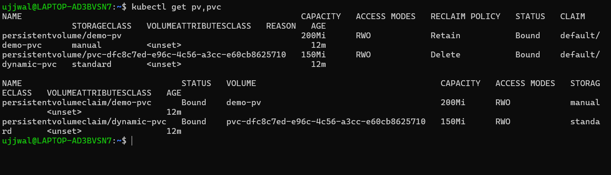
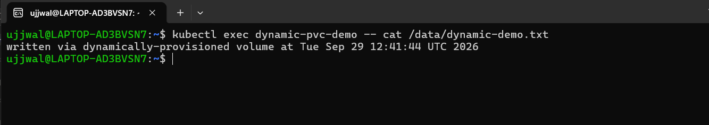

# Kubernetes Volumes

**Student Name:** Ujjwal Jain
**Roll Number:** 24bcs10173
**Section:** Section B

Part of [module 12: Kubernetes Storage, HPA & Probes](../README.md) — see [../ques.md](../ques.md) for the full task list. The doc for this session explicitly asked for a dedicated `01-kubernetes-volumes/README.md`, so this file documents Task 1 on its own; Task 2 (HPA) is written up in the parent [../README.md](../README.md).

**Environment note:** same live Minikube cluster (WSL2 Ubuntu, Docker driver) as every other Kubernetes module in this repo. Default StorageClass is `standard`, provisioner `k8s.io/minikube-hostpath` (confirmed below).

---

## emptyDir

An `emptyDir` is created fresh when a Pod is scheduled to a node and lives exactly as long as that Pod does — it's node-local scratch space shared between the containers *in the same Pod*, not something that survives a Pod restart or reaches other Pods. I proved the "shared between containers" part with a two-container Pod: one container writes a timestamp every 5s, the other just tails the same file.

```yaml
# emptydir-pod.yaml
apiVersion: v1
kind: Pod
metadata:
  name: emptydir-demo
  labels:
    demo: emptydir
spec:
  containers:
    - name: writer
      image: busybox:1.36
      command: ["sh", "-c", "while true; do date >> /cache/log.txt; sleep 5; done"]
      volumeMounts:
        - name: cache-volume
          mountPath: /cache
    - name: reader
      image: busybox:1.36
      command: ["sh", "-c", "tail -f /cache/log.txt"]
      volumeMounts:
        - name: cache-volume
          mountPath: /cache
  volumes:
    - name: cache-volume
      emptyDir: {}
```

```bash
kubectl apply -f emptydir-pod.yaml
kubectl wait --for=condition=Ready pod/emptydir-demo --timeout=60s
```
```
pod/emptydir-demo created
pod/emptydir-demo condition met
```

Read the same file from **both** containers — same content, proving it's one shared volume, not two separate filesystems:

```bash
kubectl exec emptydir-demo -c reader -- cat /cache/log.txt
kubectl exec emptydir-demo -c writer -- cat /cache/log.txt
```
```
Tue Sep 29 12:40:06 UTC 2026
Tue Sep 29 12:40:11 UTC 2026
Tue Sep 29 12:40:17 UTC 2026
Tue Sep 29 12:40:22 UTC 2026
--- writer container log ---
Tue Sep 29 12:40:06 UTC 2026
Tue Sep 29 12:40:11 UTC 2026
Tue Sep 29 12:40:17 UTC 2026
Tue Sep 29 12:40:22 UTC 2026
```

`kubectl describe` confirms the volume type and that it has no size limit set by default:

```
Volumes:
  cache-volume:
    Type:       EmptyDir (a temporary directory that shares a pod's lifetime)
    Medium:     
    SizeLimit:  <unset>
```

---

## hostPath

`hostPath` mounts a path from the **node's own filesystem** straight into the Pod. Unlike `emptyDir`, this survives Pod restarts (as long as it's rescheduled to the same node) because the data lives on the node, not inside the Pod's lifecycle. The catch — and why it's mostly a single-node/debugging tool, not something you'd rely on in production — is that if the Pod moves to a different node, the data doesn't move with it.

```yaml
# hostpath-pod.yaml
apiVersion: v1
kind: Pod
metadata:
  name: hostpath-demo
  labels:
    demo: hostpath
spec:
  containers:
    - name: hostpath-writer
      image: busybox:1.36
      command: ["sh", "-c", "echo \"written from pod $(hostname) at $(date)\" >> /host-data/hostpath-demo.txt; sleep 3600"]
      volumeMounts:
        - name: host-volume
          mountPath: /host-data
  volumes:
    - name: host-volume
      hostPath:
        path: /tmp/k8s-hostpath-demo
        type: DirectoryOrCreate
```

```bash
kubectl apply -f hostpath-pod.yaml
kubectl wait --for=condition=Ready pod/hostpath-demo --timeout=60s
```
```
pod/hostpath-demo created
pod/hostpath-demo condition met
```

Proof this really is the node's disk, not container-internal storage — read the file from inside the Pod, then again straight off the Minikube node itself via `minikube ssh`, bypassing the Pod entirely:

```bash
kubectl exec hostpath-demo -- cat /host-data/hostpath-demo.txt
```
```
written from pod hostpath-demo at Tue Sep 29 12:40:32 UTC 2026
```

```bash
minikube ssh -- cat /tmp/k8s-hostpath-demo/hostpath-demo.txt
```
```
written from pod hostpath-demo at Tue Sep 29 12:40:32 UTC 2026
```

Same content, read two completely different ways (`kubectl exec` into the container vs. SSH into the node and reading the raw path) — confirms the file genuinely lives on the node's `/tmp`, not somewhere private to the container.

---

## PersistentVolume + PersistentVolumeClaim (static provisioning)

A `PersistentVolume` (PV) is a piece of storage in the cluster, provisioned ahead of time by whoever manages storage (here, me, by hand). A `PersistentVolumeClaim` (PVC) is a request for storage made by a Pod's author, who doesn't need to know or care where the storage physically lives — Kubernetes matches the claim to a PV that satisfies its `storageClassName`, `accessModes`, and size.

```yaml
# pv-pvc-static.yaml
apiVersion: v1
kind: PersistentVolume
metadata:
  name: demo-pv
spec:
  capacity:
    storage: 200Mi
  accessModes:
    - ReadWriteOnce
  persistentVolumeReclaimPolicy: Retain
  storageClassName: manual
  hostPath:
    path: /tmp/k8s-static-pv
    type: DirectoryOrCreate
---
apiVersion: v1
kind: PersistentVolumeClaim
metadata:
  name: demo-pvc
spec:
  accessModes:
    - ReadWriteOnce
  storageClassName: manual
  resources:
    requests:
      storage: 100Mi
---
apiVersion: v1
kind: Pod
metadata:
  name: pv-pvc-demo
  labels:
    demo: pv-pvc
spec:
  containers:
    - name: app
      image: busybox:1.36
      command: ["sh", "-c", "echo \"written via PVC at $(date)\" >> /data/pvc-demo.txt; sleep 3600"]
      volumeMounts:
        - name: pvc-volume
          mountPath: /data
  volumes:
    - name: pvc-volume
      persistentVolumeClaim:
        claimName: demo-pvc
```

```bash
kubectl apply -f pv-pvc-static.yaml
kubectl wait --for=condition=Ready pod/pv-pvc-demo --timeout=60s
```
```
persistentvolume/demo-pv created
persistentvolumeclaim/demo-pvc created
pod/pv-pvc-demo created
pod/pv-pvc-demo condition met
```

The 100Mi claim bound to the 200Mi PV because `storageClassName: manual` matches on both and the PV's capacity is >= the claim's request — note `CLAIM` on the PV shows exactly which PVC took it, and the PVC's `VOLUME` column points back at `demo-pv`:

```bash
kubectl get pv demo-pv
kubectl get pvc demo-pvc
```
```
NAME      CAPACITY   ACCESS MODES   RECLAIM POLICY   STATUS   CLAIM              STORAGECLASS   AGE
demo-pv   200Mi      RWO            Retain           Bound    default/demo-pvc   manual         14s

NAME       STATUS   VOLUME    CAPACITY   ACCESS MODES   STORAGECLASS   AGE
demo-pvc   Bound    demo-pv   200Mi      RWO            manual         14s
```

*(screenshot below was taken after the dynamic-provisioning example too, so it shows both `demo-pv`/`demo-pvc` and the dynamically-provisioned pair side by side — see the Summary table)*

And the Pod really wrote through the claim end-to-end:

```bash
kubectl exec pv-pvc-demo -- cat /data/pvc-demo.txt
```
```
written via PVC at Tue Sep 29 12:41:23 UTC 2026
```

---

## StorageClass + dynamic provisioning

Hand-writing a PV for every claim doesn't scale. A `StorageClass` describes *how* to provision storage on demand — when a PVC asks for that class, the class's provisioner creates a brand-new PV automatically, with no PV manifest written by hand. Minikube ships a default StorageClass called `standard`, backed by the `storage-provisioner` addon:

```bash
kubectl get storageclass -o wide
```
```
NAME                 PROVISIONER                RECLAIMPOLICY   VOLUMEBINDINGMODE   ALLOWVOLUMEEXPANSION   AGE
standard (default)   k8s.io/minikube-hostpath   Delete          Immediate           false                  11d
```

This time I only wrote a PVC and a Pod — **no PV at all**:

```yaml
# dynamic-pvc.yaml
apiVersion: v1
kind: PersistentVolumeClaim
metadata:
  name: dynamic-pvc
spec:
  accessModes:
    - ReadWriteOnce
  storageClassName: standard
  resources:
    requests:
      storage: 150Mi
---
apiVersion: v1
kind: Pod
metadata:
  name: dynamic-pvc-demo
  labels:
    demo: dynamic-provisioning
spec:
  containers:
    - name: app
      image: busybox:1.36
      command: ["sh", "-c", "echo \"written via dynamically-provisioned volume at $(date)\" >> /data/dynamic-demo.txt; sleep 3600"]
      volumeMounts:
        - name: dynamic-volume
          mountPath: /data
  volumes:
    - name: dynamic-volume
      persistentVolumeClaim:
        claimName: dynamic-pvc
```

```bash
kubectl apply -f dynamic-pvc.yaml
kubectl wait --for=condition=Ready pod/dynamic-pvc-demo --timeout=60s
kubectl get pvc dynamic-pvc -o wide
kubectl get pv
```
```
persistentvolumeclaim/dynamic-pvc created
pod/dynamic-pvc-demo created
pod/dynamic-pvc-demo condition met

NAME          STATUS   VOLUME                                     CAPACITY   ACCESS MODES   STORAGECLASS   AGE
dynamic-pvc   Bound    pvc-dfc8c7ed-e96c-4c56-a3cc-e60cb8625710   150Mi      RWO            standard       6s

NAME                                       CAPACITY   ACCESS MODES   RECLAIM POLICY   STATUS   CLAIM                 STORAGECLASS   AGE
demo-pv                                    200Mi      RWO            Retain           Bound    default/demo-pvc      manual         32s
pvc-dfc8c7ed-e96c-4c56-a3cc-e60cb8625710   150Mi      RWO            Delete           Bound    default/dynamic-pvc   standard       6s
```



The key thing to notice: `demo-pv` (from the static example) has the name I gave it. `pvc-dfc8c7ed-e96c-4c56-a3cc-e60cb8625710` is a name **I never typed** — the `standard` StorageClass's provisioner generated that PV automatically the moment the PVC was created, with a `Delete` reclaim policy (vs. `Retain` on my manual one) since dynamically-provisioned volumes default to being cleaned up when their claim is deleted.

```bash
kubectl exec dynamic-pvc-demo -- cat /data/dynamic-demo.txt
```
```
written via dynamically-provisioned volume at Tue Sep 29 12:41:44 UTC 2026
```



---

## Summary: static vs. dynamic

| | Static (`demo-pv`) | Dynamic (`pvc-dfc8c7ed-...`) |
|---|---|---|
| Who creates the PV | Me, by hand, ahead of time | The StorageClass's provisioner, on demand |
| `storageClassName` | `manual` (a name I made up, not a real class) | `standard` (Minikube's real default class) |
| ReclaimPolicy | `Retain` (I set it) | `Delete` (the class's default) |
| PV name | Predictable (`demo-pv`) | Generated (`pvc-<uuid>`) |
