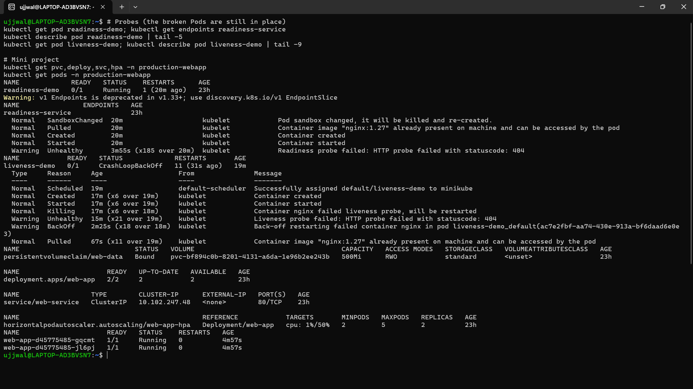
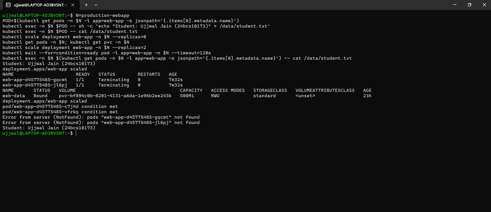
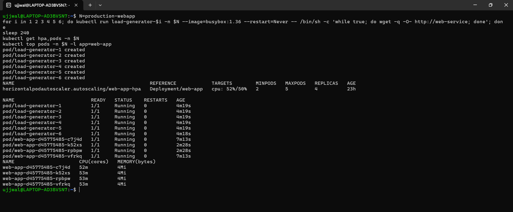

# Mini Project: Production-Ready Web App (PVC + HPA + Probes)

The Session 13 tab of the tracking doc says only "complete the mini project provided for Session 13" and attaches nothing, so I first flagged this task as blocked. It turned out the brief exists: it is the `mini-project/` folder in the instructor's reference repository ([Nency-Ravaliya/devops-heros](https://github.com/Nency-Ravaliya/devops-heros), `session-13-storage-hpa-probes/mini-project/`), a README with three verification tasks and bonus challenges, plus five manifests.

The five manifests in this folder ([`namespace.yaml`](namespace.yaml), [`pvc.yaml`](pvc.yaml), [`deployment.yaml`](deployment.yaml), [`service.yaml`](service.yaml), [`hpa.yaml`](hpa.yaml)) are the instructor's, **unchanged** (verified byte-identical to the originals). What is mine is everything below: running them, checking each claim, and writing down what actually happened, including where it did not match the brief's examples.

It combines the three things this session teaches: **storage** (a PVC that outlives Pods), **elastic scaling** (an HPA at 50% CPU between 2 and 5 replicas) and **health probes** (startup, readiness and liveness) on one nginx Deployment, in its own namespace, `production-webapp`.

```text
Service web-service (80) ──> Pods web-app (2 to 5)     each with: startup + readiness + liveness probes,
                                  │                                 requests cpu 100m / mem 64Mi,
                                  │                                 limits   cpu 200m / mem 128Mi
                                  └── volumeMount /data ──> PVC web-data (500Mi, ReadWriteOnce)
                                                              └── StorageClass "standard" (minikube-hostpath)
HPA web-app-hpa: 50% CPU target, min 2, max 5 ──reads──> metrics-server
```

**Environment:** Minikube (Kubernetes v1.37.0, single node), metrics-server and the default StorageClass enabled. The cluster was freshly created on 7 October (my Docker engine had been wiped just before), which is why the HPA starts out blind, as described below.

---

## Step 1: namespace and storage

```bash
kubectl apply -f namespace.yaml
kubectl apply -f pvc.yaml
kubectl get pvc -n production-webapp
kubectl get sc
```
```text
namespace/production-webapp created
persistentvolumeclaim/web-data created

NAME       STATUS   VOLUME                                     CAPACITY   ACCESS MODES   STORAGECLASS   AGE
web-data   Bound    pvc-bf894c0b-8201-4131-a6da-1e96b2ee243b   500Mi      RWO            standard       3s

NAME                 PROVISIONER                RECLAIMPOLICY   VOLUMEBINDINGMODE   ALLOWVOLUMEEXPANSION
standard (default)   k8s.io/minikube-hostpath   Delete          Immediate           false
```
I wrote no PersistentVolume: the claim was `Bound` within 3 seconds because the default StorageClass provisioned one on demand (`Immediate` binding mode), the dynamic provisioning from [Task 1](../01-kubernetes-volumes/README.md) of this module, now in real use.

## Step 2: the application, the Service and the HPA

```bash
kubectl apply -f deployment.yaml
kubectl apply -f service.yaml
kubectl rollout status deployment/web-app -n production-webapp
kubectl apply -f hpa.yaml
kubectl get hpa -n production-webapp
```
```text
deployment "web-app" successfully rolled out
NAME                      READY   STATUS    RESTARTS   AGE   IP           NODE
web-app-d45775485-57msp   1/1     Running   0          44s   10.244.0.9   minikube
web-app-d45775485-pbvst   1/1     Running   0          44s   10.244.0.8   minikube

horizontalpodautoscaler.autoscaling/web-app-hpa created
NAME          REFERENCE            TARGETS              MINPODS   MAXPODS   REPLICAS   AGE
web-app-hpa   Deployment/web-app   cpu: <unknown>/50%   2         5          2          2s
```
What the live Pod actually carries (from `kubectl describe pod`), which is what the HPA's percentages and the probes act on:
```text
Limits:      cpu: 200m    memory: 128Mi
Requests:    cpu: 100m    memory: 64Mi
Liveness:    http-get http://:80/ delay=5s  timeout=2s period=5s #success=1 #failure=3
Readiness:   http-get http://:80/ delay=5s  timeout=2s period=5s #success=1 #failure=2
Startup:     http-get http://:80/ delay=0s  timeout=1s period=2s #success=1 #failure=30
Mounts:      /data from persistent-storage (rw)
```
### Screenshot: the mini project's resources at the end of the session



The bottom half of this capture is the mini project after everything below had been done: the PVC `web-data` is `Bound` (500Mi, RWO, `standard`), the Deployment is `2/2`, `web-service` is a `ClusterIP` Service, the HPA reads `cpu: 1%/50%` at 2 replicas, and both Pods are `Running`. They are only 4m57s old, while everything else is 23h old, because they are the Pods created when I restored the original manifest after bonus challenge 2 (the old ones were replaced; the PVC, and the data on it, were not). The top half of the same capture is the two broken probe Pods from [04-probes](../04-probes/README.md).

The HPA reads `<unknown>/50%` at first. The CPU request (100m) is what HPA's percentage is measured against, and without a request it can never compute anything, so a missing request is the classic cause of `<unknown>`. Here the request exists, and the cause was something else (see Task 3).

---

## Task 1: storage persistence

The brief: write a file into `/data`, delete the Pod, and check the file in the replacement.
```bash
POD=$(kubectl get pods -n production-webapp -l app=web-app -o jsonpath='{.items[0].metadata.name}')
kubectl exec -n production-webapp "$POD" -- sh -c 'echo "Student: Ujjwal Jain (24bcs10173)" > /data/student.txt'
kubectl exec -n production-webapp "$POD" -- cat /data/student.txt
kubectl delete pod -n production-webapp "$POD"
```
```text
writing via pod: web-app-d45775485-57msp
Student: Ujjwal Jain (24bcs10173)
pod "web-app-d45775485-57msp" deleted from production-webapp namespace

NAME                      READY   STATUS    RESTARTS   AGE
web-app-d45775485-jrhmk   1/1     Running   0          10s          <- the replacement
web-app-d45775485-pbvst   1/1     Running   0          68s

file read from the replacement, web-app-d45775485-jrhmk:
Student: Ujjwal Jain (24bcs10173)
```
That passes the brief, but it is a **weaker proof than it looks**. With two replicas on one claim, the *other* Pod (`pbvst`) kept the volume mounted the whole time, so the data never had to survive without any Pod holding it. To prove what the brief claims ("outlives Pod deletions"), I scaled to zero so that nothing mounted the volume at all:
```bash
kubectl scale deployment web-app -n production-webapp --replicas=0
kubectl get pods -n production-webapp ; kubectl get pvc -n production-webapp
kubectl scale deployment web-app -n production-webapp --replicas=2
kubectl exec -n production-webapp <new-pod> -- cat /data/student.txt
```
```text
No resources found in production-webapp namespace.            <- zero Pods running

NAME       STATUS   VOLUME                                     CAPACITY   ACCESS MODES   STORAGECLASS
web-data   Bound    pvc-bf894c0b-8201-4131-a6da-1e96b2ee243b   500Mi      RWO            standard

NAME                      READY   STATUS    RESTARTS   AGE
web-app-d45775485-5fbks   1/1     Running   0          9s            <- two brand-new Pods
web-app-d45775485-hjxsg   1/1     Running   0          9s

Student: Ujjwal Jain (24bcs10173)
```
With **no Pods at all** the claim stayed `Bound` and two completely new Pods read the same file. The data belongs to the PVC, not to any Pod. (The file was still there much later too, after the whole HPA scale-up and scale-down below: `cat /data/student.txt` returned the same line.)

### Screenshot: the same test, run in my own terminal



This is the whole sequence in one screen: the file written and read, `--replicas=0`, `kubectl get pvc` showing `web-data` **`Bound`** (500Mi, RWO, `standard`), `--replicas=2`, and the final `cat` printing the same line. Three things in it are worth reading carefully rather than skimming past:

- The commands were pasted as one block with no pause, so `kubectl get pods` ran straight after the scale-to-zero and caught the two old Pods (`gqcmt`, `jl6pj`) still shutting down (`Terminating`), not an empty list. The strict "no Pod anywhere" moment (`No resources found`) is the transcript above, where I waited for the deletion first; what this capture proves is a **complete replacement of every Pod** with the claim `Bound` throughout.
- The two `Error from server (NotFound): pods "...gqcmt" not found` / `"...jl6pj" not found` lines are not a failure. `kubectl wait` selected the old Pods by label, and then they finished terminating and disappeared while it was waiting. Both brand-new Pods, `c7j4d` and `vfrkq`, reported `condition met`.
- By the time the last command ran, the old Pods no longer existed, so the final `Student: Ujjwal Jain (24bcs10173)` was read from a **brand-new Pod**, and the data came from the PVC.

## Task 2: Service verification

```bash
kubectl get svc,endpoints -n production-webapp
kubectl port-forward -n production-webapp svc/web-service 8081:80
curl -i http://localhost:8081
```
```text
NAME                  TYPE        CLUSTER-IP      EXTERNAL-IP   PORT(S)   AGE
service/web-service   ClusterIP   10.102.247.48   <none>        80/TCP    103s

NAME                    ENDPOINTS                       AGE
endpoints/web-service   10.244.0.11:80,10.244.0.12:80   103s

HTTP/1.1 200 OK
Server: nginx/1.27.5
<title>Welcome to nginx!</title>
```
The two endpoints are exactly the two Pods' IPs, and the Service answers through the forwarded port.

## Task 3: HPA elastic scaling

### Getting a first reading

For the first few minutes after the cluster was created the HPA could not read any CPU at all, and its own event log says so:
```text
Warning  FailedGetResourceMetric   failed to get cpu utilization: unable to get metrics for resource cpu: no metrics returned from resource metrics API
Warning  FailedGetResourceMetric   failed to get cpu utilization: did not receive metrics for targeted pods (pods might be unready)
```
That is metrics-server warming up on a brand-new cluster (it scrapes about once a minute, and the Pods I had just recreated needed a scrape of their own). `kubectl top pods` said `error: metrics not available yet` at the same time. Waiting was the fix, and the first real number was `1%/50%`.

### Generating load

The brief's load generator is a busybox Pod looping `wget` against the Service:
```bash
kubectl run load-generator -n production-webapp --image=busybox:1.36 --restart=Never \
  -- /bin/sh -c "while true; do wget -q -O- http://web-service; done"
kubectl get hpa -n production-webapp -w
```

### First run (7 October): one generator, then six

One generator is not enough. The first thing I read after starting it was `1m` of CPU per Pod, which turned out to be a **stale** metric (metrics lag the load by a minute or more), and the HPA's own reading a minute later was `23%/50%`. That is real load, but under the 50% target, so nothing scaled. I added five more copies of the identical loop. The live watch of that run:
```text
NAME          REFERENCE            TARGETS              MINPODS   MAXPODS   REPLICAS   AGE
web-app-hpa   Deployment/web-app   cpu: <unknown>/50%   2         5         2          78s
web-app-hpa   Deployment/web-app   cpu: 1%/50%          2         5         2          2m31s
web-app-hpa   Deployment/web-app   cpu: 23%/50%         2         5         2          3m31s     <- one generator
web-app-hpa   Deployment/web-app   cpu: 60%/50%         2         5         2          4m31s     <- six generators
web-app-hpa   Deployment/web-app   cpu: 60%/50%         2         5         3          4m46s     <- scaled 2 -> 3
web-app-hpa   Deployment/web-app   cpu: 75%/50%         2         5         3          5m31s
web-app-hpa   Deployment/web-app   cpu: 66%/50%         2         5         3          6m32s
web-app-hpa   Deployment/web-app   cpu: 66%/50%         2         5         4          6m47s     <- scaled 3 -> 4
web-app-hpa   Deployment/web-app   cpu: 56%/50%         2         5         4          7m32s
```
and where it came to rest:
```text
web-app-hpa   Deployment/web-app   cpu: 51%/50%   2   5   4   9m5s

NAME                      CPU(cores)
web-app-d45775485-4t5lp   52m
web-app-d45775485-5fbks   52m
web-app-d45775485-6d4ch   52m
web-app-d45775485-hjxsg   51m
```
**It stopped at 4 replicas, not 5, and that is correct, not a failure.** Four Pods each using about half their 100m request is the stable answer for this load: `51/50 = 1.02`, and the HPA ignores differences within a 10 percent tolerance, so it stops adjusting. It scales to `ceil(current replicas x current utilisation / target)`: from 2 Pods at 98% that is `ceil(2 x 98 / 50) = 4`; at 4 Pods and 51% it is `ceil(4 x 51 / 50) = 5`, but 1.02 is inside the tolerance band, so it does not move. The brief's illustrative log ends at 5; that is an example, not a promise, and it would reach 5 only if the load needed it. (The [Task 2](../README.md) HPA run in this module, with a deliberately CPU-hungry app, did reach the 5-replica cap.)

### Second run (8 October, after a restart): all six generators at once

I repeated the whole cycle after restarting the cluster, this time starting all six generators together:
```text
12:55:19 UTC  six load generators started
12:57:22      web-app-hpa   cpu: 98%/50%   2   5   4     <- 4 replicas, about 2 minutes after the load began
12:59:16      web-app-hpa   cpu: 53%/50%   2   5   4

web-app-d45775485-5fbks   54m      web-app-d45775485-hjxsg   53m
web-app-d45775485-8pwrj   54m      web-app-d45775485-rv65m   54m

resource cpu on pods (as a percentage of request):  53% (53m) / 50%
```
It went `2 -> 4` in a single step (`ceil(2 x 98 / 50) = 4`) and settled at 53%, again inside the tolerance.

### Screenshot: a third run, in my own terminal



The same experiment a third time, this one pasted with a `sleep 240` so the capture is taken four minutes after the load started: the HPA reads **`cpu: 52%/50%`** with **`REPLICAS 4`**, the six load generators have been `Running` for 4m19s, and `kubectl top pods` shows all four web Pods at **52m-53m** each (of their 100m request). The Pod ages tell the scaling story by themselves: the two Pods that are 7m13s old (`c7j4d`, `vfrkq`) are the originals, and the two that are 2m28s old (`k52xs`, `rpbpw`) were added by the HPA about 1m50s after the generators started. Three separate runs have now landed on the same answer, 4 replicas at roughly 51-53%, which is what the tolerance explanation above predicts. (The generators were deleted straight after this capture.)

### Scaling back down

```bash
kubectl delete pod load-generator-1 ... load-generator-6 -n production-webapp
```
```text
12:59:27 UTC  load removed
13:01:16      per-pod CPU: 17m, 12m, 14m, 13m          (kubectl top: the real load is already gone)
13:01:21      web-app-hpa   cpu: 14%/50%   2   5   4   <- the HPA's number catches up (metrics lag)
13:02:23      web-app-hpa   cpu: 1%/50%    2   5   4   <- fully idle, still 4 replicas
...           (held at 4 replicas for about 5 minutes)
13:06:13      New size: 2; reason: All metrics below target
13:06:32      web-app-hpa   cpu: 1%/50%    2   5   2
```
The metric was far below target from 13:01, but the replicas stayed at 4 for roughly five minutes: that is the HPA's **scale-down stabilization window** (default 300 seconds), which deliberately waits so that a brief dip does not make it throw Pods away just before the next spike. Scaling **up** is immediate; scaling **down** is patient. It kept the two oldest Pods and removed the two newest. A continuous `kubectl get hpa -w` over the whole 18 minutes (started at 12:53:27 UTC) recorded the same story independently, and showed one more thing: right after the scale-down the reading went back to `<unknown>` for about a minute while metrics-server caught up with the changed set of Pods, then returned to `1%`:
```text
cpu: <unknown>/50%   2   5   2        <- start (metrics-server just restarted)
cpu: 1%/50%          2   5   2
cpu: 9%/50%          2   5   2
cpu: 98%/50%         2   5   2        <- six generators running
cpu: 98%/50%         2   5   4        <- scaled 2 -> 4
cpu: 71%/50%         2   5   4
cpu: 53%/50%         2   5   4        <- settled
cpu: 52%/50%         2   5   4
cpu: 14%/50%         2   5   4        <- load removed, metric catches up
cpu: 1%/50%          2   5   4
cpu: 1%/50%          2   5   4
cpu: 1%/50%          2   5   2        <- scaled 4 -> 2 after the stabilization window
cpu: <unknown>/50%   2   5   2        <- (x4) metrics briefly gone for the changed Pod set
cpu: 1%/50%          2   5   2
```
The event history shows both cycles in order, the first one from the previous day still in the log:
```text
New size: 3; reason: cpu resource utilization (percentage of request) above target     (7 Oct)
New size: 4; reason: cpu resource utilization (percentage of request) above target     (7 Oct)
New size: 2; reason: All metrics below target                                          (7 Oct)
New size: 4; reason: cpu resource utilization (percentage of request) above target     (8 Oct)
New size: 2; reason: All metrics below target                                          (8 Oct)
```

---

## Bonus challenge 2: readiness gating on the real Deployment

The brief suggests changing `readinessProbe.httpGet.path` to `/does-not-exist` and watching the Service's endpoints. I did that on a **copy** (the committed `deployment.yaml` is untouched): the only difference is that one line.
```text
43c43
<               path: /
---
>               path: /does-not-exist
```
```bash
kubectl apply -f deployment-readiness-broken.yaml        # the copy
```
```text
NAME                       READY   STATUS    RESTARTS   AGE
web-app-5945bfc776-5x25s   0/1     Running   0          47s
web-app-5945bfc776-kb4lm   0/1     Running   0          47s

NAME      READY   UP-TO-DATE   AVAILABLE
web-app   0/2     2            0

NAME          ENDPOINTS   AGE
web-service               23h                        <- empty (it had both Pod IPs a minute earlier)

Warning  Unhealthy  Readiness probe failed: HTTP probe failed with statuscode: 404
```
Both Pods are `Running`, yet `READY 0/1`, the Deployment has **0 available**, and the Service has **no endpoints**. And the original healthy Pods are *gone*: this manifest says `strategy: Recreate`, which kills every old Pod before starting any new one, so a bad readiness probe plus `Recreate` means a full outage, not a stalled rollout (with the default `RollingUpdate` the old Pods would have stayed in service). A real request shows the user-visible effect:
```text
wget: can't connect to remote host (10.102.247.48): Connection refused
request FAILED: no ready backend
```
Restoring the original manifest recovered it:
```text
deployment "web-app" successfully rolled out
web-app-d45775485-gqcmt   1/1   Running   9s
web-app-d45775485-jl6pj   1/1   Running   9s
web-service   10.244.0.23:80,10.244.0.24:80
wget exit code: 0     <title>Welcome to nginx!</title>
```
I did not do bonus challenges 1 (lowering the HPA target to 30%) and 3 (liveness path `/crash`). The effect of challenge 3 is shown in detail, on a bare Pod, in [04-probes](../04-probes/README.md).

---

## What I took away

- **PVC data belongs to the claim, not the Pod.** Scaling to zero while the claim stayed `Bound` is the proof; deleting one of two Pods is not.
- **The HPA is blind until metrics exist**, and metrics lag reality by a minute or more, so what you read is always a little old (my first `1m` reading was stale). Judge it by `kubectl top` and `describe hpa`, not by one `get`.
- **It converges, it does not race to the maximum.** It stops at the replica count where utilisation sits near the target (4 here), and ignores differences within a 10 percent tolerance.
- **Up is immediate, down is patient** (the 5-minute window), by design.
- **A readiness failure is the dangerous one for availability:** Pods stay `Running`, the Service loses all endpoints, and with `strategy: Recreate` the old Pods are already gone, so users get `Connection refused`.
- The instructor's example outputs (such as `110%/50%` and 5 replicas) are illustrations of the shape of the behaviour; on this cluster the numbers differed, and the written-up numbers above are the real ones.

## Cleanup

```bash
kubectl delete namespace production-webapp        # removes the Deployment, Service, HPA, and the PVC with its data
```
