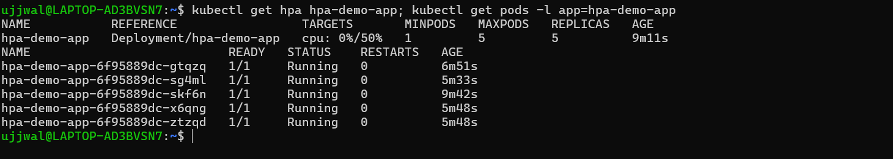

# Kubernetes Storage, HPA & Probes

**Student Name:** Ujjwal Jain
**Roll Number:** 24bcs10173
**Section:** Section B

See [ques.md](ques.md) for the exact task breakdown. Task 1 (Volumes) is written up separately in [01-kubernetes-volumes/README.md](01-kubernetes-volumes/README.md) since the doc explicitly asked for a dedicated sub-README there; Task 2 (HPA) is below. Task 3 (Mini Project) is blocked — see the note at the bottom.

**Environment note:** same live Minikube cluster (WSL2 Ubuntu, Docker driver) as every other Kubernetes module in this repo. HPA needs the `metrics-server` addon, which was **not** enabled by default — enabled it below as the first step.

---

## Task 2: HPA Hands-on

### Step 0: enable metrics-server

HPA reads CPU utilization from the Metrics API, which nothing serves until `metrics-server` is running. Without it, `kubectl top` and any HPA just sit at `<unknown>` forever.

```bash
minikube addons enable metrics-server
kubectl top nodes
```
```
* The 'metrics-server' addon is enabled

NAME       CPU(cores)   CPU(%)   MEMORY(bytes)   MEMORY(%)
minikube   209m         5%       1021Mi          26%
```

### Step 1: deploy the application

Used `registry.k8s.io/hpa-example` (the standard `php-apache` image from the official Kubernetes HPA walkthrough) — it exposes an endpoint that runs a CPU-burning loop, which makes it easy to generate real load. A `resources.requests.cpu` is set on the container, which is mandatory: HPA's percentage target (`averageUtilization`) is computed against the request, so without one the HPA has nothing to divide by.

```yaml
# 02-hpa/deployment.yaml
apiVersion: apps/v1
kind: Deployment
metadata:
  name: hpa-demo-app
spec:
  replicas: 1
  selector:
    matchLabels:
      app: hpa-demo-app
  template:
    metadata:
      labels:
        app: hpa-demo-app
    spec:
      containers:
        - name: php-apache
          image: registry.k8s.io/hpa-example
          ports:
            - containerPort: 80
          resources:
            requests:
              cpu: 200m
            limits:
              cpu: 500m
---
apiVersion: v1
kind: Service
metadata:
  name: hpa-demo-app
spec:
  selector:
    app: hpa-demo-app
  ports:
    - port: 80
      targetPort: 80
```

```bash
kubectl apply -f deployment.yaml
kubectl wait --for=condition=Available deployment/hpa-demo-app --timeout=90s
```
```
deployment.apps/hpa-demo-app created
service/hpa-demo-app created
deployment.apps/hpa-demo-app condition met
```

### Step 2 & 3: configure HPA, verify it

```yaml
# 02-hpa/hpa.yml
apiVersion: autoscaling/v2
kind: HorizontalPodAutoscaler
metadata:
  name: hpa-demo-app
spec:
  scaleTargetRef:
    apiVersion: apps/v1
    kind: Deployment
    name: hpa-demo-app
  minReplicas: 1
  maxReplicas: 5
  metrics:
    - type: Resource
      resource:
        name: cpu
        target:
          type: Utilization
          averageUtilization: 50
```

```bash
kubectl apply -f hpa.yml
kubectl get hpa hpa-demo-app
```

Right after creation the target reads `<unknown>` — metrics-server hasn't completed its first scrape cycle against this specific pod yet:

```
horizontalpodautoscaler.autoscaling/hpa-demo-app created
NAME           REFERENCE                 TARGETS              MINPODS   MAXPODS   REPLICAS   AGE
hpa-demo-app   Deployment/hpa-demo-app   cpu: <unknown>/50%   1         5         1          21s
```

`kubectl describe hpa` confirmed exactly why — `FailedGetResourceMetric: did not receive metrics for targeted pods` — a transient state, not a real error:

```
Conditions:
  Type           Status  Reason                   Message
  ----           ------  ------                   -------
  AbleToScale    True    SucceededGetScale        the HPA controller was able to get the target's current scale
  ScalingActive  False   FailedGetResourceMetric  the HPA was unable to compute the replica count: failed to get cpu utilization: did not receive metrics for targeted pods (pods might be unready)
```

About a minute later, real metrics showed up and the HPA started reporting genuine utilization:

```bash
kubectl get hpa hpa-demo-app
```
```
NAME           REFERENCE                 TARGETS       MINPODS   MAXPODS   REPLICAS   AGE
hpa-demo-app   Deployment/hpa-demo-app   cpu: 0%/50%   1         5         1          99s
```

### Step 4-7: load generator, rising CPU, Pod scaling

```yaml
# 02-hpa/load-generator.yaml
apiVersion: v1
kind: Pod
metadata:
  name: load-generator
spec:
  containers:
    - name: load-generator
      image: busybox:1.36
      command:
        - sh
        - -c
        - "while true; do wget -q -O- http://hpa-demo-app.default.svc.cluster.local; done"
  restartPolicy: Never
```

```bash
kubectl apply -f load-generator.yaml
```

Polled `kubectl get hpa` + `kubectl top pods` every ~25s for about 3.5 minutes to watch it happen live:

```
=== 12:46:07 UTC (check 1/8) ===
hpa-demo-app   Deployment/hpa-demo-app   cpu: 0%/50%   1   5   1   111s
hpa-demo-app-6f95889dc-skf6n   1m   10Mi

=== 12:46:33 UTC (check 2/8) ===
hpa-demo-app   Deployment/hpa-demo-app   cpu: 0%/50%   1   5   1   2m18s
hpa-demo-app-6f95889dc-skf6n   160m   13Mi

=== 12:47:00 UTC (check 3/8) ===
hpa-demo-app   Deployment/hpa-demo-app   cpu: 80%/50%   1   5   2   2m44s
hpa-demo-app-6f95889dc-skf6n   160m   13Mi

=== 12:47:26 UTC (check 4/8) ===
hpa-demo-app   Deployment/hpa-demo-app   cpu: 80%/50%   1   5   2   3m10s
hpa-demo-app-6f95889dc-skf6n   160m   13Mi

=== 12:47:52 UTC (check 5/8) ===
hpa-demo-app   Deployment/hpa-demo-app   cpu: 173%/50%   1   5   2   3m37s
hpa-demo-app-6f95889dc-gtqzq   327m   11Mi
hpa-demo-app-6f95889dc-skf6n   366m   13Mi

=== 12:48:19 UTC (check 6/8) ===
hpa-demo-app   Deployment/hpa-demo-app   cpu: 173%/50%   1   5   5   4m4s
hpa-demo-app-6f95889dc-gtqzq   327m   11Mi
hpa-demo-app-6f95889dc-skf6n   366m   13Mi

=== 12:48:46 UTC (check 7/8) ===
hpa-demo-app   Deployment/hpa-demo-app   cpu: 93%/50%   1   5   5   4m30s
hpa-demo-app-6f95889dc-gtqzq   201m   11Mi
hpa-demo-app-6f95889dc-sg4ml   145m   11Mi
hpa-demo-app-6f95889dc-skf6n   225m   13Mi
hpa-demo-app-6f95889dc-x6qng   185m   12Mi
hpa-demo-app-6f95889dc-ztzqd   180m   11Mi

=== 12:49:13 UTC (check 8/8) ===
hpa-demo-app   Deployment/hpa-demo-app   cpu: 93%/50%   1   5   5   4m57s
(5 pods, same as above)
```

What actually happened, reading straight off that log: CPU sat at 0% with nothing hitting the app, then climbed to 80% within ~30s of the load generator starting — comfortably over the 50% target, so the HPA scaled to 2 replicas. Load kept climbing (173% against a now-doubled capacity), so it kept scaling, capping out at `maxReplicas: 5` — the 5 pods then settled around 93%, still over target but pinned at the max I configured.

### Step 8: capture the output — HPA's own event log

`kubectl describe hpa` after it had leveled off, showing the full scaling history in the `Events` section — three real `SuccessfulRescale` events, not just the polling snapshots above:

```bash
kubectl describe hpa hpa-demo-app
```
```
Metrics:                                               ( current / target )
  resource cpu on pods  (as a percentage of request):  77% (155m) / 50%
Min replicas:                                          1
Max replicas:                                          5
Deployment pods:                                       5 current / 5 desired
Conditions:
  Type            Status  Reason            Message
  ----            ------  ------            -------
  AbleToScale     True    ReadyForNewScale  recommended size matches current size
  ScalingActive   True    ValidMetricFound  the HPA was able to successfully calculate a replica count from cpu resource utilization (percentage of request)
  ScalingLimited  True    TooManyReplicas   the desired replica count is more than the maximum replica count
  ScaledToZero    False   NotScaledToZero   the HPA controller did not scale the workload to zero
Events:
  Type     Reason                        Age                    From                       Message
  Warning  FailedGetResourceMetric       5m29s                  horizontal-pod-autoscaler  failed to get cpu utilization: unable to get metrics for resource cpu: no metrics returned from resource metrics API
  Warning  FailedComputeMetricsReplicas  5m29s                  horizontal-pod-autoscaler  invalid metrics (1 invalid out of 1), first error is: failed to get cpu resource metric value: failed to get cpu utilization: unable to get metrics for resource cpu: no metrics returned from resource metrics API
  Warning  FailedGetResourceMetric       4m27s (x4 over 5m13s)  horizontal-pod-autoscaler  failed to get cpu utilization: did not receive metrics for targeted pods (pods might be unready)
  Warning  FailedComputeMetricsReplicas  4m27s (x4 over 5m13s)  horizontal-pod-autoscaler  invalid metrics (1 invalid out of 1), first error is: failed to get cpu resource metric value: failed to get cpu utilization: did not receive metrics for targeted pods (pods might be unready)
  Normal   SuccessfulRescale             3m9s                   horizontal-pod-autoscaler  New size: 2; reason: cpu resource utilization (percentage of request) above target
  Normal   SuccessfulRescale             2m6s                   horizontal-pod-autoscaler  New size: 4; reason: cpu resource utilization (percentage of request) above target
  Normal   SuccessfulRescale             111s                   horizontal-pod-autoscaler  New size: 5; reason: cpu resource utilization (percentage of request) above target
```

Interesting detail worth calling out: the HPA jumped straight to 4 replicas on its second rescale (not 3) — that's the HPA's own scale-up algorithm being aggressive on purpose (it can roughly double replica count in one step when utilization is far over target, rather than crawling up by one), which is exactly what the 173%/50% ratio above triggered.

Cleaned up the load generator afterward so the cluster doesn't keep burning CPU:

```bash
kubectl delete pod load-generator
```
```
pod "load-generator" deleted
```

The HPA will now scale back down toward `minReplicas: 1` on its own once CPU stays under target for the default 5-minute stabilization window — I didn't sit and wait for that since the scale-*up* behavior (the actual ask) is fully captured above.

### Screenshots

`kubectl get hpa` + `kubectl get pods` at the settled state — 5/5 Running, HPA holding at 5 replicas:



---

## Task 3: Mini Project — blocked

The doc's Session 13 tab says only: *"Complete the mini project provided for Session 13."* There's no attached brief, link, or further detail on that tab. I'm not fabricating a project to fill this gap — if you have the actual mini-project handout (PDF, separate doc, or whatever the instructor shared live), send it over and I'll build it out for real.
