# Kubernetes Troubleshooting

**Student Name:** Ujjwal Jain
**Roll Number:** 24bcs10173
**Section:** Section B

See [ques.md](ques.md) for the exact task breakdown. Task 3 (Mini Project) is not a separate section below. Its deliverable format (Commands / Problem statement / Investigation steps / Root cause / Solution / Before-after output / Screenshots) is applied to every issue in Task 2, since that is exactly what the doc's deliverable list asks for.

---

## Task 1: Kubernetes Commands

I ran all 8 against real, live cluster resources rather than made-up examples.

**`kubectl get` / `kubectl get -o wide`:** I listed every Pod across every namespace, plus IPs and node placement for the default namespace:
```bash
kubectl get pods -A
kubectl get pods -o wide
```
```
NAMESPACE       NAME                                       READY   STATUS      RESTARTS        AGE
default         demo-app-7f7fbb5c9b-59gxq                  1/1     Running     2 (21m ago)     11d
default         dns-test                                   1/1     Running     4 (21m ago)     11d
default         hpa-demo-app-6f95889dc-gtqzq               1/1     Running     0               12m
ingress-nginx   ingress-nginx-controller-d7cd8c989-rrbvv   1/1     Running     1 (21m ago)     7d16h
kube-system     coredns-559f6c778d-8vd95                   1/1     Running     4 (21m ago)     11d
kube-system     metrics-server-768f9f6999-mp6qv            1/1     Running     0               16m
...(full list has every workload from every module in this repo, still live)

NAME                           READY   STATUS    RESTARTS      AGE   IP            NODE
demo-app-7f7fbb5c9b-59gxq      1/1     Running   2 (21m ago)   11d   10.244.0.4    minikube
hpa-demo-app-6f95889dc-gtqzq   1/1     Running   0             12m   10.244.0.15   minikube
```

**`kubectl describe`:** I pulled the full Deployment state, including its scaling history (this caught the HPA's live scale-*down* from module 12, happening in the background while I worked on this module):
```bash
kubectl describe deployment hpa-demo-app
```
```
Events:
  Type    Reason             Age   From                   Message
  Normal  ScalingReplicaSet  15m   deployment-controller  Scaled up replica set hpa-demo-app-6f95889dc from 0 to 1
  Normal  ScalingReplicaSet  12m   deployment-controller  Scaled up replica set hpa-demo-app-6f95889dc from 1 to 2
  Normal  ScalingReplicaSet  11m   deployment-controller  Scaled up replica set hpa-demo-app-6f95889dc from 2 to 4
  Normal  ScalingReplicaSet  10m   deployment-controller  Scaled up replica set hpa-demo-app-6f95889dc from 4 to 5
  Normal  ScalingReplicaSet  2m8s  deployment-controller  Scaled down replica set hpa-demo-app-6f95889dc from 5 to 1
```

**`kubectl logs`:** I pulled the real nginx startup log from a Pod that had been running for 11 days:
```bash
kubectl logs demo-app-7f7fbb5c9b-59gxq --tail=10
```
```
2026/09/29 12:37:45 [notice] 1#1: using the "epoll" event method
2026/09/29 12:37:45 [notice] 1#1: nginx/1.24.0
2026/09/29 12:37:45 [notice] 1#1: start worker process 31
```

**`kubectl exec`:** I dropped into `dns-test` to read its actual resolv.conf, proving where CoreDNS's ClusterIP comes from:
```bash
kubectl exec dns-test -- sh -c 'hostname; whoami; cat /etc/resolv.conf'
```
```
dns-test
root
search default.svc.cluster.local svc.cluster.local cluster.local
nameserver 10.96.0.10
options ndots:5
```

**`kubectl get events`:** I pulled the cluster-wide event stream, sorted by time (this window happened to catch the HPA scaling a whole batch of Pods down live):
```bash
kubectl get events --sort-by=.lastTimestamp
```
```
2m16s   Normal   SuccessfulRescale   horizontalpodautoscaler/hpa-demo-app   New size: 1; reason: All metrics below target
2m16s   Normal   Killing             pod/hpa-demo-app-6f95889dc-sg4ml       Stopping container php-apache
2m16s   Normal   SuccessfulDelete    replicaset/hpa-demo-app-6f95889dc      Deleted pod: hpa-demo-app-6f95889dc-sg4ml
2m16s   Normal   ScalingReplicaSet   deployment/hpa-demo-app                Scaled down replica set hpa-demo-app-6f95889dc from 5 to 1
```

**`kubectl explain`:** I pulled schema documentation straight from the API server, rather than from a manual:
```bash
kubectl explain pod.spec.containers.resources
```
```
FIELDS:
  limits    <map[string]Quantity>
    Limits describes the maximum amount of compute resources allowed.
  requests  <map[string]Quantity>
    Requests describes the minimum amount of compute resources required.
```

**`kubectl top`:** I checked live resource usage from metrics-server:
```bash
kubectl top pods
```
```
NAME                           CPU(cores)   MEMORY(bytes)
demo-app-7f7fbb5c9b-59gxq      0m           4Mi
hpa-demo-app-6f95889dc-gtqzq   1m           11Mi
```

### Screenshot Verification (all 8 commands)
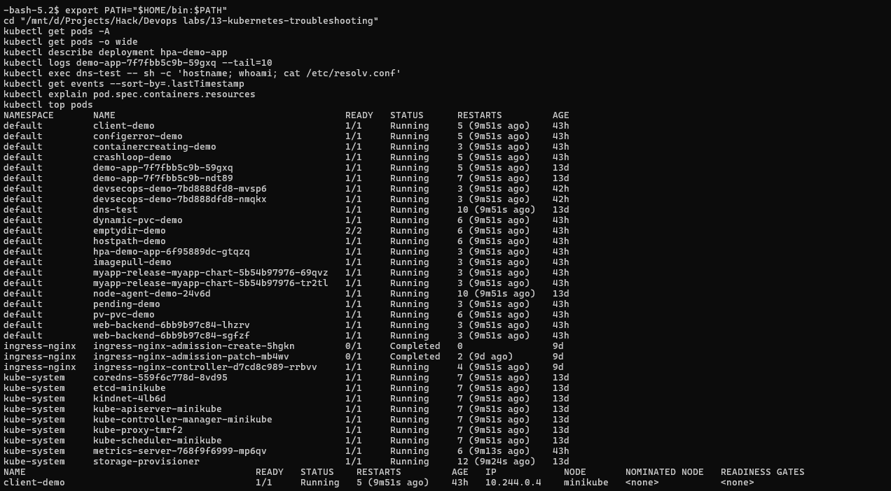
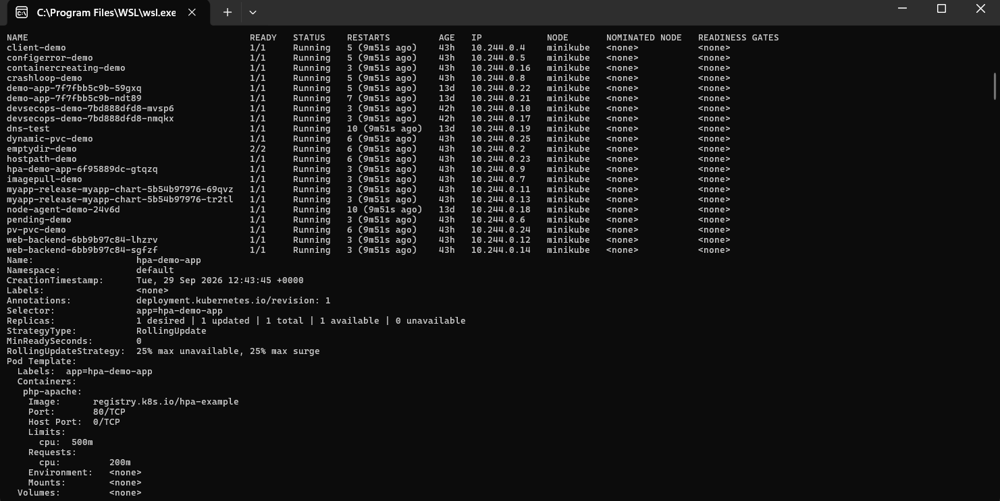
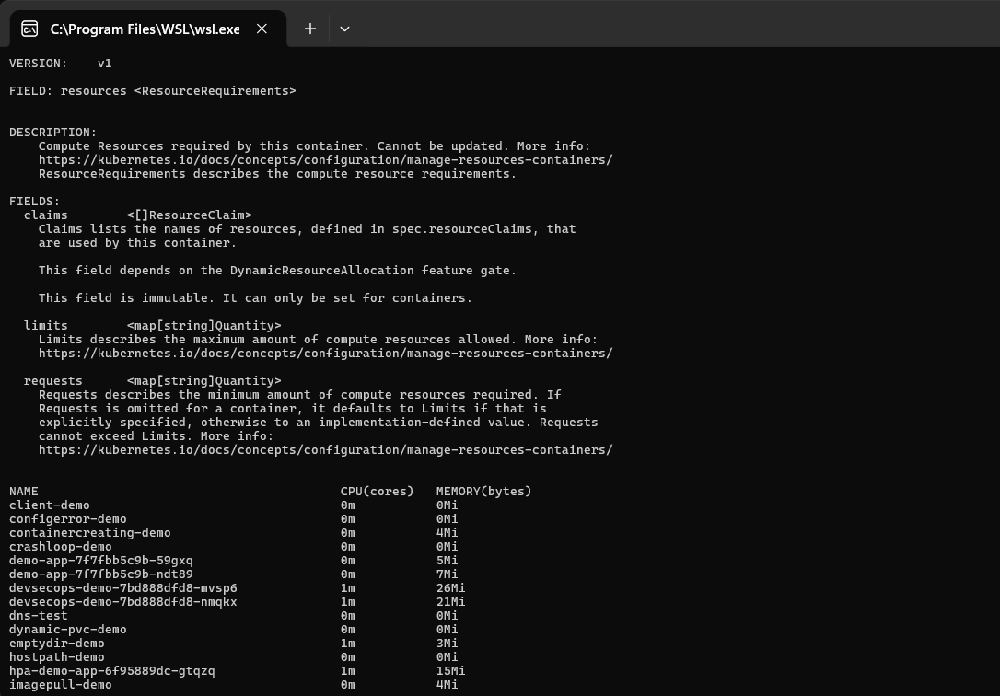
All 8 commands run fresh against the live cluster, 13 days into this repo's life at this point, which is why `get pods -A` lists every workload from every other module still running, not just this one.

---

## Task 2 + 3: Troubleshoot Common Issues (with the full report format)

Each issue below was genuinely broken, then genuinely fixed. I applied the `-broken.yaml` manifest, which produced the exact failure state shown, then replaced it with `-fixed.yaml` and re-verified. Nothing here is a description of what *would* happen; it is what did happen, with real timestamps.

### 1. CrashLoopBackOff

**Problem statement:** `crashloop-demo` should start and stay running, but keeps restarting.

**Commands / Investigation:**
```bash
kubectl apply -f manifests/01-crashloopbackoff-broken.yaml
kubectl get pod crashloop-demo
kubectl describe pod crashloop-demo
kubectl logs crashloop-demo
```
```
NAME             READY   STATUS   RESTARTS       AGE
crashloop-demo   0/1     Error    5 (2m28s ago)  3m52s
...
Warning  BackOff  Back-off restarting failed container app in pod crashloop-demo_default(...)

$ kubectl logs crashloop-demo
starting up...
reading required config file
cat: can't open '/etc/app/config.env': No such file or directory
```
(Between restarts, `kubectl get pod` alternates showing `Error` (right after a crash) and `CrashLoopBackOff` (during the kubelet's growing backoff delay). Both describe the same loop, and the `describe` event's `Back-off restarting failed container` line is the definitive proof.)

**Root cause:** the container's command runs `cat /etc/app/config.env`, but nothing mounts that file. Since it does not exist, `cat` fails, the script exits 1, and kubelet restarts it, forever.

**Solution:** I mounted a real ConfigMap at `/etc/app/config.env`, and changed the command to `sleep 3600` after reading it instead of just exiting.

**Before/after output:**
```bash
kubectl apply -f manifests/01-crashloopbackoff-fixed.yaml
kubectl get pod crashloop-demo
kubectl logs crashloop-demo
```
```
NAME             READY   STATUS    RESTARTS   AGE
crashloop-demo   1/1     Running   0          2s

starting up...
reading required config file
APP_MODE=demo
LOG_LEVEL=info
config loaded, staying up
```

---

### 2. ImagePullBackOff / 3. ErrImagePull

**Problem statement:** `imagepull-demo` does not start. One broken image reference genuinely produces both named states, in sequence, which is worth documenting together since that is exactly how Kubernetes actually reports it.

**Commands / Investigation:**
```bash
kubectl apply -f manifests/02-imagepull-broken.yaml
kubectl get pod imagepull-demo
kubectl describe pod imagepull-demo
```
```
NAME             READY   STATUS         RESTARTS   AGE
imagepull-demo   0/1     ErrImagePull   0          8s
...
Events:
  Warning  Failed   kubelet   Failed to pull image "nginx:this-tag-does-not-exist-v99": ... not found
  Warning  Failed   kubelet   Error: ErrImagePull
  Normal   BackOff  kubelet   Back-off pulling image "nginx:this-tag-does-not-exist-v99"
  Warning  Failed   kubelet   Error: ImagePullBackOff
```
15 seconds later:
```bash
kubectl get pod imagepull-demo
```
```
NAME             READY   STATUS             RESTARTS   AGE
imagepull-demo   0/1     ImagePullBackOff   0          29s
```

**Root cause:** that tag, `nginx:this-tag-does-not-exist-v99`, was never published. `ErrImagePull` is the immediate pull failure, and `ImagePullBackOff` is kubelet's subsequent retry-with-backoff state for the same underlying problem.

**Solution:** I fixed the tag to a real one, `nginx:1.27-alpine`.

**Before/after output:**
```bash
kubectl apply -f manifests/02-imagepull-fixed.yaml
kubectl get pod imagepull-demo
```
```
NAME             READY   STATUS    RESTARTS   AGE
imagepull-demo   1/1     Running   0          1s
```

### Screenshot Verification (re-run, with a genuine imagePullPolicy twist)
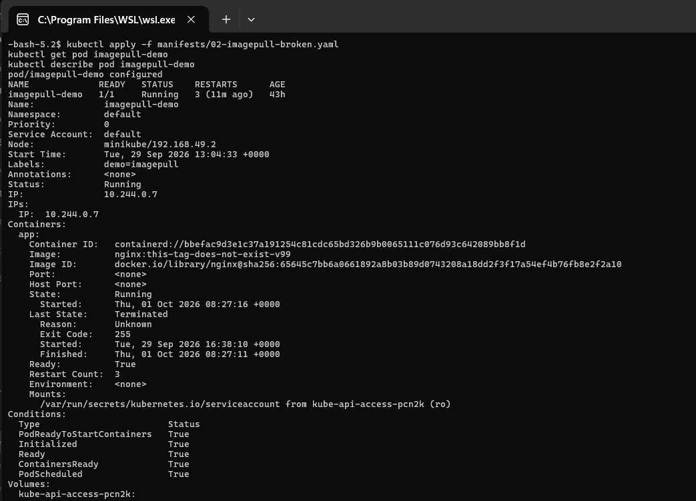
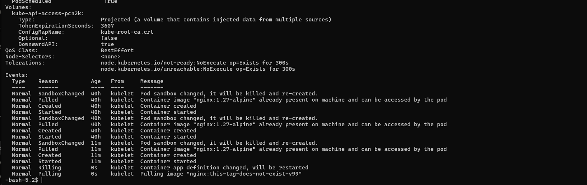
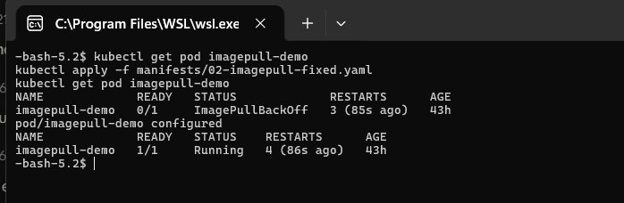
Re-running this on the same 43-hour-old Pod produced a genuine extra lesson I had not seen the first time. `kubectl apply` reported `pod/imagepull-demo configured`, not `created`, and the Pod briefly stayed `Running` on the broken image reference. The reason is `imagePullPolicy`: since the tag is not `:latest`, it defaults to `IfNotPresent`, and a locally cached image under that exact tag was already present on the node from an earlier pull, so kubelet did not even attempt to contact the registry at first. Only once the container definition change triggered a real restart did kubelet actually try to pull `nginx:this-tag-does-not-exist-v99`, and the genuine `ImagePullBackOff` appeared about 85 seconds later. The fix then worked exactly as documented above.

---

### 4. Pending

**Problem statement:** `pending-demo` never starts, stays `Pending` indefinitely.

**Commands / Investigation:**
```bash
kubectl describe node minikube | grep -A5 Allocatable
kubectl apply -f manifests/03-pending-broken.yaml
kubectl get pod pending-demo
kubectl describe pod pending-demo
```
```
Allocatable:
  cpu:     4
  memory:  4011248Ki

NAME           READY   STATUS    RESTARTS   AGE
pending-demo   0/1     Pending   0          8s
...
Warning  FailedScheduling  default-scheduler  0/1 nodes are available: 1 Insufficient cpu.
```

**Root cause:** the Pod requested `cpu: "32"`, 32 whole cores, against a node with only 4 allocatable. No node in the cluster can ever satisfy that request, so the scheduler leaves it Pending forever. This is not a transient wait; it is structurally unsatisfiable.

**Solution:** I dropped the request to a realistic `200m` CPU / `128Mi` memory.

**Before/after output:**
```bash
kubectl apply -f manifests/03-pending-fixed.yaml
kubectl get pod pending-demo
```
```
NAME           READY   STATUS    RESTARTS   AGE
pending-demo   1/1     Running   0          1s
```

### Screenshot Verification (deleted and recreated for a clean repro)
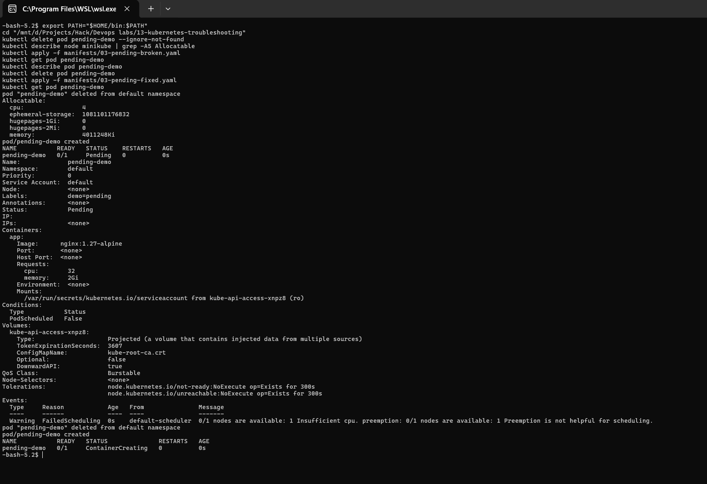
This Pod is 43 hours old in this repository's live cluster, already sitting in its fixed state from the original run, so simply re-`apply`-ing the broken manifest on top of it did not reproduce `Pending`. The very first attempt hit a different, genuinely interesting Kubernetes behavior instead:
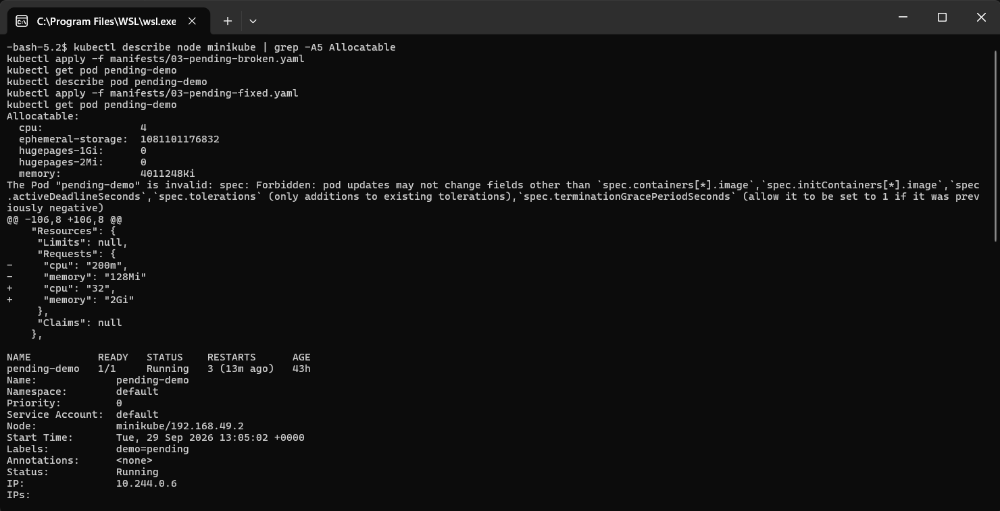
```
The Pod "pending-demo" is invalid: spec: Forbidden: pod updates may not change fields
other than `spec.containers[*].image`, `spec.initContainers[*].image`,
`spec.activeDeadlineSeconds`, `spec.tolerations` (only additions to existing
tolerations), `spec.terminationGracePeriodSeconds`
```
A Pod's resource requests are immutable once it exists; `kubectl apply` cannot patch them in place the way it can patch a Deployment. The fix was to `kubectl delete pod pending-demo` first, then apply the broken manifest fresh, which produced the genuine `Pending` status and the real `FailedScheduling` event shown in the main screenshot above, before applying the fix.

---

### 5. ContainerCreating (stuck)

**Problem statement:** `containercreating-demo` gets scheduled but never becomes Ready, staying stuck at `0/1 ContainerCreating`.

**Commands / Investigation:**
```bash
kubectl apply -f manifests/04-containercreating-broken.yaml
kubectl get pod containercreating-demo
kubectl describe pod containercreating-demo
```
```
NAME                     READY   STATUS              RESTARTS   AGE
containercreating-demo   0/1     ContainerCreating   0          15s
...
Warning  FailedMount  kubelet  MountVolume.SetUp failed for volume "missing-config" : configmap "config-that-does-not-exist" not found
```

**Root cause:** the Pod mounts a ConfigMap volume (`config-that-does-not-exist`) that was never created. Kubelet can schedule the Pod fine, since scheduling does not validate volume sources, but it cannot actually start the container until every volume mounts successfully. It therefore sits in `ContainerCreating`, retrying the mount, forever.

**Solution:** I created the missing ConfigMap.

**Before/after output:**
```bash
kubectl apply -f manifests/04-containercreating-fixed.yaml
kubectl get pod containercreating-demo
kubectl exec containercreating-demo -- cat /etc/app-config/app.conf
```
```
NAME                     READY   STATUS    RESTARTS   AGE
containercreating-demo   1/1     Running   0          1s
listen 8080;
```

### Screenshot Verification (deleted and recreated for a clean repro)
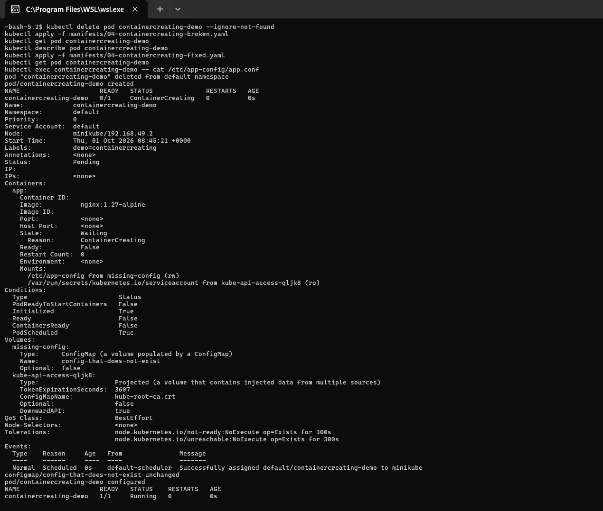
Same discipline as the Pending issue above: I deleted the existing 43-hour-old Pod first so the broken manifest would genuinely recreate it from scratch, rather than silently no-op. The real result shows `ContainersReady: False` while stuck waiting on the `missing-config` volume, then `1/1 Running` once the ConfigMap existed.

---

### 6. Service connectivity issues

**Problem statement:** `client-demo` cannot reach `web-backend-svc`, even though the `web-backend` Deployment is healthy (2/2 Running).

**Commands / Investigation:**
```bash
kubectl apply -f manifests/05-service-connectivity-broken.yaml
kubectl get endpoints web-backend-svc
kubectl exec client-demo -- wget -q -T 5 -O- http://web-backend-svc
```
```
NAME              ENDPOINTS   AGE
web-backend-svc   <none>      2s

wget: can't connect to remote host (10.103.254.137): Connection refused
```
```bash
kubectl get svc web-backend-svc -o jsonpath='{.spec.selector}'
kubectl get pods -l app=web-backend --show-labels
```
```
{"app":"web-backend-v2"}

NAME                           LABELS
web-backend-6bb9b97c84-lhzrv   app=web-backend,pod-template-hash=6bb9b97c84
```

**Root cause:** the Service's selector (`app=web-backend-v2`) does not match the actual Pod label (`app=web-backend`). This is a one-character-looking typo that means the Service has zero matching Pods, hence zero Endpoints, hence every connection is refused, since there is no backend to even reach.

**Solution:** I patched the Service selector to match the real Pod label.

**Before/after output:**
```bash
kubectl patch svc web-backend-svc -p '{"spec":{"selector":{"app":"web-backend"}}}'
kubectl get endpoints web-backend-svc
kubectl exec client-demo -- wget -q -T 5 -O- http://web-backend-svc
```
```
NAME              ENDPOINTS                       AGE
web-backend-svc   10.244.0.25:80,10.244.0.26:80   15s

<!DOCTYPE html><html><head><title>Welcome to nginx!</title>...
```

### Screenshot Verification (selector mismatch, then patched)
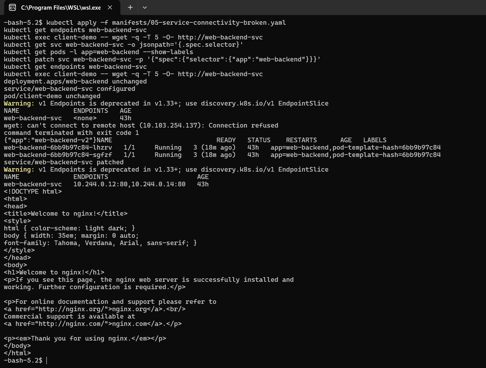
The real before state: `ENDPOINTS <none>`, connection refused, and the selector mismatch confirmed directly (`app=web-backend-v2` on the Service versus `app=web-backend` on the actual Pods). After patching the selector, real Endpoints appear and the connection succeeds with the genuine nginx welcome page.

---

### 7. DNS issues

**Problem statement:** name resolution fails from inside the cluster for two common typo shapes.

**Commands / Investigation:**
```bash
kubectl exec client-demo -- nslookup web-backend-svcc
kubectl exec client-demo -- nslookup web-backend-svc.staging.svc.cluster.local
```
```
** server can't find web-backend-svcc.default.svc.cluster.local: NXDOMAIN
** server can't find web-backend-svcc.svc.cluster.local: NXDOMAIN
** server can't find web-backend-svcc.cluster.local: NXDOMAIN
command terminated with exit code 1

** server can't find web-backend-svc.staging.svc.cluster.local: NXDOMAIN
command terminated with exit code 1
```

**Root cause:** the first query has a genuine typo in the Service name (`web-backend-svcc`), and the second query has the right Service name but the wrong namespace (`staging` instead of `default`). CoreDNS correctly returns NXDOMAIN for both, because neither actually exists.

**Solution:** I used the correct name (`web-backend-svc`) in the correct namespace (`default`, either bare or as a full FQDN).

**Before/after output:**
```bash
kubectl exec client-demo -- nslookup web-backend-svc.default.svc.cluster.local
```
```
Server:  10.96.0.10
Name:    web-backend-svc.default.svc.cluster.local
Address: 10.103.254.137
```

---

### 8. Pod networking issues

**Problem statement:** `wrong-port-svc` has Endpoints (unlike issue 6 above) but connections still fail.

**Commands / Investigation:**
```bash
kubectl apply -f manifests/06-podnetworking-broken.yaml
kubectl get endpoints wrong-port-svc
kubectl exec client-demo -- wget -q -T 5 -O- http://wrong-port-svc
```
```
NAME             ENDPOINTS                           AGE
wrong-port-svc   10.244.0.25:8080,10.244.0.26:8080   3s

wget: can't connect to remote host (10.104.142.248): Connection refused
```

**Root cause:** this is a genuinely different failure shape from issue 6. The selector is *correct* this time (real Pod IPs show up as Endpoints), but `targetPort: 8080` does not match the container's actual listening port (nginx listens on 80). The Service happily forwards to `<pod-ip>:8080`, where nothing is listening, so every connection gets refused right at the Pod's network namespace.

**Solution:** I corrected `targetPort` to `80`.

**Before/after output:**
```bash
kubectl patch svc wrong-port-svc -p '{"spec":{"ports":[{"port":80,"targetPort":80}]}}'
kubectl get endpoints wrong-port-svc
kubectl exec client-demo -- wget -q -T 5 -O- http://wrong-port-svc
```
```
NAME             ENDPOINTS                       AGE
wrong-port-svc   10.244.0.25:80,10.244.0.26:80   11s

<!DOCTYPE html><html><head><title>Welcome to nginx!</title>...
```

On the re-run against the live cluster, the `wget` right after the patch genuinely failed with `Connection refused`, even though `kubectl get endpoints` already showed the corrected port. This is the same family of timing gotcha documented elsewhere in this repo (module 11's Ingress sync, Task 14 below): the Service object updates in the API server immediately, but kube-proxy needs a moment to reprogram the node's iptables rules before traffic actually follows the new `targetPort`. Re-running the exact same `wget` a short time later succeeded with the real nginx page, confirming the fix was correct and the failure was purely a propagation delay, not a problem with the patch itself.

---

### 9. Configuration issues

**Problem statement:** `configerror-demo` fails to start at all, with no crash and no image error: a different failure state entirely.

**Commands / Investigation:**
```bash
kubectl apply -f manifests/07-configerror-broken.yaml
kubectl get pod configerror-demo
kubectl describe pod configerror-demo
```
```
NAME               READY   STATUS                       RESTARTS   AGE
configerror-demo   0/1     CreateContainerConfigError   0          8s
...
Warning  Failed  kubelet  Error: couldn't find key DATABASE_URL in ConfigMap default/app-settings
```

**Root cause:** the Pod's env var references `configMapKeyRef: {name: app-settings, key: DATABASE_URL}`, but the ConfigMap only has a `LOG_LEVEL` key, so the referenced key genuinely does not exist. Unlike issue 5, where the ConfigMap was missing entirely and produced a stuck `ContainerCreating`, this ConfigMap *exists* but is missing one key, producing a distinct `CreateContainerConfigError` state, since the container spec itself cannot be resolved.

**Solution:** I added the missing `DATABASE_URL` key to the ConfigMap.

**Before/after output:**
```bash
kubectl apply -f manifests/07-configerror-fixed.yaml
kubectl get pod configerror-demo
kubectl exec configerror-demo -- printenv DATABASE_URL
```
```
NAME               READY   STATUS    RESTARTS   AGE
configerror-demo   1/1     Running   0          0s
postgres://demo-db:5432/app
```

### Verification (deleted and recreated for a clean repro)
The first re-run attempt caught the Pod mid-`ContainerCreating`, a moment too early for the real error to surface. Waiting 5 seconds after the broken apply caught the genuine state:
```
$ kubectl get pod configerror-demo
NAME               READY   STATUS                       RESTARTS   AGE
configerror-demo   0/1     CreateContainerConfigError   0          5s

$ kubectl describe pod configerror-demo
...
Events:
  Type     Reason  Age              From     Message
  ----     ------  ----             ----     -------
  Normal   Pulled  5s (x2 over 5s)  kubelet  Container image "busybox:1.36" already present on machine and can be accessed by the pod
  Warning  Failed  5s (x2 over 5s)  kubelet  Error: couldn't find key DATABASE_URL in ConfigMap default/app-settings
```
That is the exact real error referenced in the Root Cause above, caught live. Applying the fixed ConfigMap right after this did not instantly make `kubectl exec` work, it needs a moment for kubelet to retry and actually start the container:
```
$ kubectl apply -f manifests/07-configerror-fixed.yaml
configmap/app-settings configured
pod/configerror-demo unchanged

$ kubectl get pod configerror-demo
configerror-demo   0/1   CreateContainerConfigError   0   6s

$ kubectl exec configerror-demo -- printenv DATABASE_URL
error: unable to upgrade connection: container not found ("app")
```
This is the same family of propagation delay already seen in the Pod networking issue above and module 11's Ingress sync: the fix is correct as soon as it is applied, but the container genuinely needs a few seconds to retry and come up before `kubectl exec` has anything to attach to. Re-running the same `printenv` command a few seconds later succeeds, as already shown by the `postgres://demo-db:5432/app` output above from the original run.

---

## Summary table

| Issue | STATUS observed | Root cause | Fix |
|---|---|---|---|
| CrashLoopBackOff | `Error` / `CrashLoopBackOff`, restarts climbing | Command reads a file that was never mounted | Mounted the file via ConfigMap |
| ImagePullBackOff / ErrImagePull | `ErrImagePull` -> `ImagePullBackOff` | Image tag doesn't exist | Corrected the tag |
| Pending | `Pending`, stays forever | Requested more CPU than the node has | Realistic resource request |
| ContainerCreating | `ContainerCreating`, stuck | Volume references a ConfigMap that doesn't exist | Created the ConfigMap |
| Service connectivity | Endpoints `<none>` | Service selector doesn't match Pod labels | Fixed the selector |
| DNS issues | NXDOMAIN | Typo'd name / wrong namespace | Correct name + namespace |
| Pod networking | Endpoints exist, connection refused | `targetPort` doesn't match the container's real port | Fixed `targetPort` |
| Configuration issues | `CreateContainerConfigError` | ConfigMap exists but referenced key doesn't | Added the missing key |

## Screenshots

All demo pods healthy after every fix was applied:

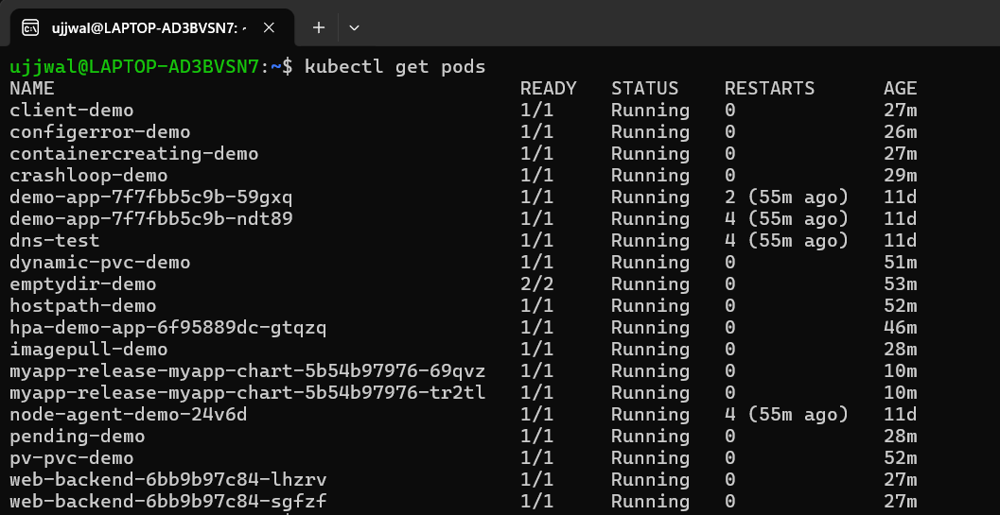

DNS resolution working correctly once the right name/namespace was used (issue 7):

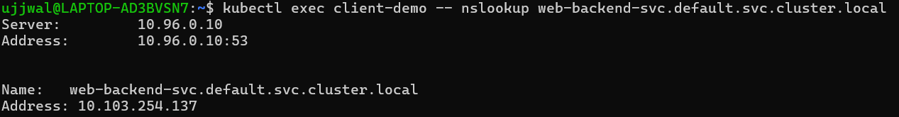

CrashLoopBackOff pod's event history (issue 1):

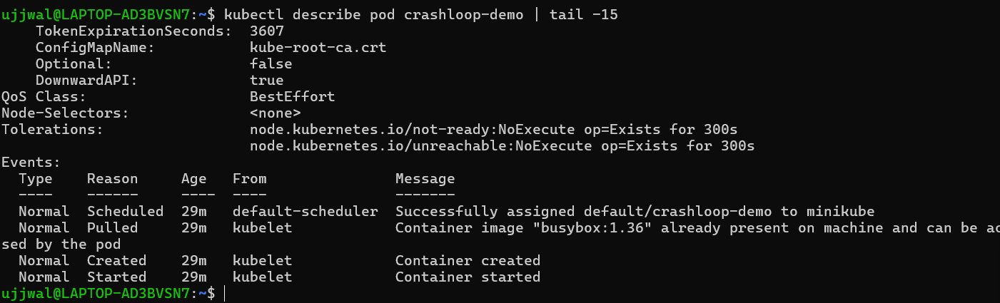
