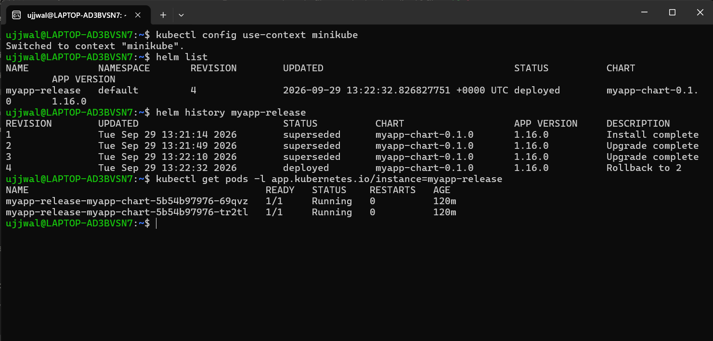

# Helm

**Student Name:** Ujjwal Jain
**Roll Number:** 24bcs10173
**Section:** Section B

See [ques.md](ques.md) for the exact task breakdown. Task 3 (Mini Project) isn't a separate build — its deliverables (chart, `values.yaml`, templates, install/upgrade/rollback, README) are exactly what Tasks 1 and 2 produce below with the one real chart, `myapp-chart/`.

**Environment note:** Helm wasn't installed. Rather than ask for a `sudo` password mid-session, installed it as a user-local binary — no root needed:
```bash
mkdir -p ~/bin
curl -sSL -o /tmp/helm.tar.gz https://get.helm.sh/helm-v3.16.3-linux-amd64.tar.gz
tar -xzf /tmp/helm.tar.gz -C /tmp
mv /tmp/linux-amd64/helm ~/bin/helm
echo 'export PATH="$HOME/bin:$PATH"' >> ~/.bashrc
helm version --short
```
```
v3.16.3+gcfd0749
```

---

## Task 1: Helm Commands

### `helm create`

Scaffolded a real chart rather than hand-writing one from scratch — `helm create` gives the standard chart layout (`Chart.yaml`, `values.yaml`, `templates/` with Deployment, Service, ServiceAccount, HPA, Ingress, a NOTES.txt and a helper template):

```bash
helm create myapp-chart
```
```
Creating myapp-chart
```

Then customized `values.yaml`: pinned `image.tag` to a real nginx tag (`1.26-alpine`, chart default is a blank tag that falls back to `appVersion: 1.16.0`, which is genuinely old) so upgrades below have something concrete to change.

```bash
helm lint myapp-chart
```
```
==> Linting myapp-chart
[INFO] Chart.yaml: icon is recommended
1 chart(s) linted, 0 chart(s) failed
```

### `helm install`

```bash
helm install myapp-release myapp-chart
```
```
NAME: myapp-release
LAST DEPLOYED: Tue Sep 29 13:21:14 2026
NAMESPACE: default
STATUS: deployed
REVISION: 1
```

### `helm list`

```bash
helm list
```
```
NAME         	NAMESPACE	REVISION	STATUS  	CHART            	APP VERSION
myapp-release	default  	1       	deployed	myapp-chart-0.1.0	1.16.0
```

### `helm status`

```bash
helm status myapp-release
```
```
NAME: myapp-release
LAST DEPLOYED: Tue Sep 29 13:21:14 2026
NAMESPACE: default
STATUS: deployed
REVISION: 1
```

### `helm get`

```bash
helm get values myapp-release
```
```
USER-SUPPLIED VALUES:
null
```
(`null` because the install used no `--set`/`-f` overrides — every value came from the chart's own `values.yaml`, so there are no *user-supplied* overrides to show. That's expected Helm behavior, not a bug.)

```bash
helm get manifest myapp-release | head -20
```
```
---
# Source: myapp-chart/templates/serviceaccount.yaml
apiVersion: v1
kind: ServiceAccount
metadata:
  name: myapp-release-myapp-chart
  labels:
    helm.sh/chart: myapp-chart-0.1.0
    app.kubernetes.io/instance: myapp-release
    app.kubernetes.io/managed-by: Helm
---
# Source: myapp-chart/templates/service.yaml
apiVersion: v1
kind: Service
...
```

### `helm repo` and `helm search`

```bash
helm repo add bitnami https://charts.bitnami.com/bitnami
helm repo list
helm repo update
helm search repo nginx
```
```
"bitnami" has been added to your repositories

NAME   	URL
bitnami	https://charts.bitnami.com/bitnami

Update Complete. Happy Helming!

NAME                            	CHART VERSION	APP VERSION	DESCRIPTION
bitnami/nginx                   	25.2.0       	1.31.6     	NGINX Open Source is a web server...
bitnami/nginx-ingress-controller	12.0.7       	1.13.1     	NGINX Ingress Controller...
```

```bash
helm search hub wordpress
```
```
URL                                        CHART VERSION   APP VERSION   DESCRIPTION
https://artifacthub.io/packages/helm/...   5.5.31          7.0.1         Using the official WordPress image...
https://artifacthub.io/packages/helm/...   34.1.0          7.1.2         WordPress is the world's most popular...
```
(`search repo` only looks in repos you've added locally; `search hub` queries Artifact Hub across every published chart on the internet — different scope, both real results above.)

### `helm uninstall`

Didn't want to tear down the main demo release just to show this command, so installed a second throwaway release from the same chart and removed that instead:

```bash
helm install throwaway-release myapp-chart
helm list
helm uninstall throwaway-release
helm list
kubectl get pods -l app.kubernetes.io/instance=throwaway-release
```
```
NAME               REVISION   STATUS
myapp-release      4          deployed
throwaway-release  1          deployed

release "throwaway-release" uninstalled

NAME             REVISION   STATUS
myapp-release    4          deployed

NAME                                             READY   STATUS
throwaway-release-myapp-chart-789584cdd8-clcqr   0/1     Terminating
throwaway-release-myapp-chart-789584cdd8-xs44g   0/1     Terminating
throwaway-release-myapp-chart-789584cdd8-zn644   0/1     Terminating
```
`myapp-release` is untouched — only `throwaway-release` disappears from `helm list`, and its Pods immediately start `Terminating`.

`helm history` and `helm upgrade`/`helm rollback` are covered together in Task 2 below, since that's where they're actually exercised as a workflow.

---

## Task 2: Helm Rollback — full workflow

### Install (revision 1)

Already shown above: `replicaCount: 1`, `image.tag: 1.26-alpine`.

### Upgrade (revision 2)

Bumped `replicaCount` to `2` in `values.yaml`:

```bash
helm upgrade myapp-release myapp-chart
```
```
Release "myapp-release" has been upgraded. Happy Helming!
REVISION: 2
```

**Verify:**
```bash
kubectl get pods -l app.kubernetes.io/instance=myapp-release
```
```
NAME                                          READY   STATUS    AGE
myapp-release-myapp-chart-5b54b97976-lht4b   1/1     Running   9s
myapp-release-myapp-chart-5b54b97976-wrnn5   1/1     Running   44s
```
Genuinely 2 Pods now, both from the new ReplicaSet.

### Upgrade again (revision 3)

Bumped `replicaCount` to `3` **and** `image.tag` to `1.27-alpine`, so this revision changes two independent things at once:

```bash
helm upgrade myapp-release myapp-chart
```
```
Release "myapp-release" has been upgraded. Happy Helming!
REVISION: 3
```

**Verify:**
```bash
kubectl get pods -l app.kubernetes.io/instance=myapp-release -o jsonpath='{range .items[*]}{.metadata.name}{"\t"}{.spec.containers[0].image}{"\n"}{end}'
```
```
myapp-release-myapp-chart-7f89bdb7d9-s2dzh   nginx:1.27-alpine
myapp-release-myapp-chart-7f89bdb7d9-sjkwt   nginx:1.27-alpine
myapp-release-myapp-chart-7f89bdb7d9-tjl9j   nginx:1.27-alpine
```
3 Pods, all genuinely running the new image tag — proof the upgrade actually rolled out, not just that `helm` reported success.

### `helm history` — before rolling back

```bash
helm history myapp-release
```
```
REVISION	STATUS    	CHART            	APP VERSION	DESCRIPTION
1       	superseded	myapp-chart-0.1.0	1.16.0     	Install complete
2       	superseded	myapp-chart-0.1.0	1.16.0     	Upgrade complete
3       	deployed  	myapp-chart-0.1.0	1.16.0     	Upgrade complete
```

### Rollback (to revision 2)

```bash
helm rollback myapp-release 2
```
```
Rollback was a success! Happy Helming!
```

**Verify:**
```bash
kubectl get pods -l app.kubernetes.io/instance=myapp-release -o jsonpath='{range .items[*]}{.metadata.name}{"\t"}{.spec.containers[0].image}{"\n"}{end}'
helm list
helm history myapp-release
```
```
myapp-release-myapp-chart-5b54b97976-69qvz   nginx:1.26-alpine
myapp-release-myapp-chart-5b54b97976-tr2tl   nginx:1.26-alpine

NAME            REVISION   STATUS     CHART               APP VERSION
myapp-release   4          deployed   myapp-chart-0.1.0   1.16.0

REVISION	STATUS    	DESCRIPTION
1       	superseded	Install complete
2       	superseded	Upgrade complete
3       	superseded	Upgrade complete
4       	deployed  	Rollback to 2
```

Back to exactly 2 Pods on `1.26-alpine` — matching revision 2's state. Worth flagging the detail that trips people up: **Helm rollback doesn't rewind the revision counter.** Rolling back to revision 2 didn't reinstate "revision 2" as current — it created a brand-new **revision 4** whose content matches revision 2. `helm history` keeps every revision as an immutable, growing log; rollback is really "redeploy an old revision's content as a new revision," not time travel. That's genuinely useful — it means you can always see *when* a rollback happened and *what* it rolled back to, instead of losing that record.

---

## Summary

| Step | Revision | Replicas | Image tag |
|---|---|---|---|
| Install | 1 | 1 | 1.26-alpine |
| Upgrade | 2 | 2 | 1.26-alpine |
| Upgrade again | 3 | 3 | 1.27-alpine |
| Rollback to 2 | 4 (content = rev 2) | 2 | 1.26-alpine |

## Screenshots

`helm list`, `helm history myapp-release` (all 4 revisions incl. the rollback), and the final Pod state — 2 Running on `1.26-alpine`, matching revision 4:


