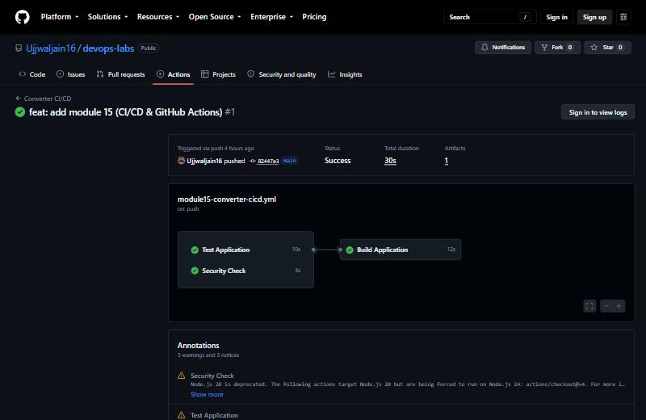
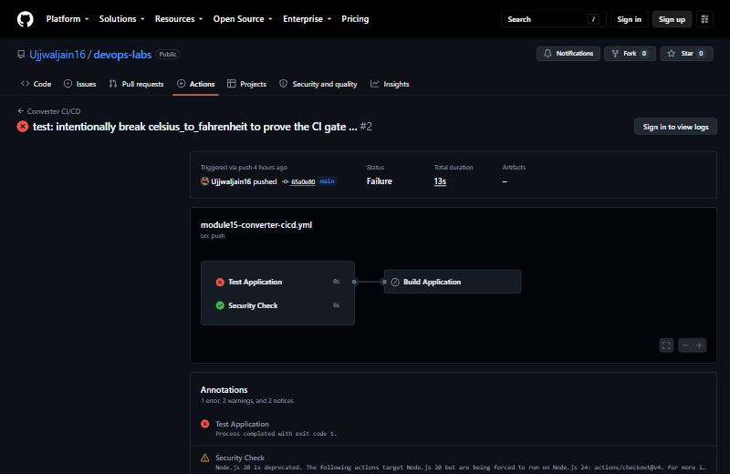
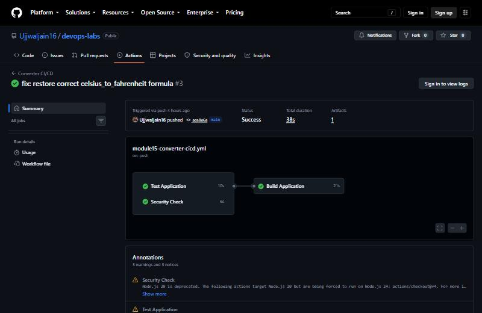

# CI/CD & GitHub Actions

**Student Name:** Ujjwal Jain
**Roll Number:** 24bcs10173
**Section:** Section B

The exact task, and where the `10-final-cicd-pipeline` reference actually came from (the instructor's own template repo, not something attached to the doc), are documented in [ques.md](ques.md).

This module needed `pip` and Python test tooling, neither of which were installed in WSL, and `apt install python3-venv`/`python3-pip` needs `sudo` (a password prompt I cannot answer). I bootstrapped `pip` into my own site-packages instead, so no root access was needed and no system packages were touched:
```bash
curl -sSL https://bootstrap.pypa.io/get-pip.py -o /tmp/get-pip.py
python3 /tmp/get-pip.py --user --break-system-packages
```

---

## CI vs CD

**CI (Continuous Integration):** every push automatically builds the app and runs its tests, so broken code is caught within minutes of being written, not discovered later. This is the `test` and `security-check` jobs below.

**CD (Continuous Delivery/Deployment):** once CI passes, the app is packaged into something deployable, here a Docker image, and made ready to ship. The reference project this task points to (see [ques.md](ques.md) §2) explicitly stops at "ready for CD / deployment" and says actual deployment targets (Docker registry push, Kubernetes, a cloud provider) are the *next* session's material. So "CD" in this module means that the pipeline produces a real, working Docker image as its output; the deploy-it-somewhere step is module 16 (DevSecOps)'s job.

## Application

A small Python unit-conversion library (`app/converter.py`), covering Celsius/Fahrenheit and km/miles, both directions:
```python
def celsius_to_fahrenheit(c: float) -> float:
    return (c * 9 / 5) + 32

def fahrenheit_to_celsius(f: float) -> float:
    return (f - 32) * 5 / 9
```

I verified it locally before it ever touched CI:
```bash
python3 -m pytest -v
```
```
tests/test_converter.py::test_celsius_to_fahrenheit PASSED               [ 20%]
tests/test_converter.py::test_fahrenheit_to_celsius PASSED               [ 40%]
tests/test_converter.py::test_km_to_miles PASSED                         [ 60%]
tests/test_converter.py::test_miles_to_km PASSED                         [ 80%]
tests/test_converter.py::test_round_trip_celsius PASSED                  [100%]
5 passed in 0.45s
```

## Dockerfile

```dockerfile
FROM python:3.12-slim
WORKDIR /app
COPY requirements.txt .
RUN pip install --no-cache-dir -r requirements.txt
COPY app/ ./app/
CMD ["python", "app/converter.py"]
```

I built and ran it locally before wiring it into CI:
```bash
docker build -t converter-app:local .
docker run --rm converter-app:local
```
```
25C -> 77.0 F
10km -> 6.21 miles
```

## GitHub Actions workflow

File: [.github/workflows/module15-converter-cicd.yml](../.github/workflows/module15-converter-cicd.yml). This has to live at the **repository root**'s `.github/workflows/`, not inside this module folder, since that is the one place GitHub Actions actually looks for workflow files. `defaults.run.working-directory` points every step at `15-cicd-github-actions/` so the workflow only touches this module.

**Workflow anatomy** (the concepts the doc asks for, mapped onto the real file):
- **Workflow** = the whole YAML file, triggered `on: push` to this folder (path-filtered so other modules' pushes do not trigger it) and `workflow_dispatch` for manual runs.
- **Jobs** = `test`, `security-check`, `build`, three independent units that can run in parallel unless one depends on another.
- **`needs: [test, security-check]`** on `build` is the actual CI gate: build only runs if both prior jobs succeed. This is the same mechanism the reference project uses to prove tests genuinely block a broken build (reproduced for real below).
- **Steps** = the ordered list inside each job (`Checkout` -> `Setup Python` -> `Install dependencies` -> `Run pytest`, etc.)
- **Runners** = `runs-on: ubuntu-latest`, GitHub's own hosted VM, fresh for every job.
- **Secrets** = `DEMO_SECRET`, a repository secret referenced as `${{ secrets.DEMO_SECRET }}`. GitHub auto-masks its value in every log line, which the `security-check` job's last step proves without ever printing it in the clear.
- **Artifacts** = `actions/upload-artifact@v4`. The `build` job's output (`converter.py` + `build-info.txt` with the commit SHA and build timestamp) gets attached to the run, downloadable from the Actions UI afterward.

## Pipeline execution

I pushed for real. First run: [github.com/Ujjwaljain16/devops-labs/actions/runs/36575952176](https://github.com/Ujjwaljain16/devops-labs/actions/runs/36575952176), and all three jobs came back green:

```
✓ Security Check in 3s
  ✓ Check for sensitive files
  ✓ Show demo secret is masked
✓ Test Application in 10s
  ✓ Run pytest        (5 passed)
✓ Build Application in 12s
  ✓ Build artifact
  ✓ Build Docker image
  ✓ Upload build artifact
```

**Secrets masking, proven from the real log** (not just asserted): `DEMO_SECRET`'s value never appears, even though the step explicitly echoes it:
```
env:
  DEMO_SECRET: ***
...
The secret value itself (GitHub auto-masks it in logs):
***
Length check without exposing it: 39 characters
```
The length check line is the tell: GitHub does not just hide the variable, it redacts the literal string wherever it would appear in output. A *derived* value like `${#DEMO_SECRET}` (a plain integer) is not the secret itself, though, so it prints normally. That is the actual mechanism: log-scanning and string substitution, not variable-level sandboxing.

**Artifact, proven from the real upload log:**
```
With the provided path, there will be 2 files uploaded
Uploaded bytes 615
Artifact converter-build has been successfully uploaded! Final size is 615 bytes. Artifact ID is 11038320148
Artifact download URL: https://github.com/Ujjwaljain16/devops-labs/actions/runs/36575952176/artifacts/11038320148
```
This is a real `converter.py` and `build-info.txt` (with the actual commit SHA and UTC build time), sitting in GitHub's blob storage and downloadable from that URL, not a simulated step.

## Break-it-then-fix-it (proves `needs: test` actually gates the build)

**Break:** I changed `celsius_to_fahrenheit` to add `33` instead of `32`. I confirmed it was failing locally first (`2 failed, 3 passed`), then pushed. Real run: [.../actions/runs/36576115091](https://github.com/Ujjwaljain16/devops-labs/actions/runs/36576115091):
```
✓ Security Check in 6s
X Test Application in 8s
    X Run pytest
- Build Application          <- never ran at all ("-", not even attempted)
```
The actual pytest failure from that run's log:
```
tests/test_converter.py::test_celsius_to_fahrenheit FAILED               [ 20%]
tests/test_converter.py::test_round_trip_celsius FAILED                  [100%]

    def test_celsius_to_fahrenheit():
>       assert celsius_to_fahrenheit(0) == 32
E       assert 33.0 == 32
```
`Security Check` still ran and passed (it does not depend on `test`), but `Build Application` shows `-`, meaning GitHub Actions never even scheduled it, because `needs: [test, security-check]` blocked on `test`'s failure. This is the doc's exact "Test -> FAIL -> Build does not run" scenario, reproduced for real, not asserted.

**Fix:** I reverted to `+ 32`. I confirmed it was passing locally (`5 passed`) first, then pushed. Real run: [.../actions/runs/36576224924](https://github.com/Ujjwaljain16/devops-labs/actions/runs/36576224924):
```
✓ Security Check in 6s
✓ Test Application (all 5 tests passing again)
✓ Build Application in 21s
  ✓ Build Docker image
  ✓ Upload build artifact
```
This was back to fully green; the same `needs: test` gate that blocked the broken build let this one through the instant the test suite passed again.

## Summary

| Run | Trigger | Test | Security Check | Build |
|---|---|---|---|---|
| [36575952176](https://github.com/Ujjwaljain16/devops-labs/actions/runs/36575952176) | Initial push | ✓ | ✓ | ✓ |
| [36576115091](https://github.com/Ujjwaljain16/devops-labs/actions/runs/36576115091) | Deliberate break | ✗ | ✓ | Skipped (`needs: test`) |
| [36576224924](https://github.com/Ujjwaljain16/devops-labs/actions/runs/36576224924) | Fix | ✓ | ✓ | ✓ |

## Screenshots

The initial pushed run, all three jobs green:



The deliberate break: Test Application fails, and Build Application never runs at all because `needs: test` blocks it:



The fix, all three jobs green again:


