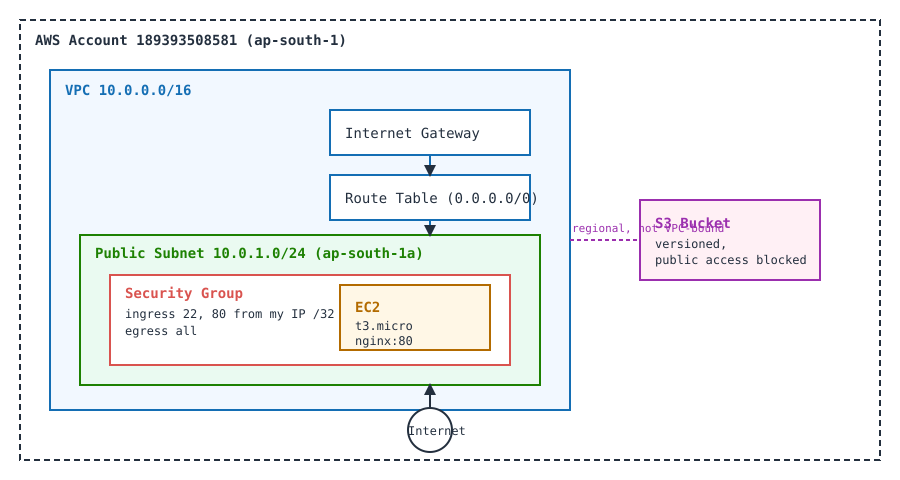

# Cloud & Terraform in Action

**Student Name:** Ujjwal Jain
**Roll Number:** 24bcs10173
**Section:** Section B

See [ques.md](ques.md) for the exact task breakdown. This builds directly on [module 17](../17-terraform-infrastructure-as-code/), reusing the same AWS account (189393508581, `ap-south-1`) and the same IAM credential, but this time the project provisions a full small network rather than a single bucket: a VPC, a public subnet, an Internet Gateway, a route table, a security group, an EC2 instance running a real web server, and an S3 bucket.

## Architecture



```
VPC (10.0.0.0/16)
├── Internet Gateway
├── Route Table (0.0.0.0/0 -> IGW)
└── Public Subnet (10.0.1.0/24, ap-south-1a)
    └── Security Group (22, 80 from my IP /32 only)
        └── EC2 (t3.micro, Amazon Linux 2023, nginx)
S3 Bucket (versioned, public access blocked)
```

S3 is a regional service, not something that lives inside a VPC, so it is drawn separately in the diagram even though it is declared in the same Terraform project.

## The Terraform project

Everything lives in [terraform/](terraform/):

| File | What it defines |
|---|---|
| `provider.tf` | AWS provider, region from a variable |
| `variables.tf` | `aws_region`, `availability_zone`, `vpc_cidr`, `subnet_cidr`, `my_ip`, `instance_type`, `bucket_name`, `environment` |
| `vpc.tf` | VPC, subnet, Internet Gateway, route table, route table association |
| `security_group.tf` | Security group restricted to my own IP for SSH and HTTP |
| `ec2.tf` | `data "aws_ami"` lookup for the latest Amazon Linux 2023 image, plus the EC2 instance itself with a `user_data` script that installs and starts nginx |
| `s3.tf` | S3 bucket, versioning, public access block (same pattern as module 17) |
| `outputs.tf` | VPC ID, subnet ID, security group ID, instance ID, instance public IP, bucket name, bucket ARN |
| `terraform.tfvars` | Real values used for this run |

## A real mistake and a real fix: free tier is t3.micro, not t2.micro here

My first plan used `instance_type = "t2.micro"`, the instance type everyone defaults to when they think "free tier." Applying it failed for real:

```
Error: creating EC2 Instance: operation error EC2: RunInstances, https response error
StatusCode: 400, api error InvalidParameterCombination: The specified instance type
is not eligible for Free Tier. For a list of Free Tier instance types, run
'describe-instance-types' with the filter 'free-tier-eligible=true'.
```

I ran exactly that command AWS suggested:

```
$ aws ec2 describe-instance-types --filters "Name=free-tier-eligible,Values=true" \
    --query "InstanceTypes[].InstanceType" --output table --region ap-south-1
-----------------------
|DescribeInstanceTypes|
+---------------------+
|  t8i.micro          |
|  c7i-flex.large     |
|  t3.micro           |
|  t4g.small          |
|  t4g.micro          |
|  t3.small           |
|  m7i-flex.large     |
|  t8i.small          |
+---------------------+
```

`t2.micro` is the classic answer, but AWS retired it from new-account free tier eligibility at some point, this account only gets free tier on `t3.micro` and a handful of other types. I switched `instance_type` to `t3.micro` and re-applied. Everything else (VPC, subnet, IGW, route table, security group, S3 bucket) had already been created successfully on the first `apply`, Terraform only needed to create the one missing resource on the second run, it did not touch anything else.

## Full real workflow

```
$ terraform init
Initializing provider plugins...
- Installing hashicorp/aws v5.100.0...
Terraform has been successfully initialized!

$ terraform fmt -check -diff
(no output, already formatted)

$ terraform validate
Success! The configuration is valid.

$ terraform plan -out=tfplan
Plan: 10 to add, 0 to change, 0 to destroy.
Saved the plan to: tfplan

$ terraform apply tfplan
# ... instance_type not free-tier eligible, see above ...
# fixed to t3.micro, re-ran plan + apply

$ terraform plan -out=tfplan
Plan: 1 to add, 0 to change, 0 to destroy.   # only aws_instance.web was missing

$ terraform apply tfplan
aws_instance.web: Creating...
aws_instance.web: Still creating... [14s elapsed]
aws_instance.web: Creation complete after 17s [id=i-0e2057dc1689235ef]

Apply complete! Resources: 1 added, 0 changed, 0 destroyed.

Outputs:
bucket_arn = "arn:aws:s3:::ujjwal-jain-24bcs10173-devops-labs-cloud-demo"
bucket_name = "ujjwal-jain-24bcs10173-devops-labs-cloud-demo"
instance_id = "i-0e2057dc1689235ef"
instance_public_ip = "13.207.176.122"
security_group_id = "sg-0695081a1de304aa7"
subnet_id = "subnet-092628ba5107ca5b8"
vpc_id = "vpc-03e9a604fcfc6a8db"
```

## Independent verification, not just Terraform's own state

```
$ aws ec2 describe-instances --instance-ids i-0e2057dc1689235ef \
    --query "Reservations[0].Instances[0].[InstanceId,InstanceType,State.Name,PublicIpAddress,VpcId,SubnetId]" \
    --output table --region ap-south-1
------------------------------
|      DescribeInstances     |
+----------------------------+
|  i-0e2057dc1689235ef       |
|  t3.micro                  |
|  running                   |
|  13.207.176.122            |
|  vpc-03e9a604fcfc6a8db     |
|  subnet-092628ba5107ca5b8  |
+----------------------------+

$ aws s3 ls | grep devops-labs-cloud-demo
2026-10-01 07:52:09 ujjwal-jain-24bcs10173-devops-labs-cloud-demo

$ aws ec2 describe-security-groups --group-ids sg-0695081a1de304aa7 \
    --query "SecurityGroups[0].IpPermissions" --output json --region ap-south-1
# confirmed both rules scoped to 202.131.133.38/32 only, nothing open to 0.0.0.0/0
```

Then the real proof the EC2 instance was actually doing something, not just sitting in a `running` state: I polled the instance's own public IP until the `user_data` script finished installing nginx, and got a real HTTP response back.

```
$ curl http://13.207.176.122/
<h1>Hello from Ujjwal's Terraform EC2 - devops-labs module 18</h1>
```

That is a real nginx server, bootstrapped entirely by the `user_data` script in `ec2.tf`, reachable only because the security group allows port 80 from my own IP. I also re-ran the verification commands from my own WSL terminal (not through the agent) and screenshotted the result, see [screenshots/01-verification.png](screenshots/01-verification.png), which shows the same instance state, the same curl output, and the bucket listing.

## Teardown, immediately after capturing evidence

Given this project creates billable-class resources (EC2, even at free tier), I destroyed everything in the same session right after the verification screenshot was captured, using the same reviewed-plan pattern as module 17 rather than a blind `-auto-approve`.

```
$ terraform plan -destroy -out=tfplan-destroy
Plan: 0 to add, 0 to change, 10 to destroy.

$ terraform apply tfplan-destroy
aws_instance.web: Destroying...
aws_instance.web: Destruction complete after 37s
aws_internet_gateway.main: Destruction complete after 28s
aws_s3_bucket.demo: Destruction complete after 0s
aws_security_group.web: Destruction complete after 1s
aws_subnet.public: Destruction complete after 1s
aws_vpc.main: Destruction complete after 1s

Apply complete! Resources: 0 added, 0 changed, 10 destroyed.
```

Independent verification that it is all really gone, not just an assumption from Terraform's own exit code:

```
$ aws ec2 describe-instances --instance-ids i-0e2057dc1689235ef \
    --query "Reservations[0].Instances[0].State.Name" --output text --region ap-south-1
terminated

$ aws s3api head-bucket --bucket ujjwal-jain-24bcs10173-devops-labs-cloud-demo --region ap-south-1
An error occurred (404) when calling the HeadBucket operation: Not Found

$ aws ec2 describe-vpcs --vpc-ids vpc-03e9a604fcfc6a8db --region ap-south-1
An error occurred (InvalidVpcID.NotFound) when calling the DescribeVpcs operation:
The vpc ID 'vpc-03e9a604fcfc6a8db' does not exist

$ terraform state list
(no output, state is empty)
```

A real 404, a real `InvalidVpcID.NotFound`, and a real `terminated` instance state. Nothing from this module is left running in the AWS account.

## Free-tier discipline followed here

- Only `t3.micro` was used for EC2, confirmed free-tier-eligible for this specific account before applying.
- No NAT Gateway, no Elastic IP, no load balancer, those either cost money outright or have no free tier at all.
- The security group only opens 22 and 80 to my own IP `/32`, nothing is open to the internet at large.
- The full lifecycle, create, verify independently, destroy, verify gone, happened inside a single working session. Nothing was left running "to look at later."
