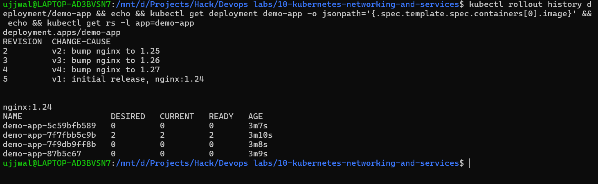
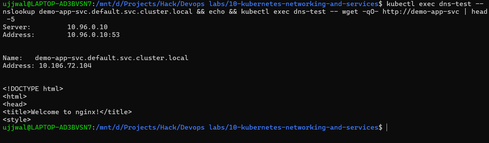

# Kubernetes Workloads, Rollback & DNS

**Student Name:** Ujjwal Jain
**Roll Number:** 24bcs10173
**Section:** Section B

The exact breakdown of what was required is documented in [ques.md](ques.md).

---

## Task 1: StatefulSet vs. DaemonSet vs. Deployment

The instructor was explicit that StatefulSet was not taught in this session; it is flagged as homework research, with only one clue given: a StatefulSet Pod "is created in a particular manner." I looked into what that actually means, drawing on the official docs (`kubernetes.io/docs/concepts/workloads/controllers/statefulset/` and `.../daemonset/`):

| | **Deployment** | **StatefulSet** | **DaemonSet** |
|---|---|---|---|
| **Pod identity** | Interchangeable - any replica can replace any other | Sticky, stable identity per Pod (`web-0`, `web-1`, `web-2`, ...) that survives rescheduling | One Pod per eligible node, tied to that node |
| **Pod naming** | Random hash suffix (`demo-app-7f7fbb5c9b-bk9rg`) | Stable ordinal suffix (`-0`, `-1`, `-2`) | Named per-node, no replica count to set |
| **Startup/scaling order** | Unordered, concurrent | **Ordered, sequential** - Pod 0 must be Ready before Pod 1 starts; scales down in reverse | N/A - driven by node membership, not a replica count |
| **Storage** | Ephemeral or shared | Stable, per-Pod `PersistentVolumeClaim` that follows the same ordinal even after rescheduling | Typically none, or `hostPath`/node-local mounts |
| **Typical use case** | Stateless web apps, APIs | Databases, distributed systems where identity/order matters (MySQL, Cassandra, ZooKeeper) | Node-level agents: log shippers, monitoring agents, CNI/kube-proxy itself |

**What "created in a particular manner" means, concretely:** a StatefulSet with `replicas: 3` does not fire off all three Pods at once the way a Deployment does. It creates `web-0` first, waits for it to be Ready, and only then creates `web-1`, waits, and then creates `web-2`. Scaling down reverses that order, so `web-2` goes first. This ordering guarantee is exactly what allows something like a database to perform leader election or ordered initialization safely, since a Deployment gives no guarantee about which replica comes up first or whether they are numbered at all.

### DaemonSet, Demonstrated Hands-On Rather Than Only Described

Rather than just quoting the docs, I actually deployed one:

```yaml
# daemonset-demo/daemonset.yaml
apiVersion: apps/v1
kind: DaemonSet
metadata:
  name: node-agent-demo
spec:
  selector:
    matchLabels:
      app: node-agent-demo
  template:
    metadata:
      labels:
        app: node-agent-demo
    spec:
      containers:
        - name: node-agent-demo
          image: busybox:1.36
          command: ["sh", "-c", "sleep 3600"]
```

```text
$ kubectl apply -f daemonset.yaml
daemonset.apps/node-agent-demo created

$ kubectl get daemonset node-agent-demo -o wide
NAME              DESIRED   CURRENT   READY   UP-TO-DATE   AVAILABLE   NODE SELECTOR   AGE   CONTAINERS        IMAGES         SELECTOR
node-agent-demo   1         1         1       1            1           <none>          11s   node-agent-demo   busybox:1.36   app=node-agent-demo

$ kubectl get nodes
NAME       STATUS   ROLES           AGE   VERSION
minikube   Ready    control-plane   69m   v1.37.0
```

I noted that there is no `replicas:` field anywhere in that manifest. DESIRED came out to exactly `1` because this Minikube cluster has exactly one node. On a real multi-node cluster, this same manifest would place one Pod on every node automatically as nodes join, which is the entire point of a DaemonSet: `kube-proxy` and `kindnet` (visible in `kubectl get daemonset -A`) are themselves running as DaemonSets in `kube-system` for exactly this reason.

### StatefulSet, Also Demonstrated Hands-On Rather Than Left as Theory

The earlier pass through this table left StatefulSet as pure comparison-table knowledge, so I went back and actually deployed one: a three-replica MySQL StatefulSet behind a headless Service, in [`statefulset-demo/`](statefulset-demo/):

```yaml
# statefulset-demo/headless-service.yaml
apiVersion: v1
kind: Service
metadata:
  name: mysql
spec:
  clusterIP: None    # <- what makes it "headless"
  selector:
    app: mysql
  ports:
    - port: 3306
```
```yaml
# statefulset-demo/statefulset.yaml (trimmed)
apiVersion: apps/v1
kind: StatefulSet
metadata:
  name: mysql
spec:
  serviceName: mysql   # <- must match the headless Service above
  replicas: 3
  selector:
    matchLabels: { app: mysql }
  template:
    metadata:
      labels: { app: mysql }
    spec:
      containers:
        - name: mysql
          image: mysql:8.0
          env: [{ name: MYSQL_ROOT_PASSWORD, value: secret }]
          volumeMounts: [{ name: data, mountPath: /var/lib/mysql }]
  volumeClaimTemplates:
    - metadata: { name: data }
      spec:
        accessModes: ["ReadWriteOnce"]
        resources: { requests: { storage: 500Mi } }
```

**Ordinal naming and strictly sequential startup, watched live:**
```bash
kubectl apply -f headless-service.yaml
kubectl apply -f statefulset.yaml
```
```text
mysql-0   0/1   Pending             0   0s
mysql-0   0/1   ContainerCreating   0   0s
mysql-0   1/1   Running             0   45s
mysql-1   0/1   Pending             0   0s
mysql-1   0/1   ContainerCreating   0   0s
mysql-1   1/1   Running             0   0s
mysql-2   0/1   Pending             0   0s
mysql-2   0/1   ContainerCreating   0   0s
mysql-2   1/1   Running             0   1s
```
`mysql-0` had to fully reach `1/1 Running` (45 real seconds, since MySQL's own initialization takes a while) before `mysql-1` was even created. This was not merely sequential naming; it was actually gated on readiness. A Deployment with `replicas: 3` would have started all three simultaneously.

**PersistentVolumeClaims, one per ordinal, via `volumeClaimTemplates`:**
```text
$ kubectl get pvc
NAME           STATUS   VOLUME                    CAPACITY   ACCESS MODES
data-mysql-0   Bound    pvc-7b353a3a-...           500Mi      RWO
data-mysql-1   Bound    pvc-4654f588-...           500Mi      RWO
data-mysql-2   Bound    pvc-7484d21d-...           500Mi      RWO
```

**Headless Service DNS: multiple `A` records rather than one virtual IP:**
```text
$ kubectl exec dns-test -- nslookup mysql
Name:	mysql.default.svc.cluster.local
Address: 10.244.0.20
Name:	mysql.default.svc.cluster.local
Address: 10.244.0.21
Name:	mysql.default.svc.cluster.local
Address: 10.244.0.22
```
The same name returned three separate real Pod IPs. A normal `ClusterIP` Service would return exactly one virtual IP here. This is what "headless" actually provides: direct, individual addressability of every replica.

**Direct ordinal addressing: reaching one specific replica by name:**
```text
$ kubectl exec dns-test -- nslookup mysql-0.mysql.default.svc.cluster.local
Name:	mysql-0.mysql.default.svc.cluster.local
Address: 10.244.0.20
```

**Identity invariance: I deleted `mysql-0` and watched it come back as `mysql-0`:**
```bash
kubectl delete pod mysql-0
```
```text
$ kubectl get pods -l app=mysql
NAME      READY   STATUS    RESTARTS   AGE
mysql-0   1/1     Running   0          12s
mysql-1   1/1     Running   0          49s
mysql-2   1/1     Running   0          49s
```
The name that came back was genuinely the same, not `mysql-3` or a random suffix. The StatefulSet controller recreated the exact ordinal slot that had gone missing. This stands in direct contrast with the `demo-app` **Deployment** from Task 3 below, which I deleted the same way:
```text
$ kubectl delete pod demo-app-7f7fbb5c9b-bk9rg
$ kubectl get pods -l app=demo-app
NAME                        READY   STATUS    RESTARTS   AGE
demo-app-7f7fbb5c9b-59gxq   1/1     Running   0          9s
demo-app-7f7fbb5c9b-ndt89   1/1     Running   2 (6m42s ago)   4h28m
```
`demo-app-7f7fbb5c9b-bk9rg` is gone forever, replaced by `demo-app-7f7fbb5c9b-59gxq`, a completely new random hash. The same "delete a Pod" action produced the opposite identity guarantee, because one controller is a Deployment and the other is a StatefulSet.

**Teardown: one honest nuance.** Deleting the whole StatefulSet (`kubectl delete -f statefulset.yaml`) did **not** cleanly terminate `mysql-2 -> mysql-1 -> mysql-0` in strict reverse order the way scaling *down* the replica count would have. All three flipped to `Terminating` within the same second, with only a slight lead for `mysql-0` finishing first. The ordered-termination guarantee is specifically about scale-down operations that change the desired replica count; deleting the StatefulSet object itself simply garbage-collects its owned Pods, which is not the same code path. This is worth knowing, rather than assuming that a StatefulSet is always sequential regardless of how it is torn down. The PVCs also **survived** the StatefulSet's deletion (`data-mysql-0/1/2` still showed `Bound` afterward), and I had to delete them separately, which is deliberate: StatefulSet storage is meant to outlive the controller that created it.

---

## Task 2: ReplicaSet vs. Deployment

This was not a gap I needed to fill, since [module 09](../09-kubernetes-pods-replicasets-deployments/README.md) already contains the real hands-on evidence (creating and scaling a bare ReplicaSet, then a Deployment performing a rolling update watched live). The instructor's ask here is to be able to state it clearly, so I do so below.

A **ReplicaSet**'s entire job is to keep N Pods matching a given label selector running, right now. That is all it does: no history, no update strategy. If I edit a ReplicaSet's Pod template, existing Pods do not change; only new Pods created afterward pick up the new template.

A **Deployment** sits one layer above a ReplicaSet and adds exactly what a bare ReplicaSet cannot do on its own: managed rollouts. When I change a Deployment's Pod template, such as bumping an image tag, it does not touch the existing ReplicaSet. Instead, it creates a **brand new ReplicaSet** with the new template, scales that one up, and scales the old one down, then keeps the old ReplicaSet around, scaled to 0, as rollback history.

That ownership chain, **Deployment → owns → ReplicaSet → owns → Pods**, is directly visible in this module's own rollback demo below: after four revisions, there are four separate ReplicaSet objects still sitting there, one per revision, and only the currently active one has any running Pods.

---

## Task 3: 4-Revision Deployment History (V1 → V4) + Direct Rollback to V1

I created four manifests, each bumping the nginx image and recording a real change-cause:

```yaml
# deployment/v1.yaml (v2/v3/v4 are identical except image + change-cause)
apiVersion: apps/v1
kind: Deployment
metadata:
  name: demo-app
  annotations:
    kubernetes.io/change-cause: "v1: initial release, nginx:1.24"
spec:
  replicas: 2
  selector:
    matchLabels:
      app: demo-app
  template:
    metadata:
      labels:
        app: demo-app
    spec:
      containers:
        - name: demo-app
          image: nginx:1.24
          ports:
            - containerPort: 80
```

I applied all four in sequence, waiting for each rollout to finish before moving on to the next:

```text
$ kubectl apply -f v1.yaml && kubectl rollout status deployment/demo-app --timeout=90s
deployment.apps/demo-app created
Waiting for deployment "demo-app" rollout to finish: 0 of 2 updated replicas are available...
Waiting for deployment "demo-app" rollout to finish: 1 of 2 updated replicas are available...
deployment "demo-app" successfully rolled out

$ kubectl apply -f v2.yaml && kubectl rollout status deployment/demo-app --timeout=90s
deployment.apps/demo-app configured
Waiting for deployment "demo-app" rollout to finish: 1 out of 2 new replicas have been updated...
Waiting for deployment "demo-app" rollout to finish: 1 old replicas are pending termination...
deployment "demo-app" successfully rolled out

# ...same pattern for v3.yaml (nginx:1.26) and v4.yaml (nginx:1.27), both rolled out cleanly
```

I confirmed the history and current state before touching rollback:

```text
$ kubectl rollout history deployment/demo-app
REVISION  CHANGE-CAUSE
1         v1: initial release, nginx:1.24
2         v2: bump nginx to 1.25
3         v3: bump nginx to 1.26
4         v4: bump nginx to 1.27

$ kubectl get deployment demo-app -o jsonpath='{.spec.template.spec.containers[0].image}'
nginx:1.27
```

### The Actual Rollback: V4 Straight to V1 in One Command

```text
$ kubectl rollout undo deployment/demo-app --to-revision=1
deployment.apps/demo-app rolled back
Waiting for deployment "demo-app" rollout to finish: 1 out of 2 new replicas have been updated...
Waiting for deployment "demo-app" rollout to finish: 1 old replicas are pending termination...
deployment "demo-app" successfully rolled out

$ kubectl get deployment demo-app -o jsonpath='{.spec.template.spec.containers[0].image}'
nginx:1.24
```

**The non-obvious part worth calling out:** rollback does **not** rewind the revision counter. I checked the history right after:

```text
$ kubectl rollout history deployment/demo-app
REVISION  CHANGE-CAUSE
2         v2: bump nginx to 1.25
3         v3: bump nginx to 1.26
4         v4: bump nginx to 1.27
5         v1: initial release, nginx:1.24
```

Revision 1 is gone from the list, and a **new** revision 5 shows up carrying V1's exact spec forward. Kubernetes treats "roll back to revision 1" as "create a new revision whose template matches revision 1's template"; the history is forward-only, not time travel. This is a genuinely useful thing to know before assuming that `--to-revision=1` will still be there to roll back to a second time.

### Proof This Is Not Just Metadata: the ReplicaSets Themselves Show It

```text
$ kubectl get rs -l app=demo-app
NAME                       DESIRED   CURRENT   READY   AGE   IMAGES
demo-app-5c59bfb589        0         0         0       42s   nginx:1.27
demo-app-7f7fbb5c9b        2         2         2       45s   nginx:1.24
demo-app-7f9db9ff8b        0         0         0       43s   nginx:1.26
demo-app-87b5c67           0         0         0       44s   nginx:1.25
```

All four ReplicaSets from all four revisions still exist. The Deployment simply scales the non-current ones down to 0 rather than deleting them, which is exactly what makes rollback fast: no image re-pull and no re-creation, only scaling one up and one down.

### Screenshot Verification (Rollout History Before/After Rollback)


---

## Task 4: FQDN and CoreDNS, Researched and Then Proved Hands-On

### What FQDN and CoreDNS Actually Are

A **FQDN** (Fully Qualified Domain Name) is the complete, unambiguous name for something. For a Kubernetes Service, that format is:

```
<service-name>.<namespace>.svc.<cluster-domain>
```

which in a default Minikube setup is `<service-name>.<namespace>.svc.cluster.local`.

**CoreDNS** is the cluster's own DNS server, running as a Deployment in `kube-system` (`kubectl get deployment coredns -n kube-system` confirms this; it is a real workload, not magic). Its job is to answer exactly that kind of query: given a Service name, return the Service's ClusterIP.

**Why it is needed:** Pod IPs and Service ClusterIPs are assigned dynamically and change every time something restarts or reschedules. Hard-coding an IP into application configuration would break the moment anything moved. DNS gives every Service a stable *name* that always resolves to whatever the current, correct IP is, which is the entire reason Service discovery in Kubernetes works at all.

**How it resolves automatically, without any app-level configuration:** kubelet writes a `resolv.conf` into every Pod pointing at CoreDNS and listing search domains, so an app can just ask for `demo-app-svc` and the OS-level resolver expands it.

### Proving This Rather Than Only Describing It

I deployed a plain test Pod:

```yaml
# dns-test/curl-test-pod.yaml
apiVersion: v1
kind: Pod
metadata:
  name: dns-test
spec:
  containers:
    - name: dns-test
      image: busybox:1.36
      command: ["sh", "-c", "sleep 3600"]
```

I also exposed the `demo-app` Deployment from Task 3 as a proper ClusterIP Service, to have something real to resolve:

```text
$ kubectl expose deployment demo-app --name=demo-app-svc --port=80 --target-port=80 --type=ClusterIP
service/demo-app-svc exposed
```

**Step 1: what kubelet actually wrote into the Pod's resolv.conf:**

```text
$ kubectl exec dns-test -- cat /etc/resolv.conf
search default.svc.cluster.local svc.cluster.local cluster.local
nameserver 10.96.0.10
options ndots:5
```

That `10.96.0.10` is CoreDNS's ClusterIP (`kubectl get svc kube-dns -n kube-system` confirms the same address). Every Pod on this cluster points here automatically, with no configuration needed.

**Step 2: resolving the Service by its short name:**

```text
$ kubectl exec dns-test -- nslookup demo-app-svc
Server:         10.96.0.10
Address:        10.96.0.10:53

** server can't find demo-app-svc.cluster.local: NXDOMAIN
Name:   demo-app-svc.default.svc.cluster.local
Address: 10.106.72.104
```

That NXDOMAIN line is not a failure. It is the search-domain expansion from `resolv.conf` actually happening in real time: BusyBox's resolver tries `demo-app-svc.cluster.local` first, finds no match, then succeeds on `demo-app-svc.default.svc.cluster.local`, which correctly resolves to the Service's real ClusterIP.

**Step 3: resolving the full FQDN directly, with no expansion needed:**

```text
$ kubectl exec dns-test -- nslookup demo-app-svc.default.svc.cluster.local
Server:         10.96.0.10
Address:        10.96.0.10:53

Name:   demo-app-svc.default.svc.cluster.local
Address: 10.106.72.104
```

I also cross-checked this against the cluster's own built-in Service, resolved the same way:

```text
$ kubectl exec dns-test -- nslookup kubernetes.default.svc.cluster.local
Name:   kubernetes.default.svc.cluster.local
Address: 10.96.0.1
```

**Step 4: the real end-to-end test, an actual HTTP request through the DNS name**

```text
$ kubectl exec dns-test -- wget -qO- http://demo-app-svc
<!DOCTYPE html>
<html>
<head>
<title>Welcome to nginx!</title>
...
```

This only works if *every* layer is actually functioning: CoreDNS resolves the name, the Service has real endpoints behind it, and kube-proxy actually routes the connection to a live Pod. I confirmed the endpoint wiring directly as well:

```text
$ kubectl get endpoints demo-app-svc
NAME           ENDPOINTS
demo-app-svc   10.244.0.76:80,10.244.0.77:80
```

Both of `demo-app`'s Pod IPs are registered as real endpoints behind the Service. This is the mechanism that both CoreDNS and kube-proxy plug into.

### Screenshot Verification (DNS Resolution + HTTP Through Service Name)
